# 线性代数的本质
&emsp;&emsp;本文参考3Blue1Brown的线性代数讲解视频，写下笔记和自己的认识。 
[课程链接：youtube](https://www.youtube.com/watch?v=fNk_zzaMoSs&list=PLZHQObOWTQDPD3MizzM2xVFitgF8hE_ab) 
[课程链接：bilibili](https://www.bilibili.com/video/BV1ys411472E) 
## 序言
&emsp;&emsp;课程中3Blue1Brown主要用了大量精力给我们解释了线性代数中常见的向量操作、矩阵操作所表示的几何含义，并且制作出精美的动画演示过程。
这对我们理解其中的奥秘十分重要，在科研过程中，如果只停留在计算和表示层面，我们很难有一个公式的直观理解
，也就是作者强调的intuition。
## 向量究竟是什么
&emsp;&emsp;向量对我们之前肤浅的接触过线性代数的学生来看，不过是几个连续
的数字组成的像有向的数组列表一样的东西，可以进行加减，数乘等运算。
不过，在后续中我们看到，无论是有向的数组、函数还是自定义的
一些计算规则，只要他们满足向量空间需要满足的
一些公理，那么他们都可以统称为广义的向量。并且带有一致的计算规则。
我们在后续的介绍中会提到。 
&emsp;&emsp;现在，我们就停留在我们认识的阶段即可，来一步步展开。
## 线性组合、张成的空间与基
&emsp;&emsp;向量的线性组合会构成相应的张成的空间(span)，不过，有些
向量可能对张成的空间维数扩大没有帮助，如三维中，三个向量共面不共线。
那么我们就可以去掉其中一个，并且称这三个向量线性相关。基的概念
就是可以描述出张成的空间中所包含的所有向量的一组线性无关向量集合。
## 矩阵与线性变换
&emsp;&emsp;线性变换实际上是一个运动的过程。在此我们先看一个空间
变换的过程：
线性变换就是空间变换的一个特例：
而在二维空间中我们需要记录的只是两个基向量的变换过程，其他向量
会随之变换：
变换后的线性组合不变：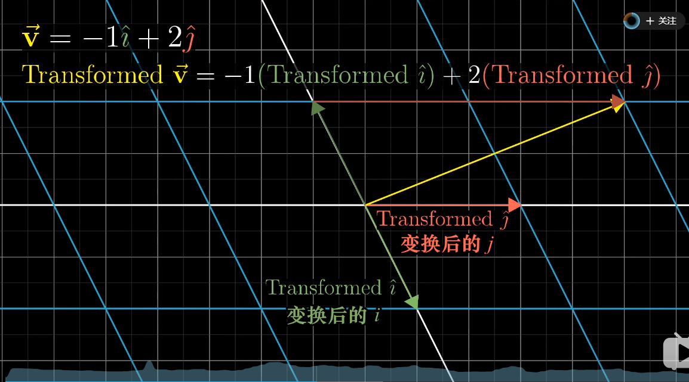
而变换矩阵可以表示我们对空间以及其中的向量具体是如何进行变换的：
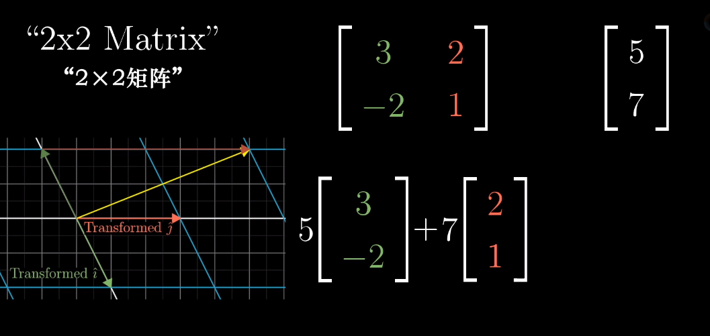
上图中矩阵中绿色的第一列，和红色的第二列分别对应二维向量横纵坐标
的变换方式，经过如图所示的运算，我们可以得到变换的后的向量
这也就是我们常见的矩阵乘法：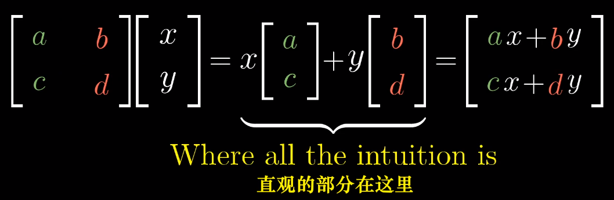
更加有趣的是，作者用一个动画来分别描述变换矩阵的两列对两个
基向量，以及整个空间的变换过程：
因此，当我们看到一个矩阵，就可以看成一个对空间的变换！
## 矩阵乘法与线性变换复合
先进行空间旋转，再进行空间旋转，需要对一个向量进行两次矩阵向量乘
运算，但是我们可以将两个变换矩阵复合到一起变成一个过程：
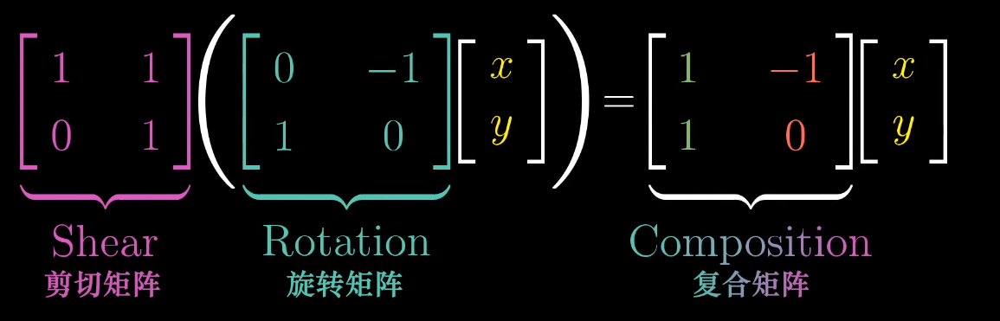

下面我简单说明一下基向量i的去向:
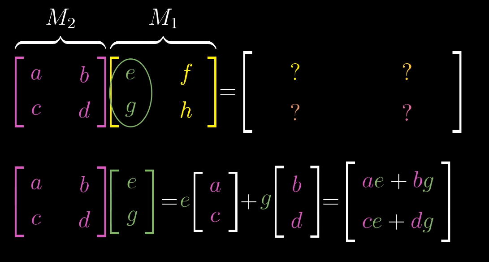
如图所示，基向量i首先经过M1作用，被拉伸/压缩到[e g]，之后
[e g]又经过M2作用，横纵坐标分别由[a c]和[b d]作用，最后
得到如图所示的向量。基向量j类似。 
而矩阵乘法交换作用于向量后得到的向量往往和交换前的结果不同，
由空间变化我们就可以得知，这样，我们对矩阵乘法没有交换律就有更深一层的理解了
。而结合律却是适用的，因为在空间中(AB)C和A(BC)对空间的变换
其实是等价的。
## 三维空间中的线性变换
三维空间与二维其实是类似的，只不过三维中我们用一个3*3的
矩阵来表示这个变换过程：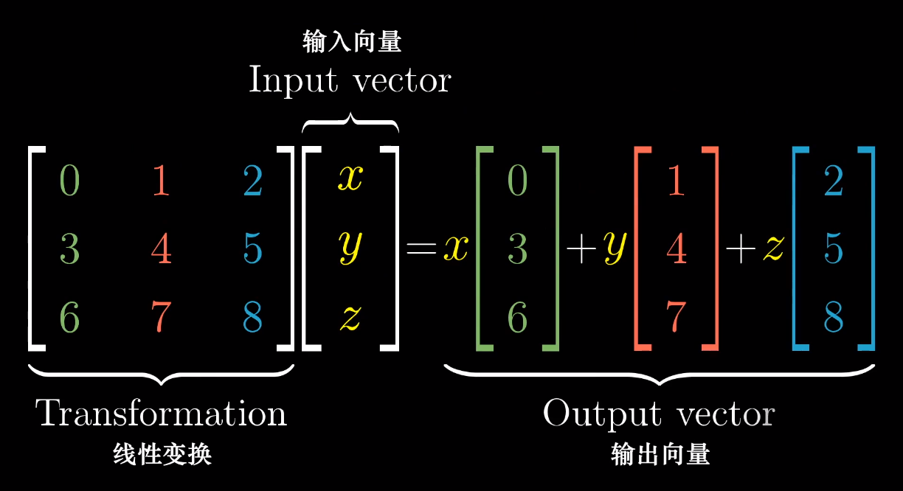
我们分别对x,y,z三个方向上的坐标进行如下变换，叠加在一起
便是最终的变换结果。同样的，三维矩阵也有和二维类似的矩阵复合过程。
## 行列式
变换矩阵行列式的作用其实是来描述一个空间被拉伸/压缩的程度的！
它的数值就是拉伸/压缩的倍数！并且在线性变换中，空间中的每一部分
经过变换后，都有一个同样的变换倍数。
更重要的是，当一个变换矩阵的行列式为0，那么说明这个空间
被“降维”了，我们以三维为例，当三维空间经过变换被压缩到
一条直线甚至一个点时，变换矩阵的行列式才可能为0！如下图所示:

还有一点就是行列式的值若为负值，我们可以认为空间被进行了
“翻转”，本来基向量i在基向量j的右边，经过翻转，变到了左边，
犹如一张翻转了的纸一样，而行列式的绝对值意义不变。如下图所示：

三维空间中的行列式意义其实也是一样的。而负值变换的过程就是
坐标轴从右手定则变为左手定则的过程。 
对于行列式的计算这里有一个二维的示意图。基向量 i 先被拉伸为
[a c]之后基向量 j 又被拉伸到[b d]，而为了计算黄色部分面积
也就是行列式的值，我们可以由以下几何关系得出：
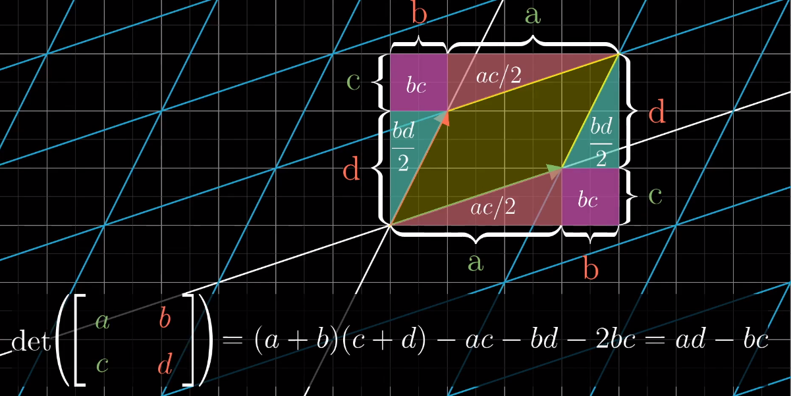
同样，我们也可以由几何关系得出以下规则：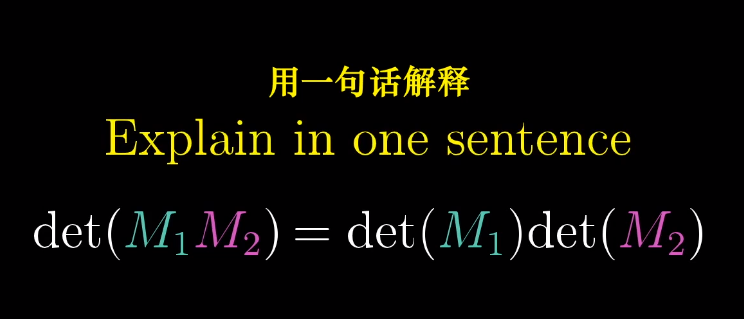
## 逆矩阵、列空间与零空间
逆变换矩阵其实就是空间的逆变换过程：
只要我们在第一次变换过程中不会进行“降维”，也就是行列式不为0，
我们就能找到对应的逆变换，逆矩阵，同时一个输入对应一个输出向量。但是，一旦我们进行了降维，我们就无法
从低维度还原回高维度的情况。 
矩阵秩的概念我们都不陌生，但是，它在几何中表示的是，一个变换矩阵
把高维空间进行变换后的维数：
如果我们对空间进行了降维变换，那么就会有一组向量被挤压成零向量。
如果一个平面被挤压成一维，那么就有一条线上的向量被挤压成零向量；
如果一个三维空间被挤压成二维，那么就有一条线上的向量被挤压成零向量；
如果一个三维空间被挤压成一维，那么就有一个平面上的向量被挤压成零向量：
变换后落到零点的向量集合，被称为“零空间”或“核”(kernel)。也就是方程Ax = 0时，我们解出的x，就是经过A变换后得到的空间向量集合――核(kernel)
## 非方阵
如果一个变换矩阵不是方阵，那么空间的变换又是如何进行的呢？ 
这里虽然作者没有做动画，但是有了之前的知识也能够理解(作者懒得做了)。
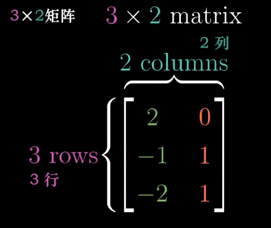
如这样一3 * 2的矩阵，我们作用到一个2 * 2的二维平面空间中，带来的结果就是，
把二维平面扩展到过原点的三维平面了。 
同样，我们把一个2 * 3的矩阵可以作用到一个3 * 3的空间中，那么，这也叫“降维”。
同样也有到一维的转换，我们可以用一个1 * 2的矩阵降维平面到数轴：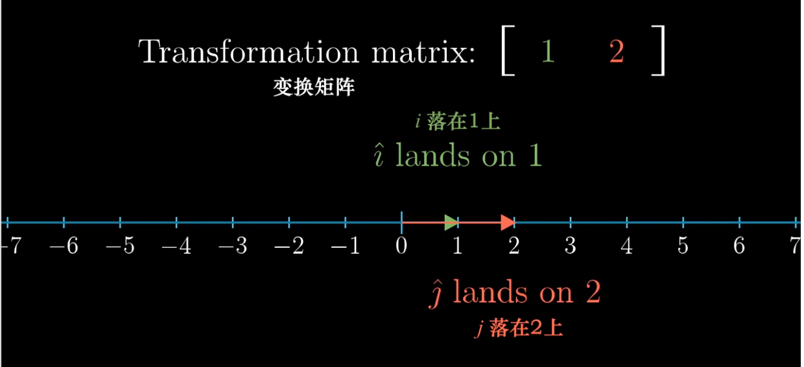
## 点积与对偶性
点积的顺序无关性，体现出了一定的对偶性(duality)。 
作者用一个平面斜向放置的数轴来解释这一现象。我们将二维空间中点
投影到如下图的斜向数轴上，u 为轴上的单位向量，这样的投影变换，将二维
中的向量投影到一维数轴上就是一个降维过程，并且它满足线性变换等距性
的要求，那么就存在一个1 * 2的变换矩阵来描述这一过程。根据如图所示的
对偶性(对称性)，u 投影到单位向量 i 上，和 i 投影到 u 上的长度是相等的
，纵坐标方向也一样，那么我们就得到的了变换矩阵的值：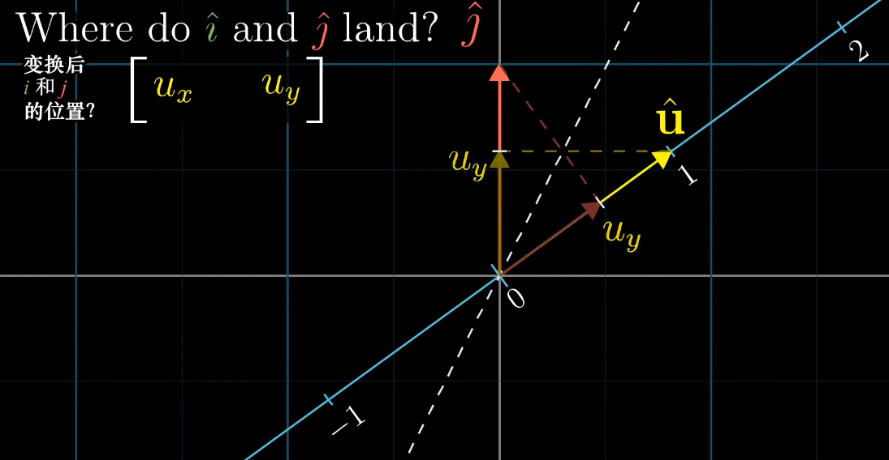
ux就是对基向量 i 的变换，uy就是对基向量 j 的变换。我们便找到了点积和矩阵变换之间
的关系：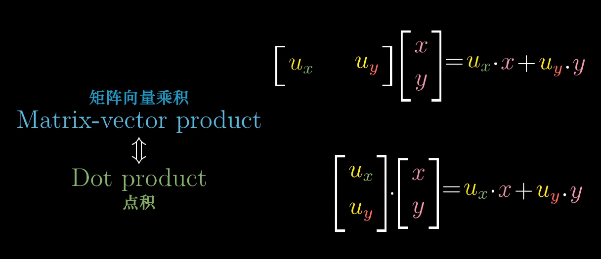
即点积就是一个降维的变换过程，将[x y]以左边的变换矩阵，变换到一维，映射到了一个数上
## 叉积的标准介绍