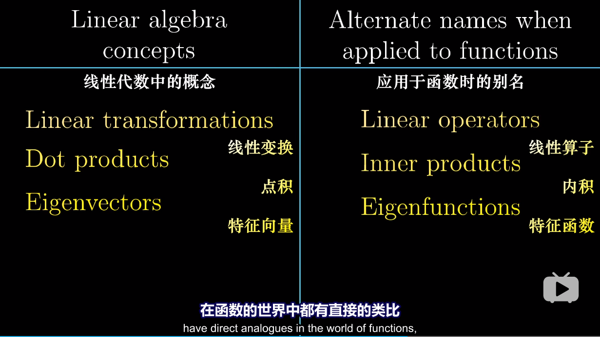

<!-- TOC -->

- [线性代数的本质](#线性代数的本质)
    - [序言](#序言)
    - [向量究竟是什么](#向量究竟是什么)
    - [线性组合、张成的空间与基](#线性组合张成的空间与基)
    - [矩阵与线性变换](#矩阵与线性变换)
    - [矩阵乘法与线性变换复合](#矩阵乘法与线性变换复合)
    - [三维空间中的线性变换](#三维空间中的线性变换)
    - [行列式](#行列式)
    - [逆矩阵、列空间与零空间](#逆矩阵列空间与零空间)
    - [非方阵](#非方阵)
    - [点积与对偶性](#点积与对偶性)
    - [叉积的标准介绍](#叉积的标准介绍)
    - [基变换](#基变换)
    - [特征向量与特征值](#特征向量与特征值)
    - [抽象向量空间](#抽象向量空间)
    - [克拉默法则几何解释](#克拉默法则几何解释)
- [矩阵论学习历程](#矩阵论学习历程)
    - [Lec_14——另一种视角的Ax = b](#lec_14另一种视角的ax--b)
    - [Lec_15——投影矩阵](#lec_15投影矩阵)
    - [Lec_17——正交矩阵和正交化方法](#lec_17正交矩阵和正交化方法)
    - [Lec_4——LU分解](#lec_4lu分解)
    - [转置-置换-向量空间——Lec_5](#转置-置换-向量空间lec_5)
    - [Lec_6——列空间和零空间](#lec_6列空间和零空间)
    - [四个基本的子空间——Lec_10](#四个基本的子空间lec_10)
    - [Lec_11——矩阵空间，秩1矩阵，小世界图](#lec_11矩阵空间秩1矩阵小世界图)
    - [Lec_12——图和网络](#lec_12图和网络)

<!-- /TOC -->
# 线性代数的本质
本文参考3Blue1Brown的线性代数讲解视频，写下笔记和自己的认识。 
[课程链接：youtube](https://www.youtube.com/watch?v=fNk_zzaMoSs&list=PLZHQObOWTQDPD3MizzM2xVFitgF8hE_ab) 
[课程链接：bilibili](https://www.bilibili.com/video/BV1ys411472E) 
## 序言
课程中3Blue1Brown主要用了大量精力给我们解释了线性代数中常见的向量操作、矩阵操作所表示的几何含义，并且制作出精美的动画演示过程。
这对我们理解其中的奥秘十分重要，在科研过程中，如果只停留在计算和表示层面，我们很难有一个公式的直观理解
，也就是作者强调的intuition。只有真正的理解数字背后的含义，我们才能够进行创新和拓展。
## 向量究竟是什么
向量对我们之前肤浅的接触过线性代数的学生来看，不过是几个连续
的数字组成的像有向的数组列表一样的东西，可以进行加减，数乘等运算。
不过，在后续中我们看到，无论是有向的数组、函数还是自定义的
一些计算规则，只要他们满足向量空间需要满足的
一些公理，那么他们都可以统称为广义的向量。并且带有一致的计算规则。
我们在后续的介绍中会提到。 
现在，我们就停留在我们认识的阶段即可，来一步步展开。
## 线性组合、张成的空间与基
向量的线性组合会构成相应的张成的空间(span)，不过，有些
向量可能对张成的空间维数扩大没有帮助，如三维中，三个向量共面不共线。
那么我们就可以去掉其中一个，并且称这三个向量线性相关。基的概念
就是可以描述出张成的空间中所包含的所有向量的一组线性无关向量集合。
## 矩阵与线性变换
线性变换实际上是一个运动的过程。在此我们先看一个空间 
变换的过程：  
线性变换就是空间变换的一个特例：  
而在二维空间中我们需要记录的只是两个基向量的变换过程，其他向量
会随之变换：  
变换后的线性组合不变：  
而变换矩阵可以表示我们对空间以及其中的向量具体是如何进行变换的： 
 
上图中矩阵中绿色的第一列，和红色的第二列分别对应二维向量横纵坐标
的变换方式，经过如图所示的运算，我们可以得到变换的后的向量
这也就是我们常见的矩阵乘法：  
更加有趣的是，作者用一个动画来分别描述变换矩阵的两列对两个
基向量，以及整个空间的变换过程：  
因此，当我们看到一个矩阵，就可以看成一个对空间的变换！
## 矩阵乘法与线性变换复合
先进行空间旋转，再进行空间旋转，需要对一个向量进行两次矩阵向量乘
运算，但是我们可以将两个变换矩阵复合到一起变成一个过程： 
 
 
下面我简单说明一下基向量i的去向: 
 
如图所示，基向量i首先经过M1作用，被拉伸/压缩到[e g]，之后
[e g]又经过M2作用，横纵坐标分别由[a c]和[b d]作用，最后
得到如图所示的向量。基向量j类似。 
而矩阵乘法交换作用于向量后得到的向量往往和交换前的结果不同，
由空间变化我们就可以得知，这样，我们对矩阵乘法没有交换律就有更深一层的理解了
。而结合律却是适用的，因为在空间中(AB)C和A(BC)对空间的变换
其实是等价的。
## 三维空间中的线性变换
三维空间与二维其实是类似的，只不过三维中我们用一个3*3的
矩阵来表示这个变换过程：  
我们分别对x,y,z三个方向上的坐标进行如下变换，叠加在一起
便是最终的变换结果。同样的，三维矩阵也有和二维类似的矩阵复合过程。
## 行列式
变换矩阵行列式的作用其实是来描述一个空间被拉伸/压缩的程度的！
它的数值就是拉伸/压缩的倍数！并且在线性变换中，空间中的每一部分
经过变换后，都有一个同样的变换倍数。
更重要的是，当一个变换矩阵的行列式为0，那么说明这个空间
被“降维”了，我们以三维为例，当三维空间经过变换被压缩到
一条直线甚至一个点时，变换矩阵的行列式才可能为0！如下图所示: 
 
还有一点就是行列式的值若为负值，我们可以认为空间被进行了
“翻转”，本来基向量i在基向量j的右边，经过翻转，变到了左边，
犹如一张翻转了的纸一样，而行列式的绝对值意义不变。如下图所示： 
 
三维空间中的行列式意义其实也是一样的。而负值变换的过程就是
坐标轴从右手定则变为左手定则的过程。 
对于行列式的计算这里有一个二维的示意图。基向量 i 先被拉伸为
[a c]之后基向量 j 又被拉伸到[b d]，而为了计算黄色部分面积
也就是行列式的值，我们可以由以下几何关系得出： 
 
同样，我们也可以由几何关系得出以下规则：  
## 逆矩阵、列空间与零空间
逆变换矩阵其实就是空间的逆变换过程：  
只要我们在第一次变换过程中不会进行“降维”，也就是行列式不为0，
我们就能找到对应的逆变换，逆矩阵，同时一个输入对应一个输出向量。但是，一旦我们进行了降维，我们就无法
从低维度还原回高维度的情况。 
矩阵秩的概念我们都不陌生，但是，它在几何中表示的是，一个变换矩阵
把高维空间进行变换后的维数：  
如果我们对空间进行了降维变换，那么就会有一组向量被挤压成零向量。
如果一个平面被挤压成一维，那么就有一条线上的向量被挤压成零向量；
如果一个三维空间被挤压成二维，那么就有一条线上的向量被挤压成零向量；
如果一个三维空间被挤压成一维，那么就有一个平面上的向量被挤压成零向量：  
变换后落到零点的向量集合，被称为“零空间”或“核”(kernel)。也就是方程Ax = 0时，我们解出的x，就是经过A变换后得到的空间向量集合——核(kernel)
## 非方阵
如果一个变换矩阵不是方阵，那么空间的变换又是如何进行的呢？ 
这里虽然作者没有做动画，但是有了之前的知识也能够理解(作者懒得做了)。 
 
如这样一3 * 2的矩阵，我们作用到一个2 * 2的二维平面空间中，带来的结果就是，
把二维平面扩展到过原点的三维平面了。 
同样，我们把一个2 * 3的矩阵可以作用到一个3 * 3的空间中，那么，这也叫“降维”。
同样也有到一维的转换，我们可以用一个1 * 2的矩阵降维平面到数轴：  
## 点积与对偶性
点积的顺序无关性，体现出了一定的对偶性(duality)。 
作者用一个平面斜向放置的数轴来解释这一现象。我们将二维空间中点
投影到如下图的斜向数轴上，u 为轴上的单位向量，这样的投影变换，将二维
中的向量投影到一维数轴上就是一个降维过程，并且它满足线性变换等距性
的要求，那么就存在一个1 * 2的变换矩阵来描述这一过程。根据如图所示的
对偶性(对称性)，u 投影到单位向量 i 上，和 i 投影到 u 上的长度是相等的
，纵坐标方向也一样，那么我们就得到的了变换矩阵的值：  
ux就是对基向量 i 的变换，uy就是对基向量 j 的变换。我们便找到了点积和矩阵变换之间
的关系：  
即点积就是一个降维的变换过程，将[x y]以左边的变换矩阵，变换到一维，映射到了一个数上
## 叉积的标准介绍
二维中两个向量叉积的的大小就是两个向量围成的平行四边形面积，这有些
像行列式，因为两个二维向量构成的2*2行列式的结果就是对应的平行四边形面积，方向
遵循右手定则，叉积的结果其实是一个向量。而三维中，两个向量的叉积
计算方法如下，而我们也就死记硬背，但是作者也给出了形象的几何理解
，但是这里与我目前关系不大，因此我不进行细究，有兴趣可以参考以下链接。 
 
[三维叉积几何解释](https://www.bilibili.com/video/BV1ys411472E?p=12) 
## 基变换
当使用 b1，b2 作为基向量时，[-1 2]表达的是黄色向量的值，但是如果我们要得到
该向量在基向量 i,j 下的坐标时，我们需要给 b1，b2 基向量下的坐标
左乘一个变换矩阵，而这个变换矩阵的两列，表达的就是 i 变为 b1，j 变换为
b2 的意思，也就是说，我们为了消除以 b1，b2作为基向量的误解，而进行空间变换
尝试用 i,j 的视角进行解读。这里好像是反的，但是事实确实如此。 
 
 
反过来，如果我们知道在 i,j 基向量下的某向量坐标，如何知道在 b1,b2 中
的呢？结果就是——矩阵的逆： 
 
接下来就是相似矩阵的概念：如果我在 i,j 基下面做一个顺时针90°旋转的变换，那么
我在 b1,b2 中如何对空间做出同样的变换呢？答案就是——相似矩阵。 
相似矩阵就是同一个线性变换在不同基下的形式！ 
 
等式左边最右面的矩阵是一个基向量的转换，也就是把 i,j 转换为 b1,b2，
按照文中的语言，也就是，从我们的视角转换到珍妮弗(她)的视角。
这样，我们再进行第二个旋转矩阵的变换，旋转过后，我们进行最左边的
逆矩阵转换，也就是从她的视角再转换为我们的视角。这样基变换逆矩阵、
旋转矩阵、基变换矩阵的乘积得到的结果，也就是在珍妮弗语言下将空间旋转90°
的变换矩阵。  
## 特征向量与特征值
特征向量就是经过空间变换后，空间中仍在原来的直线上的那些向量集合，
只是进行了一定程度的拉伸/压缩，而特征值就是拉伸/压缩程度倍数的度量！ 
 
如图所示的绿色和黄色向量就是特征向量，而红色向量因为偏离了原来的直线
，因此，他不是特征向量。 
 
如上图所示，黄色线上的向量被拉伸了2倍，绿色线上的被拉伸了3倍，因此他们
对应的特征值分别就是2和3。 
 
还有就是三维的情况，如上图所示，当我们找到三维空间上的特征向量，
我们也就发现了三维空间变换过程中的旋转轴，特别的，当对应的特征值为1
时，这个方向上不进行拉伸/压缩。 
接下来就是计算上面的技巧：  
我们发现这个计算公式其实表达的就是对于一个特征向量v经过变换矩阵A变换后，
只是放缩了一个λ倍而已。而在计算中，我们常用以下的技巧： 
 
经过移项后，我们另最后一个行列式为0，为什么呢？因为在倒数第二步，
我们把 A-λI 看成一个空间变换矩阵，也就是向量 v 经过空间变换后为0
向量，由前面的内容我们知道了，这里其实就是降维的过程！只有 A-λI 矩阵
将原来的空间进行降维，空间中才会出现被压缩为 0 向量的向量。而降维
的矩阵需要满足的条件就是行列式为 0 ，也就是将原始空间压缩为 0 倍(可以回忆二维情况
，将二维空间面积压缩为0；或者三维情况，将三维体积压缩为平面甚至直线，体积为0)
 但是有些变换是不存在特征向量、特征值的，比如二维旋转变换矩阵 A ，因为
经过旋转后没有一个平面上的向量，在原来的直线上。这时你算 Ax = λx 时会发现，
解出来λ是一个虚数。
 还有一个如下图的特殊情况，特征值为2，平面中所有向量都是特征向量，
这时你代入λ，求(A-λI )x = 0 ，会发现得到 0x = 0 ，所有x都符合要求： 

 这里最后一个知识点就是“特征基”：当基向量都是特征向量会发生什么？
 我们都知道对角阵在计算高次幂时非常方便，如下图所示：  
非对角阵在计算高次幂时就是一场噩梦！因此，我们有了一个想法，当空间变换中
所存在的基向量足够张成整个空间时，我们就可以用特征向量作为基！比如，二维情况，
变换后的空间，存在两个线性无关的基向量的情况。按照上一章的变换技巧，
我们以基向量作为特征向量，也就是进行基变换后在进行空间变换：  
如上图所示，这个新的变换必然是对角阵，因为它的基向量只进行了缩放。那此时
，我们要计算非对角阵高次幂，我们只需要进行“相似对角化”，转换为对角矩阵后，
进行高次幂计算，之后再转换回原来的基(这里的转换方法还不是很清楚，需要之后进行实践！)。 
 
但并不是所有的变换都适用，前提是：当空间变换中所存在的基向量足够张成整个空间时才行。
## 抽象向量空间
首先强调一点：行列式和特征向量和所选基向量无关。行列式是空间放缩倍数，特征向量是经过变换
仍然留在原来直线上的向量。 
 
接下来进入主题，回到第一章的问题，什么是向量？现在我们进行解释，首先是函数为什么是向量：
“线性”定义：  
我们可以看到，多项式函数求导就是线性运算：   
现在，我们尝试用矩阵来描述求导：  
上图是一个函数的矩阵描述，右侧是对应的基向量(基函数)，求导过程如下:  
最左侧的是多项式求导矩阵，之后作用于一个多项式后，得到的列向量就是求导后的多项式系数向量。
这样我们就把求导和向量运算结合到了一起，实际上线性代数中的概念在函数中都有与之对应的部分： 
 
  
 
而围绕向量空间的关键点就是：加法和数乘！满足8个公理，他就能代表
任何事物！普适的代价是抽象！
## 克拉默法则几何解释
正交矩阵概念： 
 
在正交矩阵中，满足以下规则：  
之后我们可以用以下方法来讨论 y 值：  
这样我们把 y 值和面积联系了起来，之后经过A矩阵变换空间，y的面积也发生了变化，
变化后的面积为：  
根据以上的关系，我们可以计算 y ： 
 
需要说明的只有分子上的 Area 的值计算方法，也就是变换后黄色部分面积，
我们可以由变换后的绿色向量和变换后的[x y]粉色向量构成的矩阵的
行列式得到黄色部分面积。而粉色向量变换后就是[4 2]，绿色向量变换后就是[2 0]!
这里用到了之前的一些知识。按照这种方法，我们也可以得到 x 的计算方法。也可以拓展到高维。
不过克拉默法则并不是解方程组的最好方法，高斯消元法应用往往更多，但
这里提供了一个很好的几何解释。  
现在，所有的内容已经解释完毕。最后Shout out to 3Blue1Brown！

# 矩阵论学习历程
在下面的部分我将记录一些关于大三暑假矩阵论学习过程中的内容。 
以下内容来自于Strang教授MIT的线性代数课程 
[(课程链接YouTube)](https://www.youtube.com/watch?v=YeznlKTrpmU&list=PL6839449936471E0C&index=1) 
[(课程链接bilibili)](https://www.bilibili.com/video/BV1zx411g7gq?p=1)
## Lec_14——另一种视角的Ax = b
我发现教授对 Ax = b 这个等式的特别的解释：这个方程要有解的前提是向量b要落在矩阵A的列空间中，当我们把A写成[c1 c2 ... cn] ，x写成[x1 x2 ... xn]T，答案就显而易见了，Ax = c1x1 + c2x2 + ... + cnxn = b，也就是向量b是A列向量的线性组合，也就是b需要落在矩阵A的列空间中。
## Lec_15——投影矩阵
课上说明了投影矩阵P是对称，且P^2 = P的，Px = b：将投影矩阵作用在一个向量上，会得到另一个向量且得到的向量b一定在投影直线上，那么就说明投影矩阵的列向量的秩为1，因为b必须落在P矩阵的列向量所张成的空间中。现实中，Ax = b 往往会遇到无解的情况，那么此时，我们就需要对b做一个投影，让他投影到一个“最好”的平面上，记投影后的向量为p，而此时，我们只需要解 Ax = p 即可。而投影的p需要落在矩阵A的列空间中，这样就保证了有解。换句话说，教授讲了一个例子就是最小二乘估计拟合直线，当我有很多点，但是未知的拟合直线只有两个未知数 y=ax+b 时，我们会得到一个方程组 Ax = b，此时A矩阵是一个矩形，且方程组无解，我们便可以两边同时乘以A的转置得到 AT·A·x-hat = AT·b ，而此时的x-hat和之前的x不是一个，通过证明(由空间上的垂直关系得到下图方程)我们知道此方程是有解的，x-hat = (AT·A)^-1·AT·b。与此同时，对应的解 p = A·x-hat = A·(AT·A)^-1·AT·b。而我们把去掉b的部分：A·(AT·A)^-1·AT 称之为“投影矩阵”。需要指出的是，当A为一个可逆方阵，那么此时 Ax = b 有解，我们得到投影矩阵其实是一个单位矩阵I，此时的意思就是，把一个n维的空间，投影到一个n维的空间，对应的投影矩阵就是单位矩阵。 
 
那我们得到的投影矩阵P有什么用呢?答案是：我们可以将P作用到一个向量b上，使得b投影到A的列空间中得到一个投影向量p，进而方程组 Ax = p 得到一个最优解 x-hat。而当我们最小二乘估计 Ax = b 时，两边同时乘以 AT 解出来的就是 x-hat ，再 A·x-hat = p 投影向量 
最后再强调一遍大前提是：AT·A 这个矩阵是可逆的当且仅当A的列向量线性无关，这时，最小二乘法才会成立。
## Lec_17——正交矩阵和正交化方法
正交矩阵即 QT·Q = I ，即Q的列向量互相都是正交的，并且列向量都是单位化的(长度为1)。正交矩阵也都是对称矩阵。当正交矩阵为方阵时，正交矩阵是可逆的：QT = Q^-1。在应用中，我们得到正交矩阵的意义是很重大的，比如，在上一节我们提到的标准方程：AT·A·x-hat = AT·b，当A为正交矩阵时，方程就变为： x-hat = AT·b  
之后教授又讲了施密特正交化方法的内容，施密特正交化其实就是已知一组基向量，将其转化为单位正交的基向量的过程，不过我们需要理解的是，这个正交化过程，就是依次选取每一个基向量，减去上一节我们得到的投影向量分量，而那个误差向量e，才是我们需要的，因为那个误差向量e是垂直于已知基向量的： 
(这个式子来自于Lec15_投影前5分钟)： 

 
而这个正交化过程的步骤我们在课本上已经练习了多次了。但是，搞线性代数的人并不会去列举以上的公式步骤，他们会进一步将两组基向量写成矩阵形式，比如，以原来未单位化、且未正交的基向量作为列向量构成矩阵 A，之后又以单位化、正交化的基向量作为列向量构成正交矩阵 Q，而这两个矩阵之间的关系我们可以由一个矩阵 R 来沟通起来，即 A = Q·R ，而 R 是一个上三角矩阵(这部分教授没有明确讲清楚，需要之后自己探究)。
## Lec_4——LU分解
任意一个方阵 A ，我们都可以分解成 A = L·U，的形式，其中L是下三角矩阵，而U是上三角矩阵。我们都知道左乘初等矩阵相当于行变换，对于任意一个矩阵，我们不断进行行变化，便可以化为上三角矩阵，得到：E1·E2·...·EN·A = U 的形式，因为初等矩阵都是非奇异的，因此，我们可以左乘各个初等矩阵Ei的逆，而最后我们发现Ei的逆的乘积恰好是一个下三角矩阵，并且不会出现变换“叠加”的形式。换句话说，我们更愿意研究初等矩阵逆的乘积，而不是初等矩阵的乘积，这就是我们进行LU分解的目的。
## 转置-置换-向量空间——Lec_5
在上一节我们可以看到一个矩阵可以被分解成 L·U 的形式，但是有一个问题，就是当对角线上的主元为 0 时我们就不能继续化简了，那么此时我们就需要置换两行，此时我们只需要给需要置换的矩阵左乘置换矩阵即可。置换矩阵P有以下特点： 
 
关于向量空间的子空间教授强调的一点就是：过原点。比如三维空间的子空间可以是过原点的一个面，或是三维空间本身，或是原点。因为子空间必须满足对加法和数乘的封闭性，因此它一定是包含原点的。十维空间的五个线性无关的向量组成的子空间，同样也是过原点的。最后教授说了关于矩阵列空间的含义，这在之前我也解释过，就不再赘述了。
## Lec_6——列空间和零空间
因为这部分内容之前笔记中也提到过，所以不再赘述。我想补充的只有教授在这节课最后提到的 Ax = b，这个方程的解空间其实是一个点/平面/直线/更高维的空间，但是，它的解空间不能被称之为Rn的子空间，因为它一定不过原点。它是一个不过原点的空间。也很轻易的可以证明它不满足加法和数乘的封闭性。
## 四个基本的子空间——Lec_10
以 m*n 的矩阵 A 来看，四个基本的子空间分别是：A的列空间，A列空间的零空间，A行空间，A行空间的零空间(左零空间)。 
假设 A 的秩为 r ，我们可以看到 A 的列空间的维数是 r ，A 的列空间的零空间的维数是 m - r ，A的行空间的秩为 r ，A 的行空间的零空间的维数是 n - r。 
并且教授给我们讲了关于高斯-约旦消元法的原理。 高斯-约旦消元法：我们将一个矩阵 A 和单位矩阵 I 进行组合，得到一个复合矩阵：[A I]，进行行变换后可化成：[R E] (当A为方阵时可化成[I A^-1] , R表示行最简型)。我们都知道这个方法，可是为什么可以得到 A^-1，或者更普遍的来说，得到E，其实这个 E 记录下了你之前对 A 进行的行变换的每一步，当我们进行了一系列行变换后 A 变成了 I，变换过程保存在 E 中，因此，我们只需要给 A 左乘 E 就能得到单位矩阵 I , 若 A 不是方阵，给 A 左乘 E 就能得到 R。所以有： E·A = R。 
教授解释的另一个问题就是我们如何得到这四个基本子空间的基？首先，关于 A 行向量的基，我们可以对 A 进行行变换，化为行最简型 R ，因为行变换不破坏行空间，因此得到的 R 中的非零行，就是行空间的基。行空间对应的零空间的基，我们可以从上一段我们得到的 E 中获得，如果零空间的秩为 1 ，那么就取倒数第一行就是零空间的基(这里没太懂)，其实不嫌麻烦的话，我们可以解 ATx = 0 的解空间就是行空间对应的零空间，因为我们在研究方程组时都关注的是列向量，因此这里需要转置一下。关于列空间和与之对应的零空间研究方法也就是一个转置关系，在此不再赘述。
## Lec_11——矩阵空间，秩1矩阵，小世界图
这里，第一个提出的问题是什么是矩阵空间？矩阵空间其实就是一种向量空间，只要它满足向量空间八个公理即可。而我们不禁要问，矩阵空间的维数是多少？于是教授给了我们几个特殊的矩阵空间作为代表，帮助我们理解。首先，3*3 对称矩阵，对称矩阵的维数我们定为 6，因为只要有对角元素和对角上面/下面的元素，我们就能得到整个矩阵的样子，而很明显对称矩阵对加法和数乘封闭。第二，3*3 上三角矩阵，它的维数也是 6，理由和上面类似。上三角矩阵 ∩ 对称矩阵 = 对角矩阵(分别属于那两类)，而对角矩阵维数为 3。 
而我们不去研究他们二者的并，因为他们二者的并并不是一个向量空间，我们转过头来更愿意研究他们的“和”。也就是说，上三角矩阵 + 对称矩阵 = 全体矩阵(这一点我们可以进行验证)。其中，和的意义就是取一个上三角矩阵，去一个对称矩阵，将二者相加。其实这有点不太好理解，我更愿意去把它类比成在三维空间中两个方向不同的平面，我们研究两个平面的并其实没有多大意义，而两个平面的和其实就是整个三维空间。 
并且，重要的是，这里存在一个维数的关系，U 代表上三角矩阵，S 代表对称矩阵，即 dim(U) + dim(S) = dim(U + S) + dim(U ∩ S) (6 + 6 =9 + 3) 
之后教授穿插了一个关于向量空间的例子，我之前也提到过，就是关于微分： 
 
如图所示的微分方程的解是两个解的线性组合，我们当然可以把这两个解当作基，并且认为微分方程的解空间(向量空间)的维数为2。 
下面一个知识点，秩1矩阵一定可以分解为一个列向量与一个行向量的乘积(线性代数考研题里面见过)。 
最后又提到关于矩阵表示图的概念，这是下节课的重点(克林顿和莱文斯基的例子哈哈哈)
## Lec_12——图和网络
本节课中，教授用一个矩阵表示一个电流流向图，图中四个节点、五条边，节点表示电阻/电源之类的器件，有向边表示电流，一条边的起点表示电流流出，出口表示电流流入另一个节点，之后我们把该矩阵表示为 A ,将 A 转置，我们得到一个 4 * 5 的矩阵，我们构造一个方程：ATy = 0 ，y 是一个五维向量，每一个分量表示了每条边上的电流方向和大小，因为需要一个平衡：电流流入等于流出，因此，等式右边为 0 ，转置矩阵一共四行，每一行代表一个节点的平衡情况。因此，只要解出这个方程，即 AT 的零空间，就能知道这个图中电流要达到平衡，电流的关系应该是怎样的。 
 
并且需要补充的是，如果电路图中某几条边会构成回路，那么在矩阵中，这几条边一定是线性相关的！magic！而无回路的图我们称之为——树！ 
最后教授又神奇的证明了欧拉公式，上面提到了，矩阵中线性相关的边是回路，那么我们可以推导出：图中的回路个数 = 矩阵的零空间维数 = 矩阵自由向量个数 = m - r (若 A 为 m * n 矩阵，AT 则为 n * m，零空间维数自然是 m - r )！而等式右边的 m 代表边的个数，秩 r 是节点数 - 1(这里不太理解)，见下面等式。 
 
也就是任意一个图中的回路、边、节点数有以上的关系，这就是欧拉公式。 
最后教授又把前面的全部串起来了，得到了一个应用数学里的平衡方程，但是我还是才疏学浅没有理解，不得不说这课程level真的高！Inspiring courses！