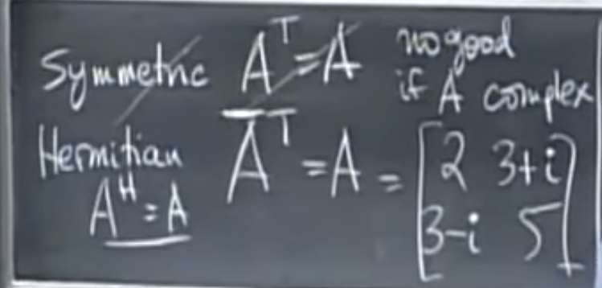

<!-- TOC -->

- [线性代数的本质](#线性代数的本质)
    - [序言](#序言)
    - [向量究竟是什么](#向量究竟是什么)
    - [线性组合、张成的空间与基](#线性组合张成的空间与基)
    - [矩阵与线性变换](#矩阵与线性变换)
    - [矩阵乘法与线性变换复合](#矩阵乘法与线性变换复合)
    - [三维空间中的线性变换](#三维空间中的线性变换)
    - [行列式](#行列式)
    - [逆矩阵、列空间与零空间](#逆矩阵列空间与零空间)
    - [非方阵](#非方阵)
    - [点积与对偶性](#点积与对偶性)
    - [叉积的标准介绍](#叉积的标准介绍)
    - [基变换](#基变换)
    - [特征向量与特征值](#特征向量与特征值)
    - [抽象向量空间](#抽象向量空间)
    - [克拉默法则几何解释](#克拉默法则几何解释)
- [MIT线性代数课程学习历程](#mit线性代数课程学习历程)
    - [Lec_14——另一种视角的Ax = b](#lec_14另一种视角的ax--b)
    - [Lec_15、Lec_16——投影与投影矩阵与最小二乘](#lec_15lec_16投影与投影矩阵与最小二乘)
    - [Lec_17——正交矩阵和正交化方法](#lec_17正交矩阵和正交化方法)
    - [Lec_4——LU分解](#lec_4lu分解)
    - [Lec_5——转置-置换-向量空间](#lec_5转置-置换-向量空间)
    - [Lec_6——列空间和零空间](#lec_6列空间和零空间)
    - [Lec_10——四个基本的子空间](#lec_10四个基本的子空间)
    - [Lec_11——矩阵空间，秩1矩阵，小世界图](#lec_11矩阵空间秩1矩阵小世界图)
    - [Lec_12——图和网络](#lec_12图和网络)
    - [Lec_21——特征值和特征向量](#lec_21特征值和特征向量)
    - [Lec_22——对角化和矩阵乘幂](#lec_22对角化和矩阵乘幂)
    - [Lec_23——微分方程和exp(At)](#lec_23微分方程和expat)
    - [Lec_24——马尔科夫矩阵和傅里叶级数](#lec_24马尔科夫矩阵和傅里叶级数)
    - [Lec_25——对称矩阵和正定矩阵](#lec_25对称矩阵和正定矩阵)
    - [Lec_26——复矩阵和快速傅里叶变换](#lec_26复矩阵和快速傅里叶变换)
    - [Lec_27——正定矩阵](#lec_27正定矩阵)
    - [Lec_28——相似矩阵和Jordan标准型](#lec_28相似矩阵和jordan标准型)
    - [Lec_29——奇异值分解](#lec_29奇异值分解)
    - [Lec_33——左右逆和伪逆](#lec_33左右逆和伪逆)
- [矩阵论课本学习历程](#矩阵论课本学习历程)
    - [正交变换与正交矩阵、对称变换与对称矩阵](#正交变换与正交矩阵对称变换与对称矩阵)
- [MIT 18.065 Matrix Methods in Data Analysis, Signal Processing, and Machine Learning, Spring 2018](#mit-18065-matrix-methods-in-data-analysis-signal-processing-and-machine-learning-spring-2018)
    - [1. The Column Space of A Contains All Vectors Ax](#1-the-column-space-of-a-contains-all-vectors-ax)
    - [2. Multiplying and Factoring Matrices](#2-multiplying-and-factoring-matrices)
    - [3. Orthonormal Columns in Q Give Q'Q = I](#3-orthonormal-columns-in-q-give-qq--i)
    - [4. Eigenvalues and Eigenvectors](#4-eigenvalues-and-eigenvectors)
    - [5. Positive Definite and Semidefinite Matrices](#5-positive-definite-and-semidefinite-matrices)

<!-- /TOC -->
# 线性代数的本质
>本文参考3Blue1Brown的线性代数讲解视频，写下笔记和自己的认识。 
[课程链接：youtube](https://www.youtube.com/watch?v=fNk_zzaMoSs&list=PLZHQObOWTQDPD3MizzM2xVFitgF8hE_ab) 
[课程链接：bilibili](https://www.bilibili.com/video/BV1s4411S78P?from=search&seid=12604659975522241651) 
## 序言
>课程中3Blue1Brown主要用了大量精力给我们解释了线性代数中常见的向量操作、矩阵操作所表示的几何含义，并且制作出精美的动画演示过程。
这对我们理解其中的奥秘十分重要，在科研过程中，如果只停留在计算和表示层面，我们很难有一个公式的直观理解
，也就是作者强调的intuition。只有真正的理解数字背后的含义，我们才能够进行创新和拓展。
## 向量究竟是什么
>向量对我们之前肤浅的接触过线性代数的学生来看，不过是几个连续
的数字组成的像有向的数组列表一样的东西，可以进行加减，数乘等运算。
不过，在后续中我们看到，无论是有向的数组、函数还是自定义的
一些计算规则，只要他们满足向量空间需要满足的
一些公理，那么他们都可以统称为广义的向量。并且带有一致的计算规则。
我们在后续的介绍中会提到。 
现在，我们就停留在我们认识的阶段即可，来一步步展开。
## 线性组合、张成的空间与基
>向量的线性组合会构成相应的张成的空间(span)，不过，有些
向量可能对张成的空间维数扩大没有帮助，如三维中，三个向量共面不共线。
那么我们就可以去掉其中一个，并且称这三个向量线性相关。基的概念
就是可以描述出张成的空间中所包含的所有向量的一组线性无关向量集合。
## 矩阵与线性变换
>线性变换实际上是一个运动的过程。在此我们先看一个空间 
变换的过程： 

 

 

>线性变换就是空间变换的一个特例： 

 

 

>而在二维空间中我们需要记录的只是两个基向量的变换过程，其他向量
会随之变换： 

 

 

>变换后的线性组合不变： 

 

 

>而变换矩阵可以表示我们对空间以及其中的向量具体是如何进行变换的： 

 

 

>上图中矩阵中绿色的第一列，和红色的第二列分别对应二维向量横纵坐标
的变换方式，经过如图所示的运算，我们可以得到变换的后的向量
这也就是我们常见的矩阵乘法： 

 

 

>更加有趣的是，作者用一个动画来分别描述变换矩阵的两列对两个
基向量，以及整个空间的变换过程： 

 

 

>因此，当我们看到一个矩阵，就可以看成一个对空间的变换！

## 矩阵乘法与线性变换复合
>先进行空间旋转，再进行空间剪切，需要对一个向量进行两次矩阵向量乘
运算，但是我们可以将两个变换矩阵复合到一起变成一个过程： 

  

 

 

 

>下面我简单说明一下基向量i的去向: 

 

 

>如图所示，基向量 i 首先经过M1作用，被拉伸/压缩到[e g]，之后
[e g]又经过M2作用，横纵坐标分别由[a c]和[b d]作用，最后
得到如图所示的向量。基向量 j 类似。 
而矩阵乘法交换作用于向量后得到的向量往往和交换前的结果不同，
由空间变化我们就可以得知，这样，我们对矩阵乘法没有交换律就有更深一层的理解了
。而结合律却是适用的，因为在空间中(AB)C和A(BC)对空间的变换
其实是等价的。

## 三维空间中的线性变换
>三维空间与二维其实是类似的，只不过三维中我们用一个3*3的
矩阵来表示这个变换过程： 

 

 

>我们分别对 x,y,z 三个方向上的坐标进行如下变换，叠加在一起
便是最终的变换结果。同样的，三维矩阵也有和二维类似的矩阵复合过程。

## 行列式
>变换矩阵行列式的作用其实是来描述一个空间被拉伸/压缩的程度的！
它的数值就是拉伸/压缩的倍数！并且在线性变换中，空间中的每一部分
经过变换后，都有一个同样的变换倍数。
更重要的是，当一个变换矩阵的行列式为 0，那么说明这个空间
被“降维”了，我们以三维为例，当三维空间经过变换被压缩到
一条直线甚至一个点时，变换矩阵的行列式才可能为 0 ！如下图所示: 

 

 

>还有一点就是行列式的值若为负值，我们可以认为空间被进行了
“翻转”，本来基向量i在基向量j的右边，经过翻转，变到了左边，
犹如一张翻转了的纸一样，而行列式的绝对值意义不变。如下图所示： 

 

 

>三维空间中的行列式意义其实也是一样的。而负值变换的过程就是
坐标轴从右手定则变为左手定则的过程。 
对于行列式的计算这里有一个二维的示意图。基向量 i 先被拉伸为
[a c] 之后基向量 j 又被拉伸到 [b d]，分别对应途中绿色和红色两个向量，而为了计算黄色部分面积
也就是行列式的值，我们可以由以下几何关系得出： 

 

 

>同样，我们也可以由几何关系得出以下规则： 

 

 

## 逆矩阵、列空间与零空间
>逆变换矩阵其实就是空间的逆变换过程： 

 

 

>只要我们在第一次变换过程中不会进行“降维”，也就是行列式不为 0，
我们就能找到对应的逆变换、逆矩阵，同时一个输入对应一个输出向量。但是，一旦我们进行了降维，我们就无法
从低维度还原回高维度的情况。 
矩阵秩的概念我们都不陌生，但是，它在几何中表示的是，一个变换矩阵
把高维空间进行变换后的维数： 

 

 

>如果我们对空间进行了降维变换，那么就会有一组向量被挤压成零向量。
如果一个平面被挤压成一维，那么就有一条线上的向量被挤压成零向量；
如果一个三维空间被挤压成二维，那么就有一条线上的向量被挤压成零向量；
如果一个三维空间被挤压成一维，那么就有一个平面上的向量被挤压成零向量： 

 

 

>变换后落到零点的向量集合，被称为“零空间”或“核”(kernel)。也就是方程 Ax = 0 时，我们解出的x，就是经过A变换后得到的空间向量集合——核(kernel)

## 非方阵
>如果一个变换矩阵不是方阵，那么空间的变换又是如何进行的呢？
这里虽然作者没有做动画，但是有了之前的知识也能够理解(作者懒得做了)。 

 

 

>如这样一个 3 * 2 的矩阵，我们作用到一个 2 * 2 的二维平面空间中，带来的结果就是，
把二维平面扩展到过原点的三维平面了。原理还是基向量 i 被拉伸到绿色列的三维情况，基向量 j 被拉伸到红色列的三维情况。 
同样，我们把一个 2 * 3 的矩阵可以作用到一个 3 * 3 的空间中，那么，这也叫“降维”。
同样也有到一维的转换，我们可以用一个 1 * 2 的矩阵降维平面到数轴： 

 

 

## 点积与对偶性
>点积的顺序无关性，体现出了一定的对偶性(duality)。 
作者用一个平面斜向放置的数轴来解释这一现象。我们将二维空间中的点投影到如下图的斜向数轴上，u 为轴上的单位向量，这样的投影变换，将二维
中的向量投影到一维数轴上就是一个降维过程，并且它满足线性变换等距性
的要求，那么就存在一个 1 * 2 的变换矩阵来描述这一过程。根据如图所示的
对偶性(对称性)，u 投影到单位向量 j 上，和 j 投影到 u 上的长度是相等的
，纵坐标方向也一样，那么我们就得到的了变换矩阵的值： 

 

 

>ux 就是对基向量 i 的变换，uy 就是对基向量 j 的变换。我们便找到了点积和矩阵变换之间
的关系： 

 

 

>即点积就是一个降维的变换过程，将 [x y] 以左边的变换矩阵，变换到一维，映射到了一个数上

## 叉积的标准介绍
>二维中两个向量叉积的的大小就是两个向量围成的平行四边形面积，这有些
像行列式，因为两个二维向量构成的2*2行列式的结果就是对应的平行四边形面积，方向
遵循右手定则，叉积的结果其实是一个向量。而三维中，两个向量的叉积
计算方法如下，而我们也就死记硬背，但是作者也给出了形象的几何理解
，但是这里与我目前关系不大，因此我不进行细究，有兴趣可以参考以下链接：
[三维叉积几何解释](https://www.bilibili.com/video/BV1ys411472E?p=12) 

 

 

## 基变换
>当使用下图 **b1，b2** 作为基向量时，[-1 2] 表达的是黄色向量的值，但是如果我们要得到
该向量在基向量 **i，j** 下的坐标时，我们需要给 b1，b2 基向量下的坐标
左乘一个变换矩阵，而这个变换矩阵的两列，表达的就是 i 变为 b1，j 变换为
b2 的意思，也就是说，我们为了消除以 b1，b2作为基向量的误解，而进行空间变换
尝试用 i,j 的视角进行解读。这里好像是反的，但是事实确实如此。 

 

 

 

 

>反过来，如果我们知道在 i,j 基向量下的某向量坐标，如何知道在 b1,b2 中
的呢？结果就是——矩阵的逆： 

 

 

>接下来就是相似矩阵的概念：如果我在 i,j 基下面做一个顺时针90°旋转的变换，那么
我在 b1,b2 中如何对空间做出同样的变换呢？答案就是——相似矩阵。 
**相似矩阵就是同一个线性变换在不同基下的形式！** 

 

 

>等式左边最右面的矩阵是一个基向量的转换，也就是上一例中把 i,j 转换为 b1,b2 的矩阵，
按照文中的语言，也就是，从我们的视角转换到珍妮弗(她)的视角。
这样，我们再进行第二个**旋转矩阵**的变换，旋转过后，我们进行最左边的
逆矩阵转换，也就是从她的视角再转换为我们的视角。这样基变换逆矩阵、
旋转矩阵、基变换矩阵的乘积得到的结果，也就是在珍妮弗语言下将空间旋转90°
的变换矩阵。 

 

 

## 特征向量与特征值
>**特征向量就是经过空间变换后，空间中仍在原来的直线上的那些向量集合**，
只是进行了一定程度的拉伸/压缩，而**特征值就是拉伸/压缩程度倍数的度量**！ 

 

 

>如上图所示的绿色和黄色向量就是特征向量，而红色向量因为偏离了原来的直线
，因此，他不是特征向量。 

 

 

>如上图所示，黄色线上的向量被拉伸了2倍，绿色线上的被拉伸了3倍，因此他们
对应的特征值分别就是 2 和 3。 

 

 

>还有就是三维的情况，如上图所示，当我们找到三维空间上的特征向量，
我们也就发现了三维空间变换过程中的**旋转轴**，特别的，当对应的特征值为 1
时，这个方向上不进行拉伸/压缩。 
接下来就是计算上面的技巧： 

 

 

>我们发现这个计算公式其实表达的就是对于一个特征向量 v 经过变换矩阵 A 变换后，
只是放缩了一个λ倍而已。而在计算中，我们常用以下的技巧： 

 

 

>经过移项后，我们另最后一个行列式为 0，为什么呢？因为在倒数第二步，
我们把 A-λI 看成一个空间变换矩阵，也就是向量 v 经过空间变换后为 0
向量，由前面的内容我们知道了，这里其实就是降维的过程！只有 A-λI 矩阵
将原来的空间进行降维，空间中才会出现被压缩为 0 向量的向量。而降维
的矩阵需要满足的条件就是行列式为 0 ，也就是将原始空间压缩为 0 倍(可以回忆二维情况
，将二维空间面积压缩为 0；或者三维情况，将三维体积压缩为平面甚至直线，体积为 0)
 但是有些变换是不存在特征向量、特征值的，比如二维旋转变换矩阵 A ，因为
经过旋转后没有一个平面上的向量，在原来的直线上。这时你算 Ax = λx 时会发现，
解出来λ是一个虚数。
 还有一个如下图的特殊情况，特征值为2，平面中所有向量都是特征向量，
这时你代入λ，求 (A-λI)x = 0 ，会发现得到 0x = 0 ，所有x都符合要求： 

 

 

>这里最后一个知识点就是“特征基”：当**基向量都是特征向量**会发生什么？
 我们都知道对角阵在计算高次幂时非常方便，如下图所示： 

 

 

>非对角阵在计算高次幂时就是一场噩梦！因此，我们有了一个想法，**当空间变换后所存在的基向量足够张成整个空间时，我们就可以用特征向量作为基**！比如，二维情况，
变换后的空间，存在两个线性无关的基向量的情况。按照上一章的变换技巧，
我们以基向量作为特征向量，也就是进行基变换后在进行空间变换： 

 

 

>如上图所示，这个新的变换必然是对角阵，因为它的基向量只进行了缩放。那此时
，我们要计算非对角阵高次幂，我们只需要进行“相似对角化”，转换为对角矩阵后，
进行高次幂计算，之后再转换回原来的基。 

 

 

>但并不是所有的变换都适用，前提是：**当空间变换后所存在的基向量足够张成整个空间时才行**。

## 抽象向量空间
>首先强调一点：**行列式和特征向量和所选基向量无关。行列式是空间放缩倍数，特征向量是经过变换
仍然留在原来直线上的向量**。 

 

 

>接下来进入主题，回到第一章的问题，什么是向量？现在我们进行解释，首先是**函数为什么是向量**？
“线性”定义： 

 

 

>我们可以看到，多项式函数求导就是线性运算： 

 

 

 

 

>既然是线性运算(线性变换)，那么求导过程就对应一个矩阵。现在，我们尝试用矩阵来描述求导： 

 

 

>上图是一个函数的矩阵描述，右侧是对应的基向量(基函数)，求导过程如下: 

 

 

>最左侧的是多项式求导矩阵，之后作用于一个多项式后，得到的列向量就是求导后的多项式系数向量。
这样我们就把求导和向量运算结合到了一起，实际上线性代数中的概念在函数中都有与之对应的部分： 

 

 

 

 

 

 

>而围绕向量空间的关键点就是：加法和数乘！满足 **8个公理**，他就能代表任何事物！普适的代价是抽象！8 个公理在矩阵论第一章中就为我们展示了。

## 克拉默法则几何解释
>正交变换概念： 

 

 

>在正交矩阵中，满足以下规则： 

 

 

>下面介绍克拉默法则：

 

 

>如上图所示，这样我们把向量 [x y] 中的 y 值和面积联系了起来(平行四边形面积 = 底乘高)，之后经过下图 A 矩阵进行空间变换，y 的面积也发生了变化，变换后的面积为 det(A)·y ，变换后的 [x y] 向量变为 [4 2] 这是我们已知的 

 

 

>根据以上的关系，我们可以计算 y ： 

 

 

>需要说明的只有分子上的 Area 的值计算方法，也就是变换后黄色部分面积，
我们可以由变换后的绿色向量和变换后的[x y]粉色向量构成的矩阵的
行列式得到黄色部分面积。而粉色向量变换后就是[4 2]，绿色向量变换后就是[2 0] !
这里用到了之前的一些知识。按照这种方法，我们也可以得到 x 的计算方法。也可以拓展到高维。
不过克拉默法则并不是解方程组的最好方法，高斯消元法应用往往更多，但这里提供了一个很好的几何解释。 

>现在，所有的内容已经解释完毕。最后Shout out to 3Blue1Brown！

# MIT线性代数课程学习历程
>在下面的部分我将记录一些关于 MIT 线性代数课程学习过程中的内容。这里并不是涵盖了所有的知识点，只是在听课或者学习中觉得重要的知识点。并且文中很多情况并不呈现详尽的代数证明，只是为了让大多只有本科线性代数基础的同学更好的理解矩阵论课本的内容。若有错误，请帮忙指出。 
以下内容来自于Strang教授MIT的线性代数课程 
[(课程链接YouTube)](https://www.youtube.com/watch?v=YeznlKTrpmU&list=PL6839449936471E0C&index=1) 
[(课程链接bilibili)](https://www.bilibili.com/video/BV1zx411g7gq?p=1)

## Lec_14——另一种视角的Ax = b
>我发现教授对 Ax = b 这个等式的特别的解释：这个方程要有解的前提是**向量 b 要落在矩阵 A 的列空间中**，当我们把A写成[c1 c2 ... cn] (c代表列向量column) ，x写成[x1 x2 ... xn]T，答案就显而易见了，Ax = c1x1 + c2x2 + ... + cnxn = b，也就是向量 b 是 A 列向量的线性组合，也就是 b 需要落在矩阵 A 的列空间中。

## Lec_15、Lec_16——投影与投影矩阵与最小二乘
>我想先说一下关于向量投影的操作(如下图所示)，b 向量投影到 a 向量上。p 是**投影向量(projection)**，是 a 向量的 x 倍。e 向量我们称之为**误差向量(error)**，是 b 向量垂直于 a 向量的分量，我们可以由 b - p 得到。根据图中的向量关系，我们可以得到一组等式，aT(b-xa) = 0 而化简后我们可以求出 x 的表达，同时投影向量 p 也可以得到： 

 

 

>当我们上升到**矩阵层面**可以得到(如下图所示)，我们把 a·aT / aT·a 看作投影矩阵 P ，当一切向量 b 经过 P 的作用后都会落到 a 向量所在的直线上，并且投影 p 大小就是 |P·b|： 

 

 

>好的，现在让我们研究一下投影矩阵 P 秩的特点：矩阵 P 的分母 aT·a是一个数，分子 a·aT 是一个矩阵，而我们知道 A = B·C，则 r(A) <= min( r(B)，r(C) )，因此**投影矩阵秩为 1**。然后我们还可以看出**投影矩阵 P 是对称矩阵，且 P^2 = P**。现在，总结一下，有三个公式我们需要记住：**投影向量 p 的计算公式，投影矩阵 P 的计算公式，投影倍数 x 的计算公式。**

>现实中，Ax = b 往往会遇到无解的情况，那么此时，我们就需要对 b 做一个投影，让他投影到一个“最好”的平面上，记投影后的向量为 p，而此时，我们只需要解 Ax = p ，就能得到一个最优解的情况。而投影的 p 需要落在矩阵 A 的列空间中，这样就保证了有解。

>这其实就是投影问题的高维情况，为了可视化便于理解，教授在课上用三维的情况进行了图示(如下图所示)，我们面对 Ax = b，b不在 A 的列空间(图示平面内)，我们要进行一个投影，投影得到 p，进而转化为 A·x-hat = p 的可解问题上，也就是说此时“最好”的平面就是 A 矩阵的列空间张成的平面： 

 

>为了找到投影 p ，我们从误差向量 e 着手，当 e 垂直于 A 列空间平面时，p 就得到了。也就是我们要关注的就是下图中的 **key**(perpendicular "垂直")。而 e 不仅垂直于投影向量 p，还垂直于平面上所有向量，我们假设 a1，a2 是平面的基，那么可以得到下面方程组： 

 

 

>我们把方程组写成矩阵形式(如下图所示)，我们惊讶的发现，这个形式和课堂开始时第一个图那个平面的例子是一样的，只不过从向量 a 变成了矩阵 A，也就是由低维转向了高维： 

 

 

>下面我们来解这个方程(如下图所示)，误差向量 e = b - A·x-hat 在 AT 的零空间中，根据四个基本子空间关系图(我们之后会介绍到) e 就垂直于 A 的列空间(这句话现在不理解我们可以之后回过头再来看)。下面就是展开括号的机械化操作，然后可以解出 x-hat（大前提是：**AT·A 这个矩阵是可逆的当且仅当A的列向量线性无关，r(AT·A)=r(A)**）： 

 

 

>结果如下，上面提到过的投影三个重要公式跃然纸上(ID那个是之前提到的低维结果)。特别的，当A为一个可逆方阵，那么此时 Ax = b 有解，我们得到投影矩阵 P 其实是一个单位矩阵 I，此时的意思就是，把一个n维的空间，投影到一个n维的空间，对应的投影矩阵 P 就是单位矩阵。否则，我们不能把 P = A·(AT·A)^-1·A 中间的括号打开： 

 

 

>并且很容易验证的是投影矩阵 P 的规则：**投影矩阵 P 是对称矩阵，且 P^2 = P**。

>下面就到了应用层面：教授讲了一个例子就是**最小二乘估计拟合直线**，当我有很多点，但是未知的拟合直线只有两个未知数 y = ax+b 时，我们会得到一个方程组 Ax = b，此时 A 矩阵(m * n矩阵, m > n)是一个矩形，且方程组无解，如下图所示情况： 

 

 

>此时，我们就要运用问题转化，从 A·x = b 到 A·x-hat = p。神奇的是，**通过之前的推导，我们只需要给方程两边同时乘以 A 的转置得到 AT·A·x-hat = AT·b ，我们知道此方程一定是有解的**。而解就是上面的上面的图：投影三个重要公式结果图。

>投影矩阵 P 的几何含义到底是什么呢? 答案是：我们可以将P作用到一个向量b上，使得 b 投影到 A 的列空间中得到一个投影向量 p。
最后再强调一遍大前提是：**AT·A 这个矩阵是可逆的当且仅当A的列向量线性无关**，这时，最小二乘法才会成立。

## Lec_17——正交矩阵和正交化方法
>正交矩阵即 QT·Q = I ，即Q的列向量互相都是正交的，并且列向量都是单位化的(长度为1)。正交矩阵也都是对称矩阵。当正交矩阵为方阵时，正交矩阵是可逆的：QT = Q^-1。在应用中，我们得到正交矩阵的意义是很重大的，比如，在上一节我们提到的标准方程：AT·A·x-hat = AT·b，当A为正交矩阵时，方程就变为： x-hat = AT·b  
之后教授又讲了施密特正交化方法的内容，施密特正交化其实就是已知一组基向量，将其转化为单位正交的基向量的过程，不过我们需要理解的是，这个正交化过程，就是依次选取每一个基向量，减去上一节我们得到的投影向量分量，而那个误差向量e，才是我们需要的，因为那个误差向量e是垂直于已知基向量的： 

 

 

>投影的原理之前讲过，如下图所示： 

 

 

>而这个正交化过程的步骤我们在课本上已经练习了多次了。但是，搞线性代数的人并不会去列举以上的公式步骤，他们会进一步将两组基向量写成矩阵形式，比如，以原来未单位化、且未正交的基向量作为列向量构成矩阵 A，之后又以单位化、正交化的基向量作为列向量构成正交矩阵 Q，而这两个矩阵之间的关系我们可以由一个矩阵 R 来沟通起来，即 A = Q·R ，而 R 是一个上三角矩阵(这部分教授没有明确讲清楚，需要之后自己探究)。

## Lec_4——LU分解
>对于一个各阶顺序主子式都不等于 0 的方阵 A ，我们都可以分解成 A = L·U，的形式，其中L是下三角矩阵，而U是上三角矩阵。我们都知道左乘初等矩阵相当于行变换，对于任意一个矩阵，我们不断进行高斯消元行变换，只要对角线上主元都不为 0 ，便可以化为上三角矩阵，得到：E1·E2·...·EN·A = U 的形式，因为初等矩阵都是非奇异的，因此，我们可以等式两边左乘各个初等矩阵 Ei 的逆化为 A = L·U 。这里 Ei 都是下三角矩阵，因此 Ei 的逆也是下三角矩阵，下三角矩阵的乘积依然是一个下三角矩阵，也就是公式中的 L。换句话说，我们更愿意研究初等矩阵逆的乘积，而不是初等矩阵的乘积，这就是我们进行LU分解的目的。

## Lec_5——转置-置换-向量空间
>在上一节我们可以看到一个矩阵可以被分解成 L·U 的形式，但是有一个问题，就是当对角线上的主元为 0 时我们就不能继续化简了，那么此时我们就需要置换两行，此时我们只需要给需要置换的矩阵左乘置换矩阵即可。置换矩阵 P 有以下特点： 

 

 

>关于向量空间的子空间教授强调的一点就是：过原点。比如三维空间的子空间可以是过原点的一个面，或是三维空间本身，或是原点。因为子空间必须满足对加法和数乘的封闭性，因此它一定是包含原点的。十维空间的五个线性无关的向量组成的子空间，同样也是过原点的。最后教授说了关于矩阵列空间的含义，这在之前我也解释过，就不再赘述了。

## Lec_6——列空间和零空间
>因为这部分内容之前笔记中也提到过，所以不再赘述。我想补充的只有教授在这节课最后提到的 Ax = b，这个方程的解空间其实是一个点/平面/直线/更高维的空间，但是，它的解空间不能被称之为 Rn 的子空间，因为它一定不过原点。它是一个不过原点的空间。也很轻易的可以证明它不满足加法和数乘的封闭性。

## Lec_10——四个基本的子空间
>以 m*n 的矩阵 A 来看，四个基本的子空间分别是：A的列空间，A列空间的零空间，A行空间，A行空间的零空间(左零空间)。我们通常说的零空间指的是列空间对应的零空间。 
假设 A 的秩为 r ，我们可以看到 A 的列空间的维数是 r ，A 的列空间的零空间的维数是 n - r ，A的行空间的秩为 r ，A 的行空间的零空间的维数是 m - r。 
 

 

>并且教授给我们讲了关于高斯-约旦消元法的原理。 高斯-约旦消元法：我们将一个矩阵 A 和单位矩阵 I 进行组合，得到一个复合矩阵：[A I]，进行行变换后可化成：[R E] (当A为方阵时可化成[I A^-1] , R表示行最简型)。我们都知道这个方法，可是为什么可以得到 A^-1，或者更普遍的来说，得到E，其实这个 E 记录下了你之前对 A 进行的行变换的每一步，当我们进行了一系列行变换后 A 变成了 I，变换过程保存在 E 中，因此，我们只需要给 A 左乘 E 就能得到单位矩阵 I , 若 A 不是方阵，给 A 左乘 E 就能得到 R。所以有： E·A = R。 

>教授解释的另一个问题就是我们如何得到这四个基本子空间的基？首先，关于 A 行向量的基，我们可以对 A 进行行变换，化为行最简型 R ，因为行变换不破坏行空间，因此得到的 R 中的非零行，就是行空间的基。行空间对应的零空间的基，我们可以从上一段我们得到的 E 中获得，如果零空间的秩为 1 ，那么就取倒数第一行就是零空间的基(这里没太懂)，其实不嫌麻烦的话，我们可以解 ATx = 0 的解空间就是行空间对应的零空间，因为我们在研究方程组时都关注的是列向量，因此这里需要转置一下。关于列空间和与之对应的零空间研究方法也就是一个转置关系，在此不再赘述。

## Lec_11——矩阵空间，秩1矩阵，小世界图
>这里，第一个提出的问题是什么是矩阵空间？矩阵空间其实就是一种向量空间，只要它满足向量空间八个公理即可。而我们不禁要问，矩阵空间的维数是多少？于是教授给了我们几个特殊的矩阵空间作为代表，帮助我们理解。首先，3*3 对称矩阵，对称矩阵的维数我们定为 6，因为只要有对角元素和对角上面/下面的元素，我们就能得到整个矩阵的样子，而很明显对称矩阵对加法和数乘封闭。第二，3 * 3 上三角矩阵，它的维数也是 6，理由和上面类似。上三角矩阵 ∩ 对称矩阵 = 对角矩阵(分别属于那两类)，而对角矩阵维数为 3。 

>而我们不去研究他们二者的并，因为他们二者的并并不是一个向量空间，我们转过头来更愿意研究他们的“和”。也就是说，上三角矩阵 + 对称矩阵 = 全体矩阵(这一点我们可以进行验证)。其中，和的意义就是取一个上三角矩阵，去一个对称矩阵，将二者相加。其实这有点不太好理解，我更愿意去把它类比成在三维空间中两个方向不同的平面，我们研究两个平面的并其实没有多大意义，而两个平面的和其实就是整个三维空间。 
并且，重要的是，这里存在一个维数的关系，U 代表上三角矩阵，S 代表对称矩阵，即 dim(U) + dim(S) = dim(U + S) + dim(U ∩ S) (6 + 6 =9 + 3) 

>之后教授穿插了一个关于向量空间的例子，我之前也提到过，就是关于微分： 

 

 

>如图所示的微分方程的解是两个解的线性组合，我们当然可以把这两个解当作基，并且认为微分方程的解空间(向量空间)的维数为2。 
下面一个知识点，秩1矩阵一定可以分解为一个列向量与一个行向量的乘积(线性代数考研题里面见过)。 
最后又提到关于用矩阵来表示图的概念，这是下节课的重点(克林顿和莱文斯基的例子哈哈哈)。

## Lec_12——图和网络
>本节课中，教授用一个矩阵表示一个电流流向图，图中四个节点、五条边，节点表示电阻/电源之类的器件，有向边表示电流，一条边的起点表示电流流出，出口表示电流流入另一个节点，之后我们把该矩阵表示为 A ,将 A 转置，我们得到一个 4 * 5 的矩阵，我们构造一个方程：ATy = 0 ，y 是一个五维向量，每一个分量表示了每条边上的电流方向和大小，因为需要一个平衡：电流流入等于流出，因此，等式右边为 0 ，转置矩阵一共四行，每一行代表一个节点的平衡情况。因此，只要解出这个方程，即 AT 的零空间，就能知道这个图中电流要达到平衡，电流的关系应该是怎样的。 

 

 

>并且需要补充的是，如果电路图中某几条边会构成回路，那么在矩阵中，这几条边一定是线性相关的！magic！而无回路的图我们称之为——树！ 
最后教授又神奇的证明了欧拉公式，上面提到了，矩阵中线性相关的边是回路，那么我们可以推导出：图中的回路个数 = 矩阵的零空间维数 = 矩阵自由向量个数 = m - r (若 A 为 m * n 矩阵，AT 则为 n * m，零空间维数自然是 m - r )！而等式右边的 m 代表边的个数，秩 r 是节点数 - 1(这里不太理解)，见下面等式。 

 

 

>也就是任意一个图中的回路、边、节点数有以上的关系，这就是欧拉公式。 
最后教授又把前面的全部串起来了，得到了一个应用数学里的平衡方程，但是我还是才疏学浅没有理解，不得不说这课程level真的高！Inspiring courses！

## Lec_21——特征值和特征向量
>这节课之前很多内容和理解方式我也涉及过，就不再赘述。 
我们在这里记几个概念：对于一个矩阵 A ，它的迹trace = 对角线元素之和 = 各特征值之和。 
对于一个矩阵 A ，它的特征值之积 = A 对应的行列式值 
对于有的矩阵，它存在重复的特征值，如 n 次，而如果这个特征值不对应 n 个线性无关的特征向量，就说 A 是退化矩阵。 
对于上三角/对角阵，根据前面的性质，对角线元素就是他们的特征值。

## Lec_22——对角化和矩阵乘幂
>教授在这里讲了关于方阵对角化的条件：**n 阶方阵可对角化的条件为有 n 个线性无关的特征向量**。我们根据如下图所示进行解释： 

 

 

>矩阵 S 是特征向量组成的矩阵，即列向量 x1,x2..xn 都是特征向量，A·S 按如图所示推导，最后由把 λ 以对角阵 Λ 的形式提出来，此时若 S 非奇异就可以移到等式左边：S^-1·A·S = Λ 。而 S 非奇异的条件就是列向量线性无关。那么，我们也可以把公式写成：A = S·Λ·S^-1，这又是 A 的一种分解方法。现在我们已经接触到三种矩阵分解方法：LU 分解，施密特正交化方法中的 QR 分解，和现在这种。**对角化对矩阵乘幂是很有帮助的**。 

>最后教授举了一个斐波那契数列求具体值的方法，就是根据已知条件构建一个初始向量 x = [0 1]，然后根据迭代公式，得到一个矩阵 A ，表示变化过程，最后我们只需要求 A 的特征值和特征向量，特征值表示数列是增大还是减小，以及变化的幅度，收敛还是发散，知道特征向量我们就可以对角化，然后再算数列第 100 项，或者更高项就很容易了。 

## Lec_23——微分方程和exp(At)
>首先第一个问题是解微分方程，不过有一点不同的是，在之前我们学高等数学时，微分方程只涉及了一个方程情况(我不知道这叫什么，请容许我暂时这样说)，而现在的方程的解是一个矩阵形式 du/dt = Au： 

 

 

>矩阵 A 就是描述右侧系数的，而解这个方程的方法的核心思想就是矩阵 A 的特征值和特征向量，解的形式如下图所示： 

 

 

>λ1，λ2 就是特征值，x1，x2 就是二者对应的特征向量。这个解的形式就很像我们上节课提到的斐波那契数列差分方程解的形式(列在的约等号的右边)。根据这个微分方程解的形式我们可以看出，当 λ 为 0 时，我们在最终结果中会得到一个“稳态”，也就是不随时间变化的状态，而 λ > 0 的是发散的部分，随时间推移越来越大，而 λ < 0 的是“收敛”的，随时间推移越来越小趋于 0 。最后根据初始条件，我们可以得到常数 C1,C2。最终的解： 

 

 

>之后教授又讲了这个微分方程的解 u(t) 其实可以表示为矩阵指数的形式，如下图所示： 

 

 

>为什么可以把以 At 为指数的转换为以 Λt 为指数的表示呢？我们可以用泰勒展开式来理解，泰勒展开在此种情况下仍然适用： 

 

 

>最后如何理解以 Λt 为指数的形式呢，我们给出如下定义： 

 

 

>我们也可以把之前见到的单个二阶方程的微分方程表达成矩阵形式进行求解： 

 

 

>第一行 -b * y' - k * y = y''实际是原方程，而第二行 y' = y'是一个补充方程。根据这种思路，我们求单个五阶微分方程就可以构造四个补充方程来化为矩阵方式求解。

## Lec_24——马尔科夫矩阵和傅里叶级数
>马尔科夫矩阵就是每一个列向量，各分量加起来是 1，且各分量都大于等于 0 的矩阵。它的特点是：一定存在一个 λ = 1 的特征值，其他特征值 |λ| < 1。至于其证明过程也不是很难，在这里不再赘述。
 之后教授用一个人口迁移的例子，解释了马尔科夫矩阵的应用。我们先来回忆一下之前Lec_22中提到的斐波那契数列求解过程，斐波那契数列的特点就是不断进行迭代，我们假设加州人口和麻省人口是以每年一个固定比例进行互相迁移的，加州每年90%的人口留在本地，10%的人口去了麻省，而麻省每年20%的人留在本地，80%的人去了加州，我们可以得到如下马尔科夫矩阵： 

 

 

>而问题就是我们要知道100年后这里的人口分布情况，可以假设开始人口为[0 1000]，即加州没人，麻省1000人。而这种差分方程的解的形式我们也知道： 

 

 

>而这个 2 * 2 的矩阵的特征值有两个，一个是 1 ，一个小于 1 ，当代入 uk 中后，其中一个必定随着 k (年份)的增大而逐渐趋于 0，而 λ = 1 的项却不会，因此我们把它称之为“稳态”，这是解决问题的关键，同样也是我们研究马尔科夫矩阵的原因。之后的步骤就是求解马尔科夫矩阵的特征值，特征向量之后初始值带入求解 c1,c2 即可。  
关于傅里叶级数：法国数学家傅里叶发现，任何周期函数都可以用正弦函数和余弦函数构成的无穷级数来表示（选择正弦函数与余弦函数作为基函数是因为它们是正交的）： 

 

 

>而问题的关键在于我们要得到等式的系数，而特别的，傅里叶级数的基：1，cos x，sin x，cos 2x，sin 2x，...都是两两“正交”的，在向量中正交表示内积为 0 ，而在函数中正交表示两函数相乘在周期内积分为 0 ，这样，我们只需要给等式两边依次乘每一个基，然后在周期内记分，就能得到每个系数 an，因为除了基的那一项，其他的积分下来都是 0 。如下图求 a1 的过程： 

 

 

## Lec_25——对称矩阵和正定矩阵
>**对称矩阵两大特点：特征值都是实数(并不是所有实矩阵特征值都是实数，如旋转矩阵)；特征向量相互垂直(正交)**。 
一个非奇异矩阵可以写成 A = S·Λ·S^-1 的形式，而对于非奇异的且对称的矩阵，因为它的特征向量是相互垂直(正交)的，那么我们可以找到一组单位化的正交特征向量，而我们前提是这个矩阵是非奇异的(满秩)，那么这一组单位化的正交特征向量就可以作为一组标准正交基。而标准正交的基组成的正交矩阵的特点就是：Q·QT = I 即 QT = Q^-1，因此我们可以把 A = S·Λ·S^-1 写成 A = Q·Λ·Q^-1，进而写成 A = Q·Λ·QT。**其实实对称一定可以正交相似于对角阵，而这个证明较为复杂，之后看书来理解。**
 以上的推导值得我们反复推敲，而现实中大多数情况， A 都会是一个非奇异的，因此研究非奇异对称矩阵的特点很有必要。最后一个分解对称矩阵的等式在数学中就叫做——谱定理(spectral theorem)。 
至于特征值是实数的证明比较繁琐，我在这里不想说什么。 
对于非奇异对称矩阵的分解，我们还可以进一步展开： 

 

 

>即分解成多个正交特征向量乘积组成的矩阵线性组和相加的形式，注意 qn·qnT 是矩阵，qnT·qn 是数。而qn·qnT 其实是一个投影矩阵，因为它是对称的，并且 qn·qnT·qn·qnT = qn·qnT ，并且当 qn 是标准正交时，qnT·qn = 1，因此我们可以不要分母 aT·a 的形式。以防我们忘记，这里再回顾一下投影 p 的形式，如下图所示： 

 

 

>对称矩阵还有一个特点就是，主元(高斯消去法化为行阶梯型后对角线上的元素)的正负个数，等于特征值的正负个数。主元的乘积就是特征值的乘积。(这里不太明白，之后探究一下)

>下面来说说正定矩阵，正定矩阵的特点：特征值都为正，主元都为正的对称矩阵。这是微分方程中很喜欢的矩阵，因为微分方程中出现负特征值，那么相关项就会逐渐变小到 0。并且，当我们依次检查一个方阵的主子行列式，若都为正，那么就是一个正定矩阵。

## Lec_26——复矩阵和快速傅里叶变换
>介绍复矩阵前我们先说一些复向量的特点，原来我们求一个向量的模，我们会用 xT·x，但是对于复向量我们还得取前面一个向量的共轭，我们把一个复向量转置求共轭的操作叫Hermitian(算符：H)： 

 

>同样我们求两向量内积也是对第一个向量进行Hermitian操作： 

 

>对于复对称矩阵，定义也不是原来的 AT = T 了，而是 A^H = A ： 

 

>而关于正交的概念也做了相应的变化，之前正交矩阵概念 QT·Q = I，对于复矩阵 Q^H·Q = I，而我们不再称 Q 是正交矩阵，而是说 Q 是——酉矩阵。 

>之后就是关于傅里叶矩阵的介绍，傅里叶矩阵 Fn 的形式如下(请原谅我以一张清晰度很差的图给大家做演示)： 

 

>根据W的形式，我们判断出来，傅里叶矩阵上的每一个元素，都在复平面的一个单位圆上，如下图所示 n = 6 的情况： 

 

>因此我们可以得知，一旦阶数 n 确定，傅里叶矩阵的样子就呈现在我们面前，如下图是一个四阶的傅里叶矩阵： 

 

 

>而我们通过观察发现傅里叶矩阵列向量两两正交(别忘了这里用内积是Hermitian操作，而不是简单点乘)，而各列向量的模又都是 2，因此我们给该矩阵乘 1/2 ，使之成为一个单位正交矩阵。所以 F^H · F = I -> F^H = F^-1

>最后教授讲了一个递归分解高阶傅里叶矩阵的方法，我没有太听懂，但是这个分解会让傅里叶矩阵作用于一个向量的计算量从 n^2 降低到 1/2·log2n (2为底数)(这里以 n = 10 为例计算相应开销降低了约200倍)： 

 

 

## Lec_27——正定矩阵
>上一节我们讲了正定矩阵的两个特点，和一个判定方法，但是往往**判定正定矩阵还有一个最关键的方法：xT·A·x > 0**。当我们把这个式子展开(假设 A 是 2 6 6 18 的 2 * 2正定矩阵)： 

 

 

>我们得到了一个二次式，而这个二次式就是我们研究的对象。我们可以由正定矩阵 A 得到该二次式的系数特点，如图所示的 a,2b,c，进一步为了得知该二次式的正负，我们可以进行配方(这里 A 为 2 6 6 20)： 

 

 

>我们发现若是正定矩阵会配方成两个正的平方和形式。若 A 为 2 6 6 18，则是半正定(奇异，存在特征值 0 ，可看作临界状态)，即没有第二项的平方项(+2y^2)。而若 A 为 2 6 6 7，则第二个平方项会是减号，则不能保证 xT·A·x 恒为正，当然它对应的各阶主子式行列式也不全为零，特征值也不全为正，当然也就不是正定矩阵。而两项配方项的系数，就是对应正定矩阵的主元。而这个二元二次展开式也可以画出对应的图像，如图所示，正定矩阵就是一个朝上的碗状面，若不是正定的话就是一个鞍型曲面。 
而当我们拓展到三维正定矩阵，展开式就是一个三元二次展开式，为了得到相应图像，我们可以在第四维进行切割，当第四维的切割面大于 0 ，我们会得到一个椭球面。这个椭球面的三个轴的方向由三维正定矩阵的特征向量决定，三个轴的长度由特征值大小决定。A = Q·Λ·QT，在这里之前叫谱定理，现在也可以叫“主轴定理”。下图是一个三维正定的分解，第四维用 1 来切割。 

 

 

## Lec_28——相似矩阵和Jordan标准型
>在课堂的开始，教授用一个矩阵 AT·A 来引出，这个矩阵在之前我们知道它是一个方阵，无论 A 是不是一个方阵，还有它一定是对称的，那么它是不是正定的呢？我们可以用上节课的判定方法，构造 xT·AT·A·x = (A·x)T·(A·x) = |A·x| >= 0，如果我们不要等于零的情况，即 Ax = 0 无非零解，即 A 的零空间只有零向量，只需要矩阵 A 满足列满秩即可。 

 

 

>关于相似矩阵，我要说的并不多，相似矩阵具有相同的特征值，推导过程如下，这里 A 相似于 B ，M 为相似矩阵，我们可以看到 A B 有相同的特征值 λ ，只不过 B 的特征向量为 M^-1·x ： 

 

 

>需要强调的是相似对角化的问题，我们之前提到一个 n 阶方阵要相似于一个对角阵，需要有 n 个线性无关的特征向量，如果一个 n 阶方阵有 n 个不同的特征值，那么就显然满足对角化条件。但是，当有重复的特征值时，问题就出现了，如果一个 2 重的特征值，没有两个线性无关的特征向量时，那么就不能对角化。我们把这种存在多重特征值的情况单独领出来讨论： 

 

 

>按照上图，我们把相同多重特征值的矩阵分为两大类，第一类是对角矩阵，他不能转化为和它有相同特征值的其他类矩阵，因为如图所示，M^-1·Λ·M = Λ。第二类是非对角矩阵，如图所示的 4 1 0 1 矩阵，就是第二类中最具代表性的，因为它的形式最接近于对角阵，我们把这个形式叫做——Jordan标准型。其实当矩阵可对角化，并且有 n 个不同特征值时，也能化为Jordan标准型，因为Jordan标准型把对角阵也包括进来了。 
而一个Jordan块里面只包含一个特征向量(当我们计算特征向量时，会有自由变元， 而一个Jordan块里只有一个自由变元存在，如下图所示)，因此Jordan块的个数等于特征向量个数。 

 

 

>左边的和右边的矩阵都有四个相等的特征值 0 ，但是我们分别按上图中所示进行Jordan块的划分，因为，在左图中，x2 = 0，x3 = 0，x1 和 x4 是自由变元；在右图中 x2 = 0，x4 = 0，x1 和 x3 是自由变元。Jordan认为所有方阵都相似于一个Jordan标准型，而具有同样 Jordan标准型的矩阵之间是相似的，可互相转化的，可分为一类。至于怎么求Jordan标准型，教授并没有在课上强调。

## Lec_29——奇异值分解
>我们之前见到过对正定矩阵 A 的奇异值分解：A = Q·Λ·QT，而对于一般有足够多的线性无关特征向量的矩阵(可对角化)我们只能进行 A = S·Λ·S^-1 分解，而正定矩阵的 S 是正交的，因此可以写成 Q ，并且是标准化的，因此 Q·QT = I。而我们就很喜欢类似正定矩阵的分解形式，引出奇异值分解的定义： 

 

 

>如上图所示，U 和 V 都是正交矩阵，Σ 是对角阵，奇异值分解(Singular Value Decomposition 也就是 SVD)，而此时对 A 没有要求，可以是任何矩阵。相比于正定矩阵的奇异值分解只需要一个正交矩阵 Q ，更加 general 的形式是两个不同的正交矩阵 U 和 V。 而奇异值分解到底有什么用？教授用一个空间变换基向量的例子来引出，我们已知一个 m * n 矩阵行向量的一组标准正交基 V (一定可以得到，施密特正交化)，需要变换到列空间的一组同样标准正交的基我们应该怎么做？首先，理论上存在一个 A ，当作用到行向量的标准正交基上时，会转化为列空间的另一组正交基 U (此时不一定标准)，为了达到标准，我们需要乘以一个，伸缩因子 σ ，因此得到下面的式子 σ1·u1 = A·v1 ： 

 

 

>而我们将上面的基变换写成矩阵形式( r 是行/列空间的秩)： 

 

 

>同时考虑矩阵零空间也是没有问题的，因为零空间体现到对角阵 Σ 里只不过是在 σr 后面加一些伸缩因子为 0 的值，并且在矩阵 V 的 vr 后面加上 ，n - r 个零空间标准正交基向量，最后在矩阵 U 的 ur 后面加上 m - r 个左零空间标准正交基向量即可(这里就涉及到四个基本子空间的维数关系和正交关系)。于是这个式子就等于 A·V = U·Σ。其实可以理解为，每一个变换矩阵 A 都对应了两组正交基向量之间的变换，因此我们对任意 A 才有这样的分解形式。 

 

 

>之后我们要求解分解后的三个矩阵的内容，我们不妨引入 AT·A 和 A·AT 这两个特殊的矩阵来进行讨论。首先构造 AT·A ，如图所示，中间的 UT·U = I 被消去，Σ是对角阵，因此有以下性质： 

 

 

>根据上图的形式我们知道 AT·A 是正定矩阵(Q·Λ·QT) 因此按照正定矩阵分解方法我们就能计算得到 V 矩阵和 Σ 。类似的，我们用 A·AT 可以消去 V ，从而求出 U，Σ (两个 Σ 是一样的，因为 AB 特征值等于 BA 特征值)。V是 AT·A 列空间的标准正交基为列向量的矩阵，σn^2 是对应的特征值 

>之后又举了一个含有零空间的秩1矩阵的奇异值分解例子，其中 U 的第一列是 A·AT 的列空间标准正交基，第二列是对应的零空间的标准正交基(与第一列正交)，VT 的第一行是 AT·A 的列空间的标准正交基，第二行是对应的零空间的标准正交基，Σ 第二列第二行的 0 ，就是那个零空间对应的特征值 0 ： 

 

 

>实际上，奇异值分解在代数上表现就是 A 将一组正交基转化为另一组正交基。好了我们可以总结下了，对于任意实矩阵A的奇异值分解，它的右奇异向量(V的列向量)是 AT·A 的特征向量，它的左奇异向量(U的列向量)是 A·AT 的特征向量，而奇异值是这两个对称矩阵相同的非零特征值的平方根(实际上它们两个非零特征值一模一样)。SVD分解只告诉我们总是存在这样一个分解，并没有说这个分解是唯一的。很显然：特征值次序就可以不一样，显然SVD分解不唯一。但是我们常常把奇异值按照从大到小的顺序排列，这样S就可以由A唯一确定了。 

>奇异值分解其实是一个很值得探究的问题，这里的我解释也是冰山一角，我们可以参考作者whitefang这个知乎回答，相比来说就全面的多了：[奇异值分解的意义](https://www.zhihu.com/question/22237507)

## Lec_33——左右逆和伪逆
>如果 A 为 m * n 矩阵，且列满秩，则 r(AT·A) = r(A) ([同解方程组秩相等](https://www.zybang.com/question/a8e327ac6f818f9d4c3a96cc1795fa3a.html))，那么 AT·A 的秩为 n ，即满秩方阵，所以可逆，因此有：(AT·A)^-1·AT·A = I，而我们把 (AT·A)^-1·AT 称为 A 的左逆： 

 

 

>类似的，对于行满秩的情况，我们可以得到右逆的定义： 

 

 

>而我们如果把左逆写在 A 的右边会得到一个投影矩阵，投影到 A 的列空间： 

 

 

>而我们如果把右逆写在 A 的左边也会得到一个投影矩阵，投影到 A 的行空间： 

 

 

>如果一个矩阵 A 它不是行满秩，也不是列满秩，此时就需要用到伪逆的概念。如果 A 本身可逆，伪逆就是逆，但当 r(A) < m 且 r(A) < n，则不存在逆、左逆、右逆，只存在伪逆。 
伪逆是在奇异值分解的基础上得到的( U V 都是正交矩阵，因此对应的逆矩阵就是转置，但中间的对角阵 Σ 对角线上可能有零，因此不可逆，我们只能求相应的伪逆，也就是不为零的元素取倒数得到 Σ+)： 

 

 

>至于伪逆空间意义，这里借用知乎上的一位上传的解释图，我们看到在零空间和左零空间存在的情况下，原本在行空间的向量 x+ 经过 A 的作用到了 A 的列空间中得到向量 p。其实这很好解释，我们都知道 A 作用到任意的向量 x 后，得到的向量都落在 A 的列空间中，x 只不过是列向量的线性组合。而得到 p 之后我们用 A+(伪逆)作用于 p 则会得到原本的向量 x ，这说明对于原本在行空间的向量 A+ 的作用和 A^-1 其实是一样的，但此时原向量 x+ 是由 A+·p 得到的。(这个中间的 b 我没太看懂)。因为两个零空间都不只有零向量，因此，当 A 作用到一些处于 A 的零空间向量时会变为 0 无法恢复，同样的若向量在左零空间中，我们也只能用 A+ 将其恢复到 0： 

 

 

>至于伪逆意义(伪逆应用在最小二乘不再适用的场合，比如列向量线性相���时（不是满秩的）)： 

 

 

 

 

# 矩阵论课本学习历程
>因为学习顺序和之前基础的原因，我就从1.3节正交变换与正交矩阵开始记录。并且我记录的不是所有知识点，只是一些觉得重要的或者有启发性的内容。这部分暂时不更新，假期看书真的不太好看进去，等什么时候静下心来再更吧。

## 正交变换与正交矩阵、对称变换与对称矩阵
>需要指出的是，**正交变换在几何中指的是空间中任意向量 x 的模保持不变的变换过程**。当然，与正交变换对应的矩阵就是正交矩阵。至于正交矩阵的特点上面的内容也介绍过。其次，**正交变换在标准正交基下的矩阵是正交矩阵，但是，他在别的基下的矩阵可能是正交矩阵，也可能不是**。比如之前在《线性代数的本质》中相似矩阵那一节提到的，不同基下的空间旋转变换，在一个非标准基下对应的矩阵就不是正交矩阵。欧式空间中，两组标准正交基的转换，也是由正交矩阵连接起来的。
 类似的，对于对称变换的定义是这样的：(Tx,y) = (x,Ty)。而欧氏空间的线性变换是实对称变换的充要条件是：他对于正交基的矩阵是实对称矩阵。对于别的基就不一定了。

# MIT 18.065 Matrix Methods in Data Analysis, Signal Processing, and Machine Learning, Spring 2018
>从这个标题可以看到这是 Gilbert Strang 在 2018 年 MIT 的又一课程，查矩阵范数的内容时突然发现的，刚好不想看书(人懒)，就先学这个吧。[课程链接：youtube](https://www.youtube.com/watch?v=Cx5Z-OslNWE&list=PLUl4u3cNGP63oMNUHXqIUcrkS2PivhN3k)。建议安装Dualsub谷歌浏览器翻译插件进行学习。 课程主题主要分为四个部分： 

 

 

>可以看到，这个系列课程与计算机专业息息相关，是之前线性代数课程的一个延申。并且该课程有一些在线编程类项目作业，而没有期末考试。可以用 Matlab/Python/Julia 等工具/语言完成。好的，现在我们开始走进这门课。 

 

 

## 1. The Column Space of A Contains All Vectors Ax
>本节课没有太多内容，主要提到的是两点内容：矩阵的 CR 分解，矩阵乘法的另一种看待方式。 
首先，矩阵 A = C·R 分解中，C 代表列空间的基组成的矩阵，其中的基向量是从 A 矩阵中的列向量中原封不动的抽取的，只要是线性无关的就加进来。R 代表行空间的基组成的矩阵，其中的基不是从 A 中直接获得，而是通过一定计算推导而得(课上的矩阵很简单，就直接看出来了)。特别的，我们发现 C 的最后一行中的 5 7 如果和 R 矩阵的两个行向量进行组合恰好就是 A 的第三行，这其实不是巧合，也许之后我们会再次接触这样的内容： 

 

 

>矩阵乘法 A = B·C (A 为 m * n 矩阵)我们之前总用 B 的行向量点乘 C 的列向量来得到。然而，还有一种看待方式是用 B 的第 k 列向量乘 C 的第 k 行向量来得到矩阵(k = 1,2,...,n)，之后把各个矩阵相加，这样的计算次数和之前是相同的。 

 

 

## 2. Multiplying and Factoring Matrices
>开始教授提到了五种之前讲过的矩阵分解方式(Factoring)。之后讲了一些关于秩1矩阵分解，矩阵乘法，四个基本子空间的内容，之前也都提到过，在此不再赘述。： 

 

 

## 3. Orthonormal Columns in Q Give Q'Q = I
>本节课的重点在正交矩阵，教授开始讲了旋转矩阵的正交性，之后又引出了反射矩阵(det为负的情景)的正交性，Householder矩阵的正交性： 

 

 

>Hadamard矩阵正交性： 

 

 

>Haar小波矩阵(图像压缩中讲过)正交性(可进一步将列向量单位化)： 

 

 

>傅里叶矩阵(四阶)正交性： 

 

 

## 4. Eigenvalues and Eigenvectors
>这节课首先需要注意的是矩阵 AB 和 BA 的相似关系。AB 和 BA 相似，相似矩阵 M = B，因此 AB 和 BA有相同的特征值，但是 A 的特征值乘 B 的特征值往往不等于 AB 的特征值，同样 A 的特征值加 B 的特征值往往不等于 A + B 的特征值： 

 

 

>其次就是，实对称矩阵具有实特征值，实对称矩阵的正交分解：A = Q·Λ·QT，也称之为谱定理。其他内容就是一些回顾性内容了。

## 5. Positive Definite and Semidefinite Matrices
>课堂主要是一些关于正定矩阵和半正定矩阵的验证，以及一些回顾性内容，下图列出了五个判定正定的条件，半正定往往只需要稍作修改即可(大于变成大于等于)： 

 

 