<!-- TOC -->

- [MIT 18.065 Matrix Methods in Data Analysis, Signal Processing, and Machine Learning, Spring 2018](#mit-18065-matrix-methods-in-data-analysis-signal-processing-and-machine-learning-spring-2018)
    - [1. The Column Space of A Contains All Vectors Ax](#1-the-column-space-of-a-contains-all-vectors-ax)
    - [2. Multiplying and Factoring Matrices](#2-multiplying-and-factoring-matrices)
    - [3. Orthonormal Columns in Q Give Q'Q = I](#3-orthonormal-columns-in-q-give-qq--i)
    - [4. Eigenvalues and Eigenvectors](#4-eigenvalues-and-eigenvectors)
    - [5. Positive Definite and Semidefinite Matrices](#5-positive-definite-and-semidefinite-matrices)
    - [6. Singular Value Decomposition (SVD)](#6-singular-value-decomposition-svd)
    - [7. Eckart-Young: The Closest Rank k Matrix to A](#7-eckart-young-the-closest-rank-k-matrix-to-a)
    - [8. Norms of Vectors and Matrices](#8-norms-of-vectors-and-matrices)
    - [9. Four Ways to Solve Least Squares Problems](#9-four-ways-to-solve-least-squares-problems)
    - [10. Survey of Difficulties with Ax = b](#10-survey-of-difficulties-with-ax--b)
    - [11. Minimizing _x_ Subject to Ax = b](#11-minimizing-_x_-subject-to-ax--b)
    - [14. Low Rank Changes in A and Its Inverse](#14-low-rank-changes-in-a-and-its-inverse)
    - [15. Matrices A(t) Depending on t, Derivative = dA/dt](#15-matrices-at-depending-on-t-derivative--dadt)
    - [16. Derivatives of Inverse and Singular Values](#16-derivatives-of-inverse-and-singular-values)
    - [17. Rapidly Decreasing Singular Values](#17-rapidly-decreasing-singular-values)
    - [18. Counting Parameters in SVD, LU, QR, Saddle Points](#18-counting-parameters-in-svd-lu-qr-saddle-points)
    - [19. Saddle Points Continued, Maxmin Principle](#19-saddle-points-continued-maxmin-principle)
    - [20. Definitions and Inequalities](#20-definitions-and-inequalities)
    - [21. Minimizing a Function Step by Step](#21-minimizing-a-function-step-by-step)
    - [22. Gradient Descent: Downhill to a Minimum](#22-gradient-descent-downhill-to-a-minimum)
    - [23. Accelerating Gradient Descent (Use Momentum)](#23-accelerating-gradient-descent-use-momentum)
    - [27. *Backpropagation(whole neural network process)](#27-backpropagationwhole-neural-network-process)
    - [30. Completing a Rank-One Matrix, Circulants!](#30-completing-a-rank-one-matrix-circulants)
    - [31. Eigenvectors of Circulant Matrices: Fourier Matrix](#31-eigenvectors-of-circulant-matrices-fourier-matrix)

<!-- /TOC -->
# MIT 18.065 Matrix Methods in Data Analysis, Signal Processing, and Machine Learning, Spring 2018
>从这个标题可以看到这是 Gilbert Strang 在 2018 年 MIT 的又一课程，查矩阵范数的内容时突然发现的，刚好不想看书(人懒)，就先学这个吧。[课程链接：youtube](https://www.youtube.com/watch?v=Cx5Z-OslNWE&list=PLUl4u3cNGP63oMNUHXqIUcrkS2PivhN3k)。建议安装Dualsub谷歌浏览器翻译插件进行学习。在 Github 上浏览请在 Chorme 上安装 MathJax Plugin for Github 插件以方便阅读相关数学公式(这个插件好像不能正常显示矩阵)。 课程主题主要分为四个部分： 

 

 

>可以看到，这个系列课程与计算机专业息息相关，是之前线性代数课程的一个延申。并且该课程有一些在线编程类项目作业，而没有期末考试。可以用 Matlab/Python/Julia 等工具/语言完成。好的，现在我们开始走进这门课。 

 

 

## 1. The Column Space of A Contains All Vectors Ax
>本节课没有太多内容，主要提到的是两点内容：矩阵的 CR 分解，矩阵乘法的另一种看待方式。 
首先，矩阵 $A = C·R$ 分解中，C 代表列空间的基组成的矩阵，其中的基向量是从 A 矩阵中的列向量中原封不动的抽取的，只要是线性无关的就加进来。R 代表行空间的基组成的矩阵，其中的基不是从 A 中直接获得，而是通过一定计算推导而得(课上的矩阵很简单，就直接看出来了)。特别的，我们发现 C 的最后一行中的 5 7 如果和 R 矩阵的两个行向量进行组合恰好就是 A 的第三行，这其实不是巧合，也许之后我们会再次接触这样的内容： 

 

 

>矩阵乘法 $A = B·C$ (A 为 m * n 矩阵)我们之前总用 B 的行向量点乘 C 的列向量来得到。然而，还有一种看待方式是用 B 的第 k 列向量乘 C 的第 k 行向量来得到矩阵(k = 1,2,...,n)，之后把各个矩阵相加，这样的计算次数和之前是相同的。 

 

 

## 2. Multiplying and Factoring Matrices
>开始教授提到了五种之前讲过的矩阵分解方式(Factoring)。之后讲了一些关于秩1矩阵分解，矩阵乘法，四个基本子空间的内容，之前也都提到过，在此不再赘述。： 

 

 

## 3. Orthonormal Columns in Q Give Q'Q = I
>本节课的重点在正交矩阵，教授开始讲了旋转矩阵的正交性，之后又引出了反射矩阵(det为负的情景)的正交性，Householder矩阵的正交性： 

 

 

>Hadamard矩阵正交性： 

 

 

>Haar小波矩阵(图像压缩中讲过)正交性(可进一步将列向量单位化)： 

 

 

>傅里叶矩阵(四阶)正交性： 

 

 

## 4. Eigenvalues and Eigenvectors
>这节课首先需要注意的是矩阵 AB 和 BA 的相似关系。若 A B 可逆，AB 和 BA 相似，相似矩阵 M = B，因此 AB 和 BA有相同的特征值，但是 A 的特征值乘 B 的特征值往往不等于 AB 的特征值，同样 A 的特征值加 B 的特征值往往不等于 A + B 的特征值： 

 

 

>其次就是，实对称矩阵具有实特征值，实对称矩阵的正交分解：$A = Q·Λ·QT$，也称之为谱定理。其他内容就是一些回顾性内容了。

## 5. Positive Definite and Semidefinite Matrices
>课堂主要是一些关于正定矩阵和半正定矩阵的验证，以及一些回顾性内容，下图列出了五个判定正定的条件，半正定往往只需要稍作修改即可(大于变成大于等于)： 

 

 

## 6. Singular Value Decomposition (SVD)
>之前我们也花了很大篇幅来说明 SVD，主要是运用 $A·A^T$ 和 $A^T·A$ 的特性去计算分解后两个正交矩阵和特征值的值。但是实际中往往 A 会很庞大，$A·A^T$ 的计算量很大，因此我们不常用这种方法。而是，用下图的方法来求得另一组正交矩阵 U ，我们常常是很容易得到矩阵 A 和一组正交矩阵 V，还有特征值。这一组式子来自于我们最初讨论 SVD 时，把一组单位正交基 V 转化为另一组单位正交基 U 的过程。 

 

 

>而通过证明，我们发现这样得到的矩阵 U 确实是正交矩阵： 

 

 

>当我们分解过后，我们来看 SVD 的几何意义(如下图所示)，当一个矩阵 A 作用到一个向量 x 上时，可以看作 $U·Σ·V^T$ 三个部分分别作用的结果。$V^T$ 为正交矩阵，作用类似于旋转/反射，Σ 对角矩阵作用后相当于拉伸/压缩成一个椭圆，最后正交矩阵 U 作用也是一个旋转。这个示意图是二维情况，并且我们假设了 Σ 是正定的，不存在升维/降维情况。整个过程实际上涉及了四个参数，首先 $V^T$ 的旋转/反射涉及一个参数 θ 。Σ 是二维的，因此涉及两个参数，对应两个基的拉伸幅度。最后 U 与 $V^T$ 类似： 

 

 

>如果扩展到三维，那三个矩阵就分别对应3、3、3个参数，加起来是 9 个，旋转此时也涉及三个方向，三个角。在实际应用中我们常常关注奇异值分解的第一个分量的值 σ1，因为 Σ 矩阵上的奇异值往往按从大到小排列，展开式中每一项的秩为 1 (如第一项 $u1·σ1·v1^T$)： 

 

 

>之后从奇异值分解引出了极分解(Polar Decomposition)，**极分解告诉我们任意一个矩阵 A 都可以分解为一个对称矩阵和一个正交矩阵的乘积**。 $A = S·Q$，我们可以由奇异值分解进行推导：$A = U·Σ·V^T = (U·Σ·U^T)·(U·V^T)$，前半部分很明显是对称的，后半部分是两个正交矩阵的乘积，还是正交矩阵(由正交矩阵几何意义很容易想到)。

## 7. Eckart-Young: The Closest Rank k Matrix to A
>本节课的重要思想就是关于主成分分析(PCA)的核心观念，我们如何找到最接近 A 的秩为 k 的矩阵？首先我们需要回答：如何度量两个矩阵的接近程度？答案是：范数。关于向量范数我们之前已经有所耳闻，主要有以下三种最关键的，下面的两个公式是范数需要满足的条件： 

 

 

>之后我们引出矩阵范数，其中 σ 就是矩阵奇异值分解中的奇异值，这是最主要的三种矩阵范数。其中 Frobenius 范数还有下面图的表示方法(关于奇异值的部分)： 

 

 
 

 

>接下来，就是 Eckart-Young 的发现(如下图所示)，他发现既然任何矩阵 A (秩为r) 都可以奇异值分解为如下 r 个秩 1 矩阵相加的结果，那我们取前 k 个构成的矩阵，就是最接近 A 的秩 k 矩阵。其中 σi 是从大到小排列的，这个“最接近”的度量方式就是上面我们提到的三种矩阵范数其中的任意一个 ： 

 

 

>最后是关于 PCA 的内容，教授举了一个很像最小二乘的例子(图之后重新画。。。)： 

 

 

>左图是最小二乘估计(Least Square Estimate)的方法，右图是 PCA 的方法，我们发现二者度量的误差距离是不一样的，LSE 是竖直的距离，而 PCA 度量的是垂直于直线的距离。并且这是一个直线拟合的问题，PCA 的结论告诉我们那个斜率 k 就是所有样本构成的 2 * n 矩阵经过奇异值分解后(n为样本数，矩阵第一行代表年龄，第二行代表身高)，奇异值 σ1 的值。

## 8. Norms of Vectors and Matrices
>本节课我们首先来看二维向量范数，下图从左至右依次是各个范数等于 1 的情况：2-范数为1、1-范数为1、无穷范数为1、0-范数为1 (0-范数指的是向量中不为 0 的分量个数)。有趣的是，我我们从 0-范数 一直增加到无穷范数我们发现图像是一个扩张的过程，从两条线扩张到菱形再到圆再到方形。而一个好的范数，我们要求图像是凸的而不是凹的，如 1、2、∞ 范数都是凸的，而 p ∈ [0,1) 的范数都是凹的： 

 

 

>补充一点就是 S-范数 (课本中也叫加权范数/椭圆范数)。S-范数定义为 $||x|| = (x^T·A·x)^1/2$，我们也可以按照上图作出此图像 S-范数等于 1 的情况。下图是一个正定矩阵的 S 范数为 1 的情况，做出图来就是一个椭圆： 

 

 

>当我们进行空间中点的范数大小判定时，我们就可以用对应的图形从原点进行扩张，先命中的就是范数更小的点。下图可能不太清晰，但是也标出了图中直线上 L1，L2 范数最小的两个点。其中判定 L1 最小点时，我们用菱形扩张，L2 最小点我们用圆进行扩张： 

 

 

>下面我们详细介绍一下矩阵范数，下图右侧是矩阵 2-范数 的一个定义。我们看到是从向量范数角度进行定义的， $||Ax||/||x||$，这个值可以看作向量 x 经过 A 矩阵作用后改变的程度，我们叫这个数为爆炸因子，而 2 范数就是找一个最大的爆炸因子，这就和向量有关。如果 x 是 A 的特征向量，那么此时对应的爆炸因子就是相应的特征值，但是对于一个一般的矩阵(非方阵)，这个值往往是奇异值 σ ，而最大的爆炸因子就是 σ1，推导过程见右下，奇异向量 $||v|| = 1$，而奇异值分解中 $A·v = σ·u$，$||u|| = 1$： 

 

 

## 9. Four Ways to Solve Least Squares Problems
>前半节课教授回顾了关于四个基本子空间和伪逆的内容。 
>关于之前的最小二乘问题，我们在前面也得出了很多结论。如 $A·x = b$ 无解时，我们可以两边同左乘 AT 则原方程有解，得到 $A^T·A·x-hat = A^T·b$，当是我们是用投影的角度来看待这个方程有解的。现在我们有另一种看待方式，就是在无解方程 $A·x = b$ 上，最小化 $||Ax-b||^2$，这里我们取 2-范数 的平方，之后对 $x^T$ 求导，就可以得到 $A^T·A·x-hat = A^T·b$ 这个式子： 

 

 

>上面两个角度我们都假设了 A 是列满秩的，如果列不满秩，则上述方法不可行。同时，当列满秩时，我们发现，上述方法解出 $x-hat = (A^T·A)^{-1}·A^T·b = A^+·b$ ( $A^+$ 为伪逆)。$(A^T·A)^{-1}·A^T = A^+$ 右乘 A ，左右两式都得到单位矩阵 I (n * n)。这就是第三种方法，但其实 $x-hat = A^+·b$ 这第三种方法在列不满秩情况下也可使用： 

 

 

>至于第四种方法下节课我们会提到，如下图所示。第一种就是伪逆方法，第二种应该是上面介绍的最小化 $Loss = ||Ax-b||^2$ 然后求导的方法，第三种施密特正交化应该是投影的方法(投影的根源就是正交)，第四种下节课我们会提到： 

 

 

## 10. Survey of Difficulties with Ax = b
>本节课我们专注于现实的应用问题，在面对现实问题时，我们要求解 $A·x = b$ 此种问题时，往往会遇到 A 不是方阵但列满秩的情况，上一节课也提到过我们可以用那四种方法来解决(最小二乘问题本质上就是 $Ax = b$ 的求解问题)。但是还有一种情况是 A 是一个非奇异矩阵，但 nearly singular 很接近奇异，也就是说有的奇异值很接近 0 ，或者说 A 的逆矩阵中有值很大的元素，这样我们求解出来的结果往往不太符合期望。此时我们可以加一个正则项，如下图所示： 

 

 

>我们需要最小化的 Loss 改变了，而这个 $A^*·x = b^*$，对应的最小二乘方法就是上节课我们提到的方法 4 中的那个等式 $(A^T·A+δ^2·I)x = A^T·b$ (至于这个推导原因我也不清楚，A 为 1 * 1 矩阵时是一个求导的关系，即最小化的式子求导为 0 得到的式子恰好是 $A^*·x = b^*$ 的结果)。教授给我们推导了 A = [σ] 即 A 为 1 * 1 矩阵的优化解决方式： 

 

 

>我们可以通过最小化那个式子(求导)，或者解  $(A^T·A+δ^2·I)x = A^T·b$ 这个等式，来得到同一个式子。然后结果 x 在上图的左下角。我们发现如果我们的正则项系数 δ 取 0 ，那么当矩阵 A 为 0 时，即 σ = 0 时，我们的 x 会出现错误(分母为 0)，但是如果我们有正则项，就算 σ = 0 ，我们也能得到两个结果(见上图右下角)。因此正则项不但保证了逆的不理想的情况，也保证了所有情况有解。而这个解的形式最终会和 $A^+$ 相近，即： 

 

 

## 11. Minimizing _x_ Subject to Ax = b
>这节课讲的一点是解决施密特正交化的一些问题。之前我们讨论过施密特正交化是依次取基向量的误差部分 e ，但是当两个向量十分接近时，e 就会很小，我们不希望这种事情发生。于是，我们在选取基向量时，可以依次考察所有向量，选择一个最适合做下一个正交基向量的向量，即误差最大的来进行迭代。这样看似计算量变大了，其实时几乎不变的，因为我们在用之前的方法时，也是需要依次计算的。如下图，我们在挑选 q2 时，选取剩下所有向量与 q1 进行误差 e 的计算： 

 

 

>还有最后提到 Krylov 子空间迭代。

## 14. Low Rank Changes in A and Its Inverse
>本节课主要提到了在实际问题中会遇到的矩阵秩 k 扰动问题。我们常常会先解决一个类似 $Ax = b$ 的问题，但是随着时间变化，我们收集到更多的数据，或者改动以往的数据，那么此时的 A 发生变化，当然问题的解 x 也会发生变化。我们如果不知道矩阵扰动的相关公式，那么就得从头开始重新计算一遍。但有了相关公式，我们就可以根据之前的解和扰动因素得到新的解，大大降低了运算代价。 
>教授主要讲了三种矩阵扰动的公式，如下图所示，第一种是对单位矩阵 I 秩为 1 的扰动，第二种是对单位矩阵 I 秩为 k 的扰动，第三种是对任意矩阵 A 秩为 k 的扰动，只要我知道了他们的逆矩阵如图所示则新结果 x 也就得出了： 

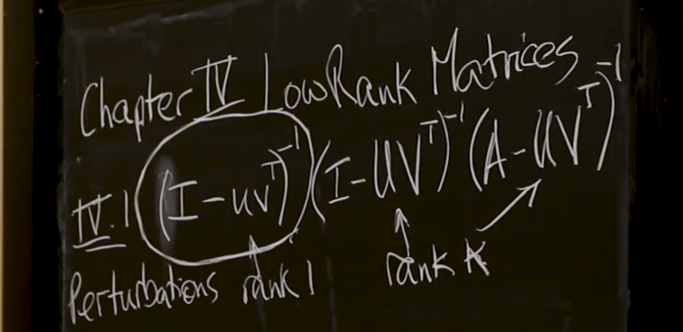 

 

>我们依次来看相应的公式。第一种如下图，我们可以用逆矩阵乘本身的技巧来验证这个是正确的： 

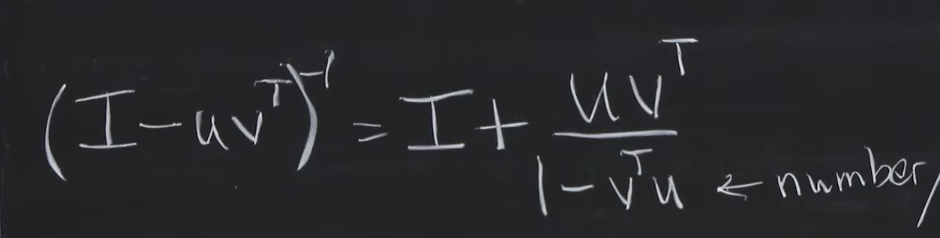 

 

>第二种如下图，我们可以用相同的验证方式： 

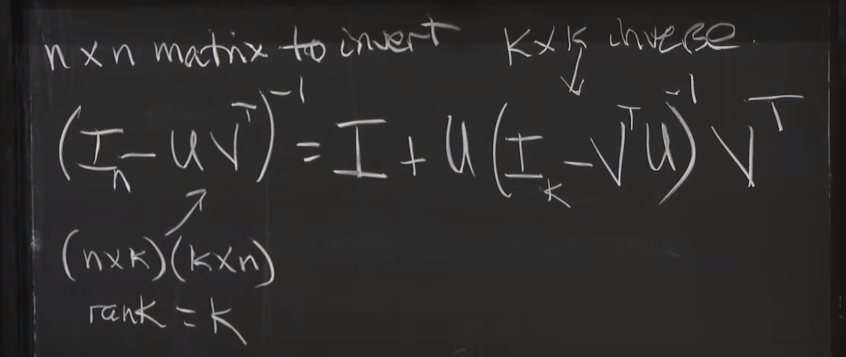 

 

>第三种如下图，这种就类似我们实际中的问题了： 

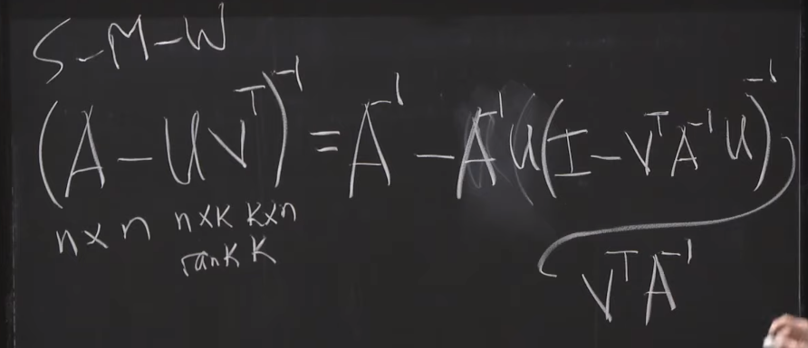 

 

>教授给我们举了最小二乘的动态问题，即不断有新样本加入的问题，如下图所示，我们在原本 $A^T·A·x = A^T·b$ 的基础上给 A 增加了更多的行 $v^T$ (样本)，而此时我们问题的构造就如下图一样，也就是给 $A^T·A$ 了一个秩为 $r(v·v^T)$ 的扰动，而要求得 x-new 的值。这个问题类似于卡尔曼滤波器，至于卡尔曼滤波器如果之后碰见再细究： 

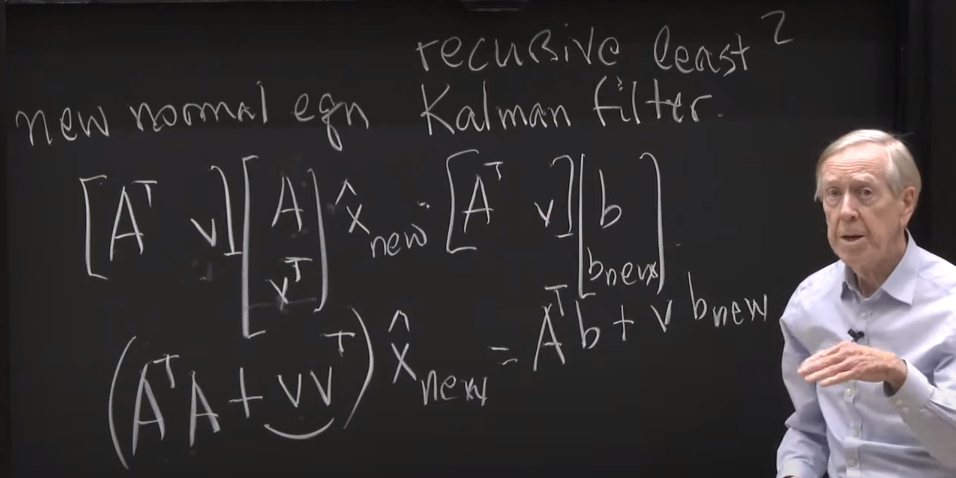 

 

>而扰动问题的解决如下图所示，我们常常在解决一个带有扰动的新问题时(第二行)，已经解决了一个基础问题 $A·w = b$ ，而此时如果我们能解决 $A·z = u$，那么就可以用已知的解来组合为新问题的解，新问题的解的形式见第二张图(这个形式好像有点问题)： 

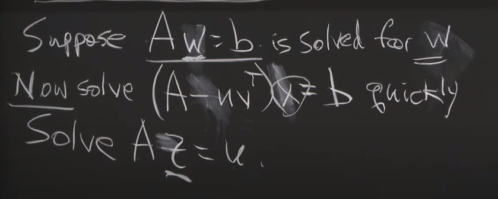 

 

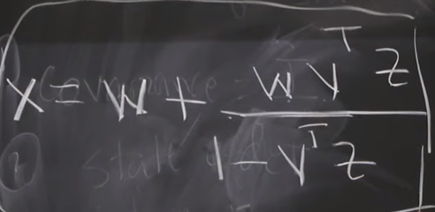 

 

>BTW，这一节的公式推导都没有给出，只是对于前两个关于单位矩阵 I 的扰动公式的正确性进行了验证，这个也很好验证。

## 15. Matrices A(t) Depending on t, Derivative = dA/dt
>这节课开头，教授给我们讲了 $A^{-1}$ 的导数与 A 的导数的关系，如下图所示。先构建一个恒等式 $B^{-1} - A^{-1} = B^{-1}·(A - B)·A^{-1}$，然后我们把 B 看作 A 矩阵的增量矩阵，即 $B = A + ΔA$，再两边除以 $Δt$ 可以得到下面的式子。注意，如果 $B = A + ΔA$ 那么 $B^{-1} - A^{-1}$ 在意义上就能表示 $ΔA^{-1}$ ，就像 $B - A = ΔA$ 一个道理：  

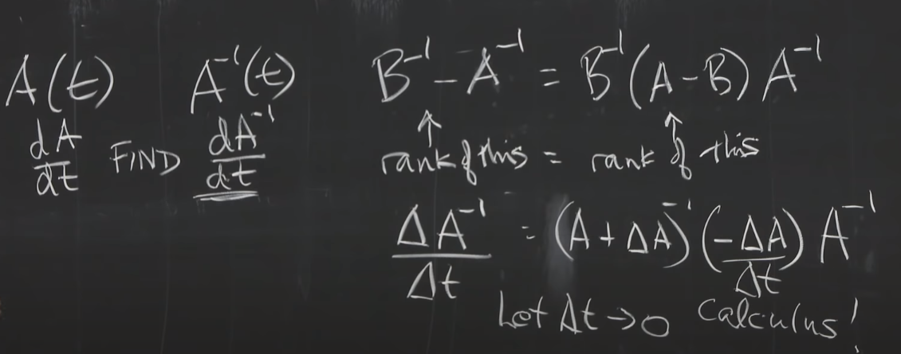 

 

>之后我们再让 $Δt -> 0$，就得到了微分的形式。我们可以把 A 当作 1 * 1 矩阵 [t] 来验证正确性，即其中 $A^{-1} = 1/t$：  

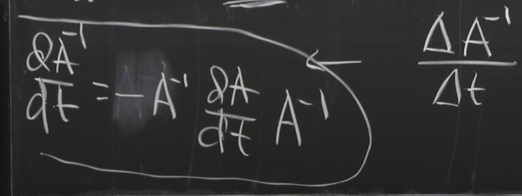 

 

>现在我们解决 $dλ/dt$ 的问题，如下图。其中矩阵 A、A的特征值(λ)、A的特征向量(x)、A行空间的特征值(与 A 特征值相同)、A 行空间的特征向量(y)，都和 t 有关。我们可以得到第一行的 Fact ，其中后面那个的写法不常见，但是确实有如此写法来描述行空间特征向量和特征值关系的公式(我不知道为什么)。然后，$y^T·x = 1$ 的原因下面有一个评论说是因为 Matlab/人工 在处理时，往往对特征向量进行归一化，之后我们对 Fact2 两边同右乘 x(t) 得到 Formula 1(最后一行)，经过化简恰好是 λ(t) ，然后就可以对其求导：  

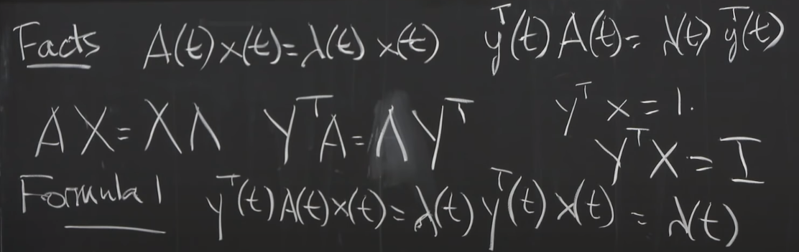 

 

>求导结果如下，神奇的是第一项和第三项相消为 0 (没看懂)，结果只剩下第二项就是 dλ/dt 的值：  

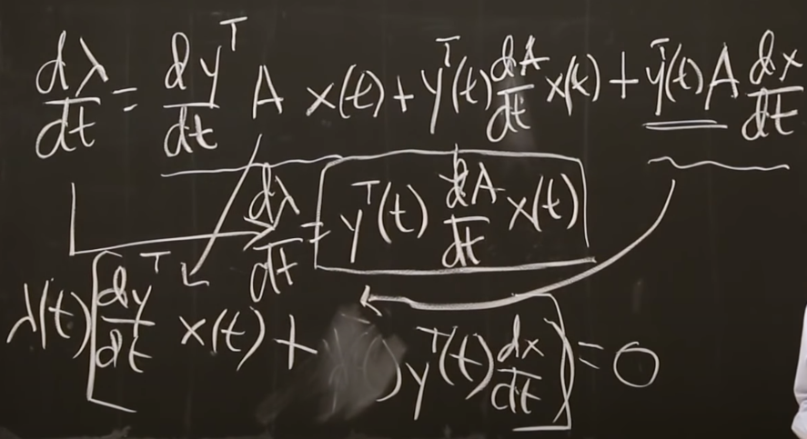 

 

>最后又讲了一些关于 interlacing theorem 交错定理的内容，但是我听的半懂不懂，并且似乎不是很重要，我就不放上笔记了。

## 16. Derivatives of Inverse and Singular Values
>承接上节课，教授讲了 $dσ/dt$ 的公式，和 $dλ/dt$ 的证明方法类似，得出的结论也类似：  

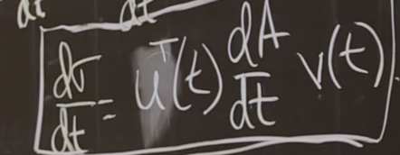 

 

>证明过程如下，和 $dλ/dt$ 的开头类似，教授用一个三项的乘积代表 σ(t) ，这是从 SVD 中的 $Av=σu$ 中得来的，之后用求导法则求 σ(t) 的导数，最后只留下中间项，第一项第三项都为 0 ，并且我们看 $u^T·u = 1$ 的导数（最右边），$(du^T/dt)·u 和 u^T·(du/dt)$这两项其实是相等的，所以 $du/dt = 0$。同理：$dv / dt = 0$，所以第一项第三项为 0 ：  

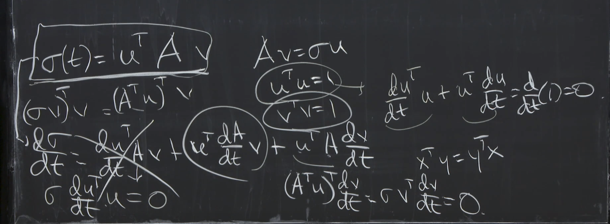 

 

## 17. Rapidly Decreasing Singular Values
>本节课是由 Alex Townsend 讲述，主要讲述关于低阶矩阵的问题。首先为我们陈述了三个关于矩阵奇异值的 Fact 。如果矩阵 x 是 n * n 方阵，前 k 个奇异值大于 0，后面的都小于零，则有：1. 矩阵 x 的秩为 k；2. 矩阵 x 可以分解为 k 个秩 1 矩阵相加的形式；3. 矩阵的行秩和列秩都为 k：  

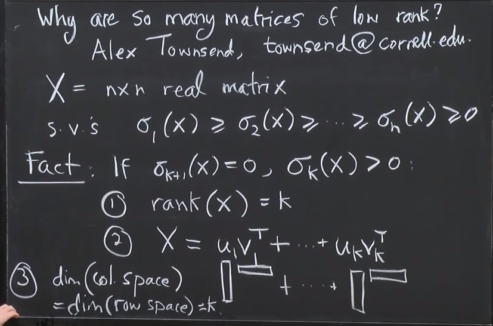 

 

>于是，Alex 给我们举了各个国家的国旗例子。我们可以看到右上角第一行的国旗如果用低秩矩阵展开的形式(上面第二个 Fact)发送的话应该都很容易，因为他们有很多相同的行，而第二行的如日本国旗似乎就不那么理想，第三行含有三角的是最不理想的。因此当我们碰到低秩矩阵时，用展开形式发送简单，而高秩形式就直接发送原矩阵更快捷。至于低秩的具体数字描述见下图第一行，因为我们如果把整个n阶矩阵发送的话，开销为 $n^2$ ，而秩为 k 的矩阵展开我们有 k 项，每一项有 2n 个条目，因此开销为 2kn，如果 $2kn < n^2$，我们就称为低秩。但在实际操作中，我们往往要求 k << n/2：  

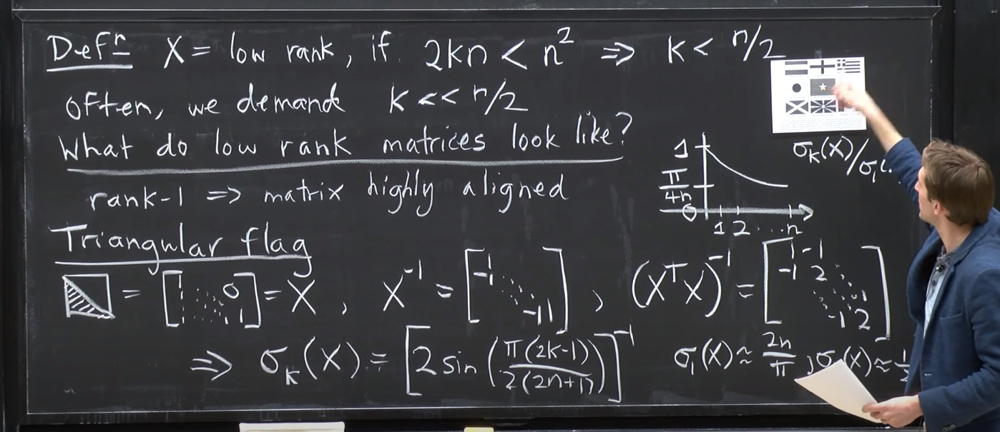 

 

>上图中的三角旗为什么发送开销大呢？Alex 给我们推出了类似左下角形式的下三角 n 阶矩阵的相关逆矩阵，我们由 $(X^T·X)^{-1}$，就能得出矩阵 X 奇异值相关信息，在最后一行 Alex 给我们写出了三角旗矩阵 X 的奇异值，我们发现都不为 0 ，并且不收敛到 0。归一化后画出了奇异值图像，横坐标是第 i 个奇异值，纵坐标是归一化后各奇异值大小。

>之后，就到了圆形旗如日本旗那样，如下图所示。我们可以从旗的中间圆形掏出一个正方形，这样正方形的秩就为 1，剩下的部分就是轴对称图形，我们可以取 1/4，秩是和原来相同的，这 1/4 可以分为两个部分，我们分别计算二者的秩，最后结果取决于图中圆的半径 r，大约下来是 $r/2-1$ 也不会很大：  

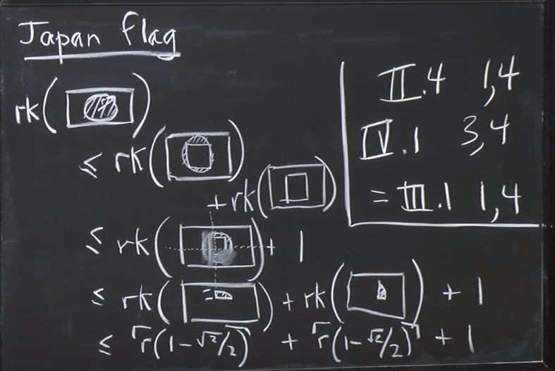 

 

>接下来介绍了数字秩(Numerical rank)的定义，其中 ε 是一个容忍度，我们可以看到 Numerical rank 关联的是奇异值，而不是特征值。而当 ε = 0 时，Numerical rank 就等于 rank 了：  

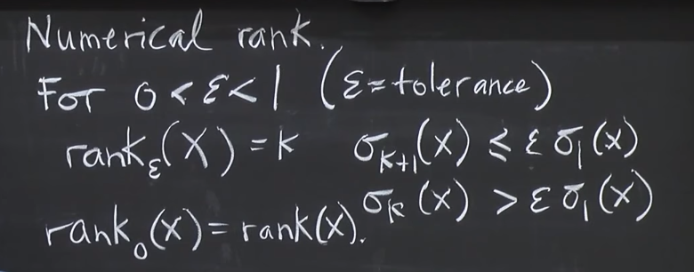 

 

>在实际中有很多 Numerical low rank 矩阵，如下图所示的 Hilbert 矩阵和 Vandermonde 矩阵，这两个矩阵其实是满秩的，但是 Numerical rank 很低。从定义中我们能推测出 Numerical rank 往往会筛出奇异值很低的部分。Numerical low rank 矩阵不总是好的，因为他们的逆矩阵很难求：  

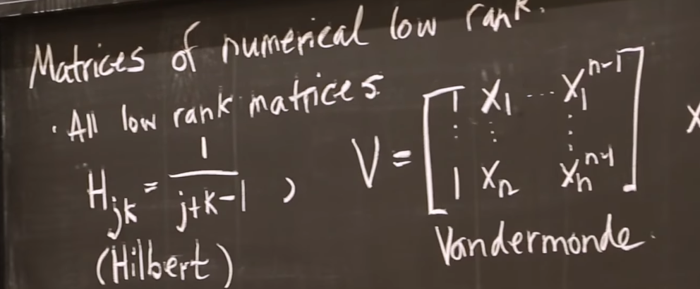 

 

## 18. Counting Parameters in SVD, LU, QR, Saddle Points
>本节课我们逐渐向概率、优化、深度学习进行过渡。首先，教授给我们讲了在计算中各种矩阵分解的参数个数，如下图所示，下面我依次进行推导：  

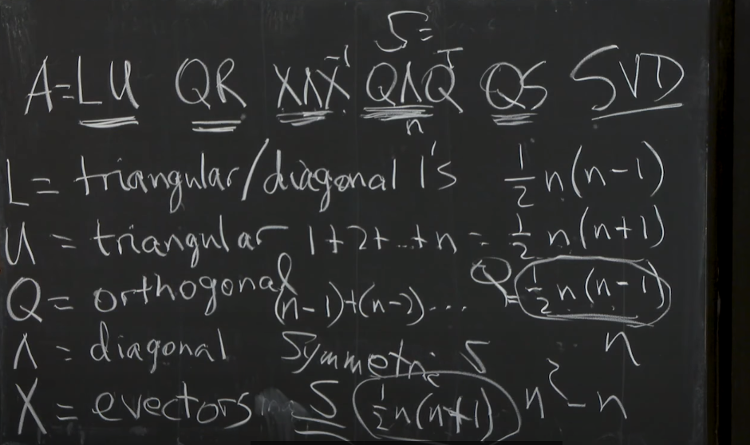 

 

>首先我们从单个矩阵开始看。 
L 代表单位上三角矩阵，对角线元素都为 1，因此对角线 元素不算参数，参数个数为：$1+2+...+(n-1) = 1/2·n·(n-1)$。 
U 代表下三角矩阵，但是对角线元素不设限，因此参数个数为：$1+2+...+n = 1/2·n·(n+1)$。 
Q 代表正交矩阵，正交矩阵的特点是列向量标准化，且两两正交；因此我们选择 Q 的第一列时只需要 n-1 个参数，第 n 个值只需要利用标准化性质计算可得。第二列除了标准化性质，还有与第一列正交性质，因此只需要 n-2 个参数。第三列除了标准化性质，还有与第一、二列正交性质，因此只需要 n-3 个参数，以此类推。总参数个数为：$(n-1)+(n-2)+...+(1) = 1/2·n·(n-1)$ 
Λ 代表对角矩阵，当然有 $n$ 个参数。 
X 代表特征矩阵，计算机在处理时往往有个约定，就是特征向量第一个值为 1 ，这个可以通过对特征向量乘以一个合适的常数 c 来得到。因此参数总数为 $n^2 - n$。 

>下面我们开始看分解矩阵的参数个数。 
$A = LU$ ，L、U两个矩阵可以由上面分别得到参数个数，总的参数个数为：$1/2·n·(n-1)+1/2·n·(n+1)=n^2$ 
$A = QR$ ，Q 是正交矩阵，R 是上三角矩阵但是对角线不限制，因此，总的参数个数为：$1/2·n·(n-1)+1/2·n·(n+1)=n^2$ 
$A = XΛX^{-1}$，$X 和 X^{-1}$只需要取一个另一个就知道了，总的参数个数为：$n^2 - n + n = n^2$ 
$S = QΛQ^T$，Q和QT只需要取一个另一个就知道了，总的参数个数为： $1/2·n·(n-1) + n = 1/2·n·(n+1)$ 
$A = QS$ (polar decomposition极分解)，Q是正交矩阵，S是对称矩阵，总的参数个数为：$1/2·n·(n-1)+1/2·n·(n+1) = n^2$ 
$A = U·Σ·V^T$，这个比较麻烦，我们用下面的图进行解释。我们首先假设矩阵 A 是 $m * n$ 的，并且行满秩，即 $r(A) = m$，并且 $m < n$。然后对于 $U、Σ、V^T$ 的尺寸见下图所示，U 是秩为 m 的正交矩阵，当然参数个数为：$1/2·m·(m-1)$。$Σ$ 秩为 m ，当然参数个数为：m。最后 $V^T$ 有些特别，虽然它是 $n * n$ 的但是它只有 m 列是未知的，且相互标准正交，这部分的参数个数为：$(n-1)+(n-2)+...+(n-m)$。剩下的 $n - m$ 列是来源于零空间正交的标准基向量，因此我们不关心它们的值。所以这三部分加起来恰好是 $m * n$ 个参数。  

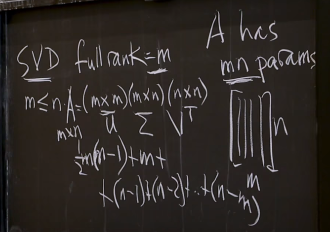 

 

>对于 SVD，更加 general 的情况是 $rank(A) = r < m < n$。此时，分解矩阵的各部分尺寸见下图所示，此时第一部分参数个数为：$(m-1)+(m-2)+...+(m-r)$，对角矩阵参数个数为：r，第三部分参数个数为：$(n-1)+(n-2)+...+(n-r)$，加起来参数个数是: $mr+nr-r^2$  

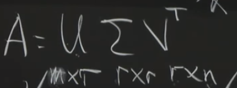 

 

>接下来介绍关于拉格朗日乘数法的内容，如下图。我们在遇到求 $min 1/2·x^T·S·x$ 的问题时，往往会遇到 $Ax = b$ 的限定。于是我们构造 $L(x，λ)$ 分别对 x，λ 求导，得到右下角的矩阵形式方程组。这样求出来的 x 就是鞍点，而不是最值点，因为在 x 方向是最值，但是有 λ 项的约束。鞍点（Saddle point）在微分方程中，沿着某一方向是稳定的，另一条方向是不稳定的奇点，叫做鞍点：  

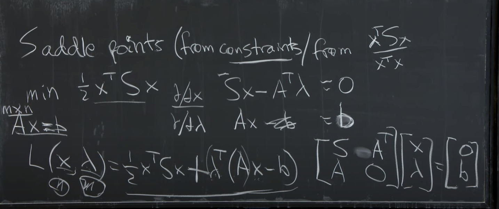 

 

>鞍点的图像如下： 

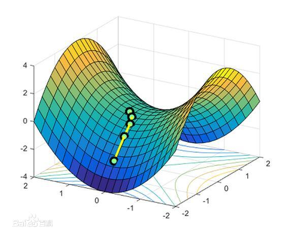 

 

>而对于上述矩阵形式方程组我们能做什么呢？我们可以进行如下变换，于是我们就可以得知主元正负的情况(我也不知道这一步的目的是在干嘛)：  

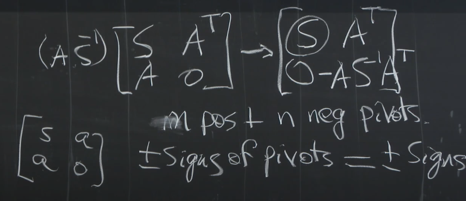 

 

>我们还可以引出瑞利熵(Rayleigh Quotient)：我们看到 R(x) 的最大值就是矩阵 S 最大的特征值 λ1，x 为相应的特征向量 q1，最小值就是矩阵 S 最小的特征值 λn，x 为相应的特征向量 qn。在这之间的其他一些特征值和对应的特征向量得到的 R(x) 就是鞍点：  

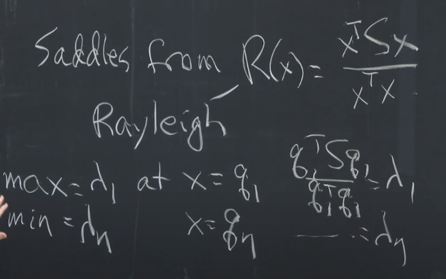 

 

## 19. Saddle Points Continued, Maxmin Principle
>承接上一节，我们讲一下为什么其他特征值对应的特征向量得到的 R(x) 就是鞍点。我们先看一下下面的一个例子。我们取 S 为一个正定矩阵，R(x) 展开的形式也呈现在板书上，特征值以及各特征向量见左下角。其中每个特征向量点对应的 R(x) 的一阶导数都为 0 ，可以当作一个 Fact：  

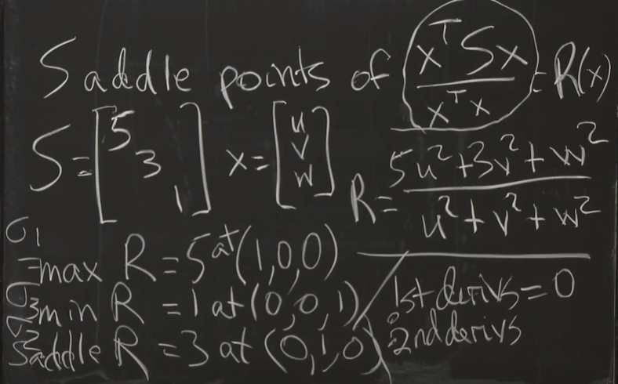 

 

>现在我们研究各个特征值，首先最小值和最大值是显而易见的，而位于中间的特征值 λ2 = 3，有什么特点呢？下面的板书有点混乱，我来解释一下。首先，我们的结论是：λ2 是 R(x) 的一个鞍点，并且在某一个二维子空间内是最大值点，在另一个二维子空间内是最小值点。我们取子空间 (u,v,0) ，如右下角所示，这是 λ1 对应特征值 (1,0,0) 和 λ2 对应特征值 (0,1,0) 张成的子空间，在这个子空间内 R(x) 的最小值为 3 ，对应的 R(x) 展开式见右上角；但在 λ2 对应特征值 (0,1,0) 和 λ3 对应特征值 (0,0,1) 张成的子空间 (0,v,w) 内，R(x) = 3 是最大值：  

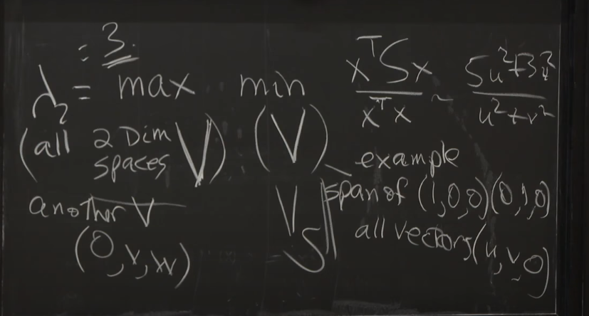 

 

>最后教授提到了关于均值、方差的内容，为了引出下节课的协方差矩阵。关于均值，我们分为样本均值和均值的期望(expected mean)。同理，方差也分为样本方差和方差的期望。他们也都有离散和连续情况的公式。下图 1 是关于均值，下图 2 是关于方差(注意大写的 N 表示实验次数，小写的 n 代表实验结果的可能数)：  

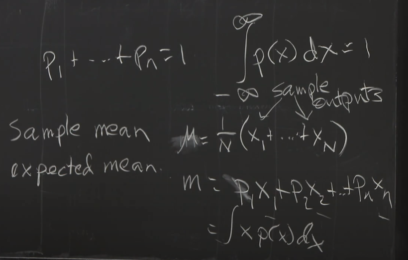 

 

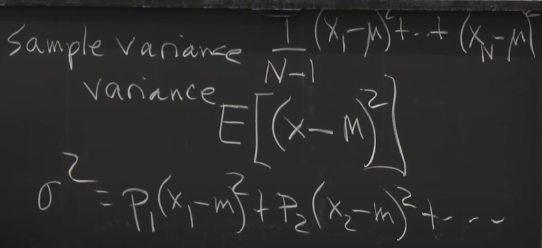 

 

## 20. Definitions and Inequalities
>本节课我们主要讨论概率，因为这是深度学习很重要的一部分。首先，教授接着上节课给我们讲了关于方差的内容，我们从上节课的方差公式可以进一步进行化简(注意倒数第二行的第二项其实是 2E[X] ，但是 E[X] = m = 均值，于是得到图中的公式)：  

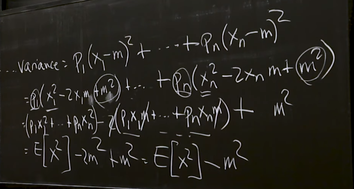 

 

>之后介绍了马尔可夫不等式，这在之前的概率论课程中也讲过。需要注意的是马尔可夫不等式成立的前提假设是 xi >= 0：  

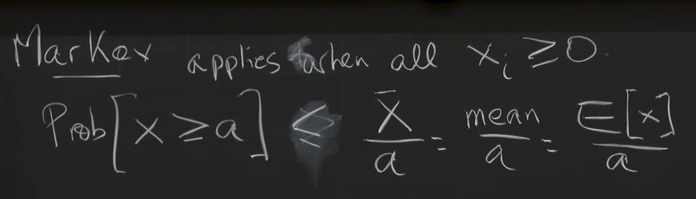 

 

>之后是切比雪夫不等式，这个不等式没有前提假设的要求：  

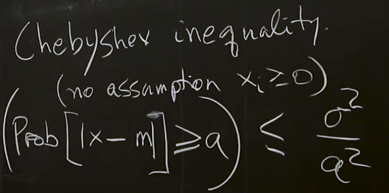 

 

>课上给出了用马尔可夫不等式证明切比雪夫不等式的过程，但是我感觉不太清晰，于是借用知乎上一位up的证明过程，至于更详细的两个不等式证明过程见[马尔可夫与切比雪夫](https://www.zhihu.com/question/27821324)：  

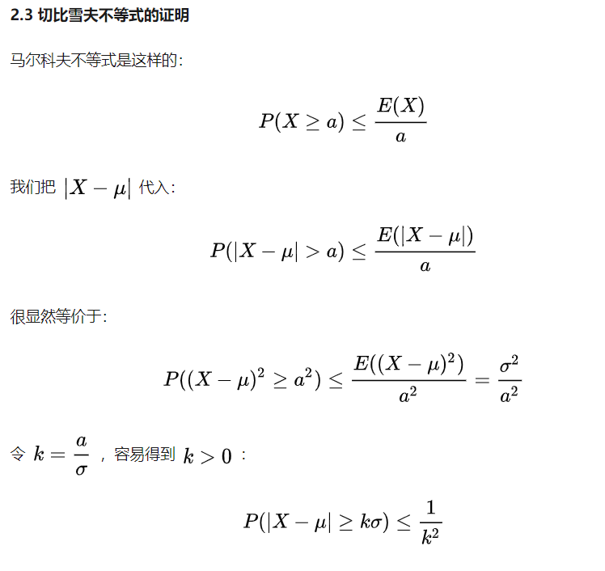 

 

>在介绍协方差矩阵前，教授给我们举了一个抛硬币的例子，先告诉了我们什么是张量(tensor)。当我们同时做两个抛硬币实验时，我们可以把两枚硬币横着粘起来，也可以两个单独做，这样我们可以写一个概率的矩阵：  

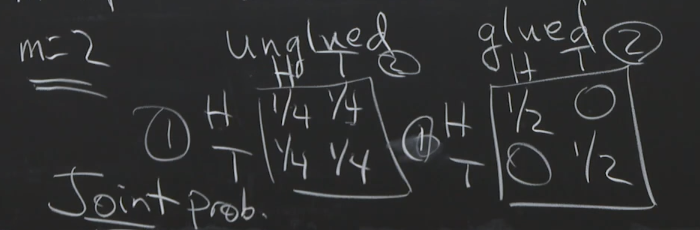 

 

>但是当我们同时做三组抛硬币实验时，我们得到的概率图不是 $3 * 3$ 的矩阵，而是一个 $2 * 2 * 2$ 的立方体，每一维有两个结果：正/反，然后三组实验联合起来构成一个立方。这就是张量的形象描述。

>最后就是协方差矩阵的内容了，当我们同时做两组抛硬币实验时，我们可以得到下面的二阶协方差矩阵 V 。我们可以看到协方差矩阵 V 是对称的，并且在左上角项和左下角项分别是实验 x 和实验 y 的结果方差，而在次对角线上描述的是 xy 的联合方差结果，表述了两个实验的相关性。当两枚硬币 unglued 时，次对角线上两个元素为 0；当两枚硬币 glued 时，次对角线上 $σ_{xy}^2 = σ_x^2 + σ_y^2$ ，此时矩阵 V 是奇异的，半正定的，其他情况 V 都是正定的。在此只做一个简要介绍，不做详细推理计算，有一个宏观概念即可：  

 

 

## 21. Minimizing a Function Step by Step
>本节课我们介绍 optimization 优化问题。首先教授提到关于函数近似的内容，如下图所示，很明显这里是用泰勒展开式来进行近似的，但是稍有不同的是，第二行将泰特展开扩展到了矩阵形式。这时 x 不再是单变量，而是一个向量 $[ x1,x2...xn ]$，函数 F 对 x 的导数就成了梯度(为一个向量)，F 对 x 的二阶导数就是一个 Hessian 矩阵：  

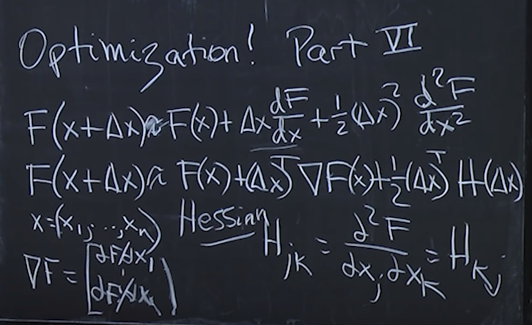 

 

>关于梯度定义和 Hessian 矩阵定义。其中，黑塞矩阵（Hessian Matrix），又译作海森矩阵、海瑟矩阵、海塞矩阵等，是一个多元函数的二阶偏导数构成的方阵，描述了函数的局部曲率。黑塞矩阵常用于牛顿法解决优化问题，利用黑塞矩阵可判定多元函数的极值问题。在工程实际问题的优化设计中，所列的目标函数往往很复杂，为了使问题简化，常常将目标函数在某点邻域展开成泰勒多项式来逼近原函数，此时函数在某点泰勒展开式的矩阵形式中会涉及到黑塞矩阵：  

 

 
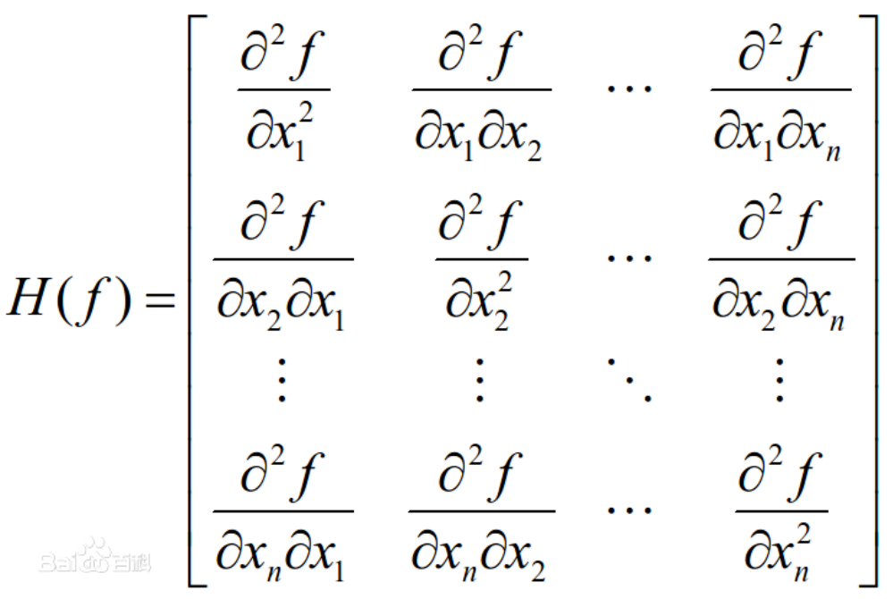 

 

>下面叫要介绍 Jacobian 矩阵，注意和 Hessian 矩阵进行区分，  

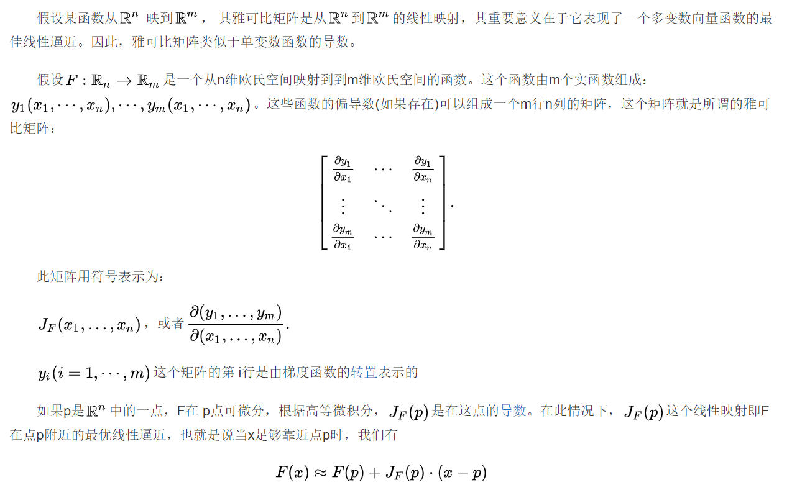 

 

>知道了 Jacobian 矩阵，我们就能引出牛顿下山法的内容。此方法是基于光滑函数（导函数连续）通过迭代将零点邻域内一个任选的点收敛至该零点（也就是方程的解）。  

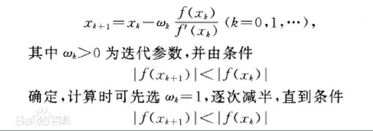 

 

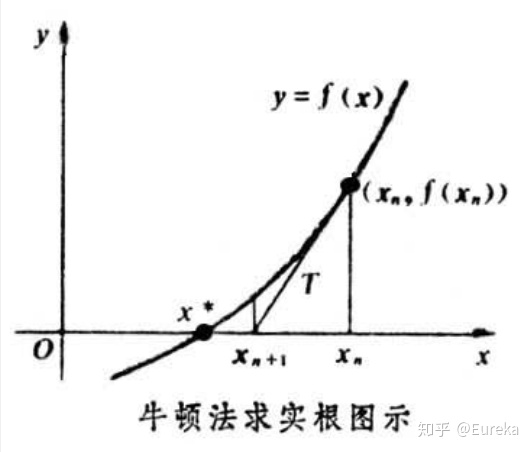 

 

>上面是基于一元函数在一维时的情况，当我们扩展到高维情况公式就变为下图所示情景。注意，这里只是在求高维函数的零点：  

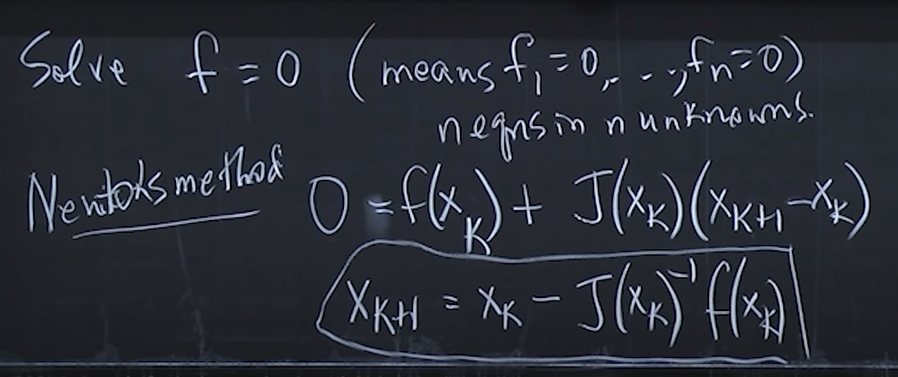 

 

>那我们如解决高维函数的优化问题呢？其实就是解决梯度为 0 的情况，即求梯度函数的零点。一种方法是 Steep descent，在此不做证明；另一种是牛顿法优化：  

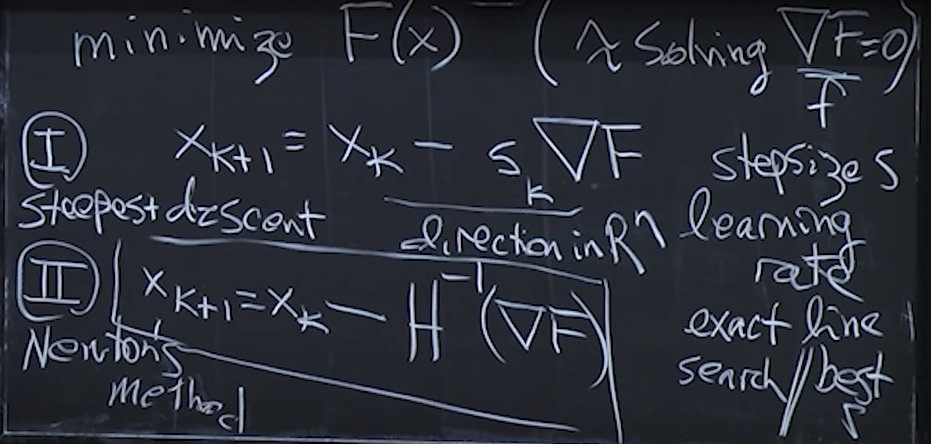 

 

>我们主要证明的是牛顿优化问题，因为板书上的证明过程很简略我就用知乎上的一个证明，如下图。我们看到 Steep descent 每次的变化参数是一个固定值 s ，也就相当于学习率的概念。但是牛顿法这里用的是 Hessian 矩阵，因此会更加合适，收敛会快一些：  

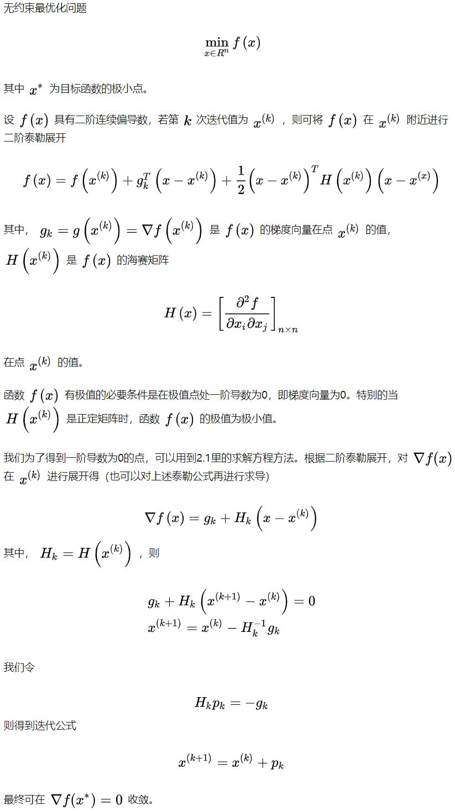 

 

>最后教授又提到了关于凸函数的证明问题，在一元情况中，我们只需要证明二阶导数大于等于 0，则这个函数是凸函数。但是多元中我们需要证明 $f(x) = x^T·S·x >= 0$，其中 S 是 Hessian 矩阵(当曲线光滑时，Hessian 矩阵为对阵矩阵 symmetric ，我们用 S 代替)。也就是说 Hessian 矩阵必须是一个正定/半正定矩阵，我们就可以说原函数是一个凸函数。

>ps.中国大陆数学界某些机构关于函数凹凸性定义和国外的定义是相反的。Convex Function在某些中国大陆的数学书中指凹函数。Concave Function指凸函数。课堂上 Convex 指的是凸函数，如开口向上的一元抛物线函数，或开口向上的碗状二元函数。

## 22. Gradient Descent: Downhill to a Minimum
>在本节课开始，教授讲了两个关于求函数梯度的例子。第一个例子，我们设一个严格的凸函数(Hessian正定) f(x)，如下图所示。我们要求这个严格凸函数的最小值，于是我们求对向量 x 的梯度 $ᐁf = 0$，得到在 $x^*$ 处取得最小值，最小值点代入可得最小值 fmin 图中未带入计算：  

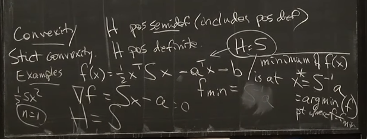 

 

>第二个例子是另一个函数 f(X)，这里 X 为一个矩阵，如下图(我们把 log 理解成 ln 来看后面的推导)：  

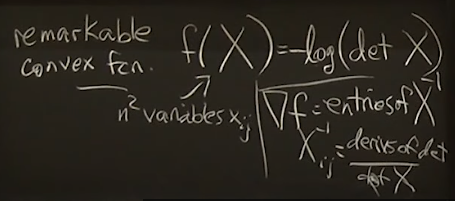 

 

>我们都知道对 f(X) 求导结果为：if $f(X) = -ln(det(X))$, gradient(f) = (derivatives of det(X))/det(X) in matrix form (ln函数求导规则)，而 derivatives of det(X) 是个什么呢？我们在线性代数中学过行列式按行展开，如下图，我们此时按第一行展开，而这样看 det(X) 对 x11 求偏导，其实就是第一个括号里的内容，也就是我们常说的伴随矩阵 A* 的第一项 (下图中叫 minor/cofactor )，对其他元素的导数以此类推。而我们发现，构造的这个函数对 X 的导数形式，恰好就是 $X^{-1}$ ，因为我们在线代中学过 $A^{-1} = A^* / det(A)$。因此这个函数的梯度 ᐁf，就是 entries of $X^{-1}$，结果见上图右下角。  

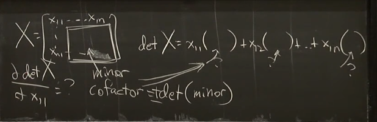 

 

>最后教授讲了关于梯度下降的一个简单例子，如下图所示，我们假设优化的函数为 $f(x) = 1/2·(x^2+by^2)$，对应的矩阵 S 如下图2所示(其中，b < 1)。图2中的图就是 $1/2·(x^2+by^2) = c$ 的图像(平面图)，如果我们从$(x0,y0) = (b,1)$点开始，优化过程中的 $x_k,y_k,f_k$ 值见图一，这里用的方法是 steep descent 公式见上文。我们可以看出如果 b 很小，那么平面图像就是细长的，对应的优化过程就是震荡 zigzag 很严重的，不好收敛，下节课我们进行详细推导：  

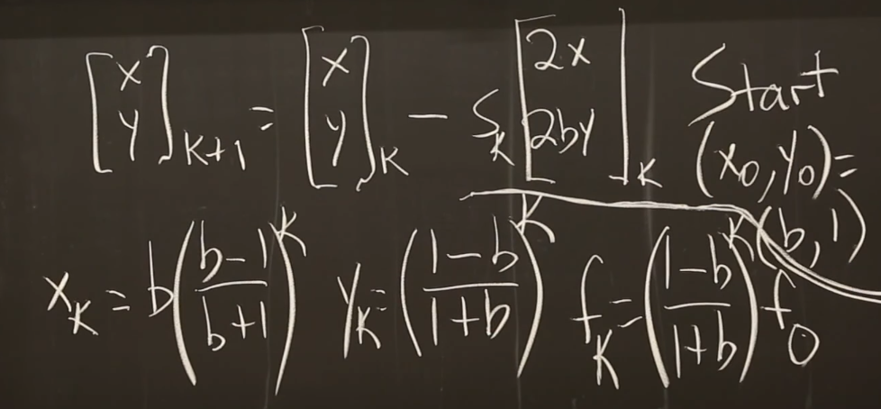 

 

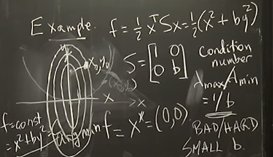 

 

## 23. Accelerating Gradient Descent (Use Momentum)
>本节课主要提到了三个梯度下降的变式。 第一个就是 SGD (首先与minibatch概念注意区分 minibatch：一次取一部分训练数据的梯度下降。SGD 中我们选取输入数据 x 的一部分分量的梯度方向进行参数更新，因为总的 x 维度 d 往往很大，数据量 n 也很大，这种随机的选取分量梯度进行更新在我们远离最终结果时是很有效的，因为每一个分量对应的梯度都是往最优的方向走，但是当我们快到达最优解时会出现震荡，因为有些分量方向梯度趋于最优解，有些可能已经过了，但是在机器学习中，我们往往需要这种非最优解的训练结果来使系统有更高的鲁棒性。还有一点就是 SGD 比 GD 往往在学习率上更加敏感) 。 第二个是 Momentum，公式见下图1，可以看到这个方法在梯度选择上有所不同，第 k 次梯度下降的方向还参考了第 k-1 次方向的 β 倍，这样 zigzag 就没有之前那么厉害了。这个部分的优化图在 Pytorch 书 P63 页有一个示例。 第三种就是 Nesterov 方法，公式见下图 2，它采用的更新准则不是到达的点，而是第 k 次和第 k-1 次之间的点，选取的梯度也类似：
  

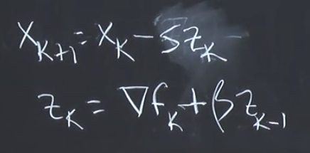 

 

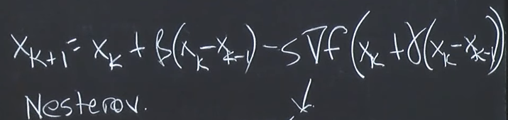 

 

## 27. *Backpropagation(whole neural network process)
>关于反向传播算法可能是神经网络里最难理解的一个部分，我在这节课上也是听的一头雾水。因此，我看了看 [3Blue1Brown 的Backpropagation视频教学](https://www.bilibili.com/video/BV16x411V7Qg/?spm_id_from=333.788.videocard.1)，现在有了一些思路，下面我总结一下。我会从前向传递讲起，到反向传播，最后再到梯度下降。因为我觉得这种顺序更加容易让人理解神经网络的整个运行过程。 
首先，我们用下图做一个示例(不用在意图中文字)，图中是一个由四层神经元构成的神经网络，面向的是 28 * 28 像素的手写数字识别问题。首先第一层是由 784 个神经元构成，一个神经元代表一个像素，第二第三层都是 16 个神经元，最后一层代表分类结果一共用 10 个神经元，也就是 10 类。我们现在把每个神经元当作一个处在[0,1]的数据，我们称之为“激活值”，偏白色的就比较大接近 1，偏黑色的就比较小接近 0 。最后一层越白的神经元，代表图像越接近那个类别：  

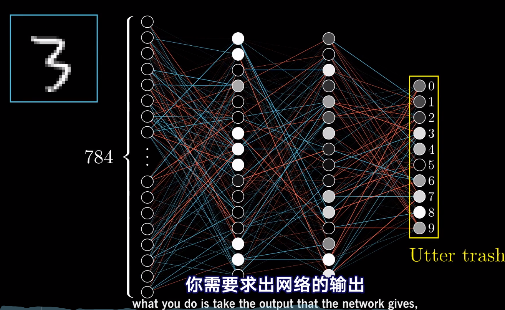 

 

>其次，我要说的是，我们都知道神经网络其实是由两种参数构成：神经元的权重、偏差bias。激活值我们上面提到了是神经元代表的数值，那权重其实就是上面图像中两两神经元之间的连线代表的大小，偏差bias是一个常数值，这三个部分又是如何联系起来的？又如何决定下一层输出的呢？这个问题其实属于 3Blue1Brown 随机梯度下降部分的内容，我用一个公式来表示，如下图。对于最后一层数字 2 代表的这一个神经元来说，它的值是怎么由前面的值决定的呢？其实是前一层 16 个神经元的激活值乘以对应每一个边的权重加上偏移量bias，最后经过一个激活函数 σ(这里代表sigmoid)，最后算出来是 0.2。我们写成向量形式就是 y = σ(wT·a)。：  

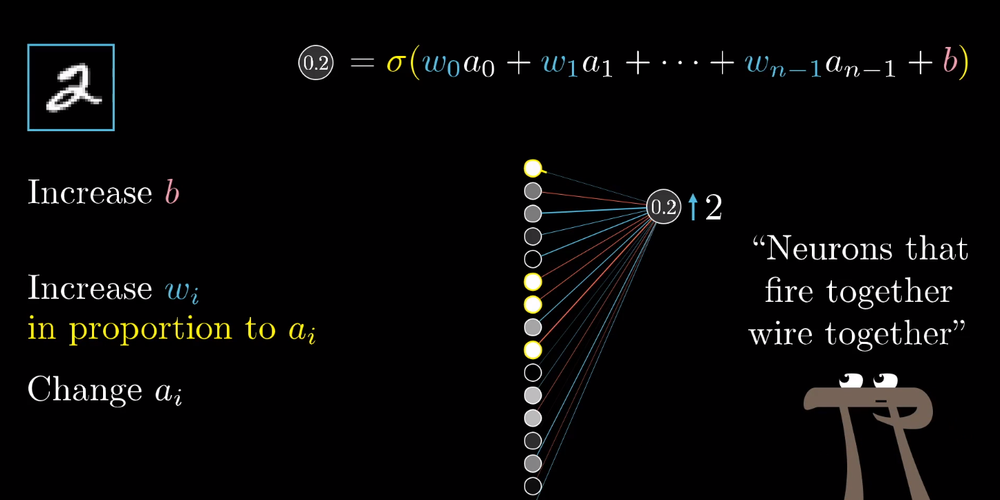 

 

>好了，现在我们弄清楚了最后一层的一个神经元输出是怎么产生了，我们向前再迈进一步，如下图所示，我们现在取两个完整的层来看构成的矩阵形式是什么样的。下面介绍的时候还是用手写数字的具体尺寸来给大家介绍，这样避免抽象的n，k等字母让人产生混淆。首先此时的激活值向量 a 不变，还是涉及倒数第二层的 16 个神经元，而权重向量 w 现在成了一个矩阵 W ，矩阵的尺寸为 10 * 16，每一行与每一个激活值相乘，得到最后一层一个神经元的输出值。因此，最后一层的输出值也从一个单个的数值 y 变成一个矩阵 Y。完整的矩阵表达就成了 $σ(W·a) = Y$。当然前面每一层的输入，也是由同样的方法经过上一层的激活值、对应的权重、偏移还有激活函数决定的。需要注意的是，在我们神经网络的开始阶段，我们是随机地进行初始化的，给每个权重、偏移赋一个初始值，来计算每个神经元的激活值，第一层的 784 个神经元激活值是由输入进来的图像灰度值来得到的：  

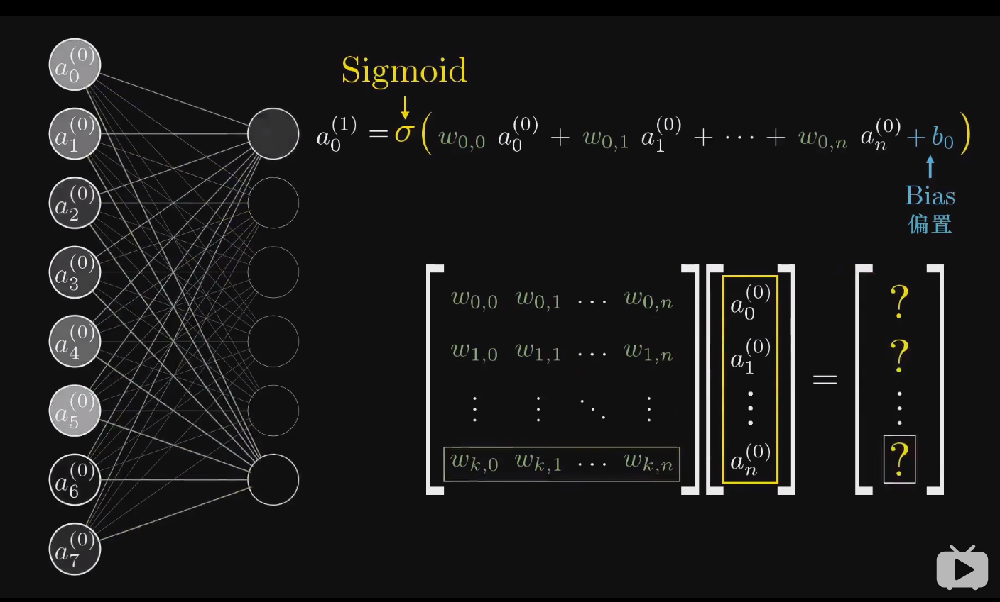 

 

>好，现在我们已经弄清了一个部分，如何进行前向传递。那么随机的初始化权重和偏移bias后，经过前向传递依次计算完成后，最后一层得到的数值可以说就是 Utter trash，就像上面第一个图一样，我们传进去一个数字 3 的图像，本来想要最后一层 3 对应的神经元变白，即数值接近 1，其他的全都接近黑色就行。但是现在很多都成白色的了，甚至 3 对应的神经元并不是最白的。那么这中间就存在误差，我们常称之为 Loss 。我们可以进行下图的处理，计算每一个输出与我们期待的标准输出的误差，这里用平方取一个正值。对于一张训练图片，我们会得到如下图的 10 个误差，我们对其进行求和，然后得到一个数值，可以用来评价神经网络对这张图片分类的好坏程度。把所有的图片误差值全部加起来，就能得到网络对整个数据集分类的好坏程度，也就是 Loss：  

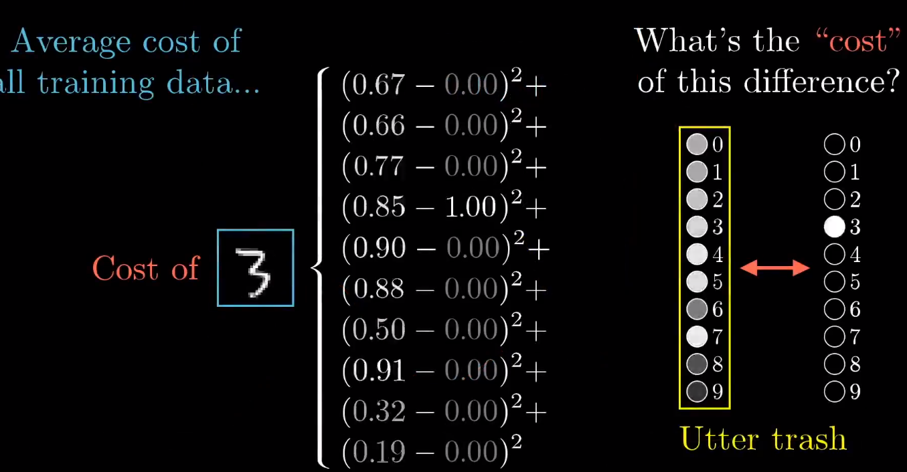 

 

>当然，用一个数值来表示网络的好坏程度，并不能让网络进行调整与更新。毕竟对于上面的四层网络来说，它第一二层之间有 784 * 16 + 16 个参数，第二三层之间有 16 * 16 + 16 个参数，第三四层之间有 16 * 10 + 10 个参数，全部加起来是：13002 个参数！(参数来自每两层之间的矩阵 W 和偏移 bias)。那么我们要知道什么信息才能让神经网络进行参数调整呢？ 
这里我们要先有一个概念，就是我们优化的到底是什么函数？我们知道这个代价函数对应的参数其实就是那 13002 个参数，而代价函数的输出就是总的 Loss 值。但是由于这个代价函数过于复杂，我们没办法去想象它的图像究竟是什么样子的。不过我们知道，因为网络层中，每一层 W·a = Y 都是线性连续的，但是这个 Y 要再经过一个激活函数 σ ，那么最终就成了一个非线性的了。不过，代价函数连续的本质没有变，它一定是一个光滑的。 
只要它是光滑的，我们就能够进行梯度下降算法。至于梯度下降算法，我在前面的章节已经讲过了。但是这里又有一个问题，这里的“梯度”在神经网络中到底代表着什么？下面用一个超级简单的网络结构给大家做一个讲解，下图所示，是一个四层网络，每一层只有一个神经元，因此整个网络只有 3 个权重，3 个偏移bias，这 6 个参数决定着最后的输出，同样也决定了最后的代价函数 C：  

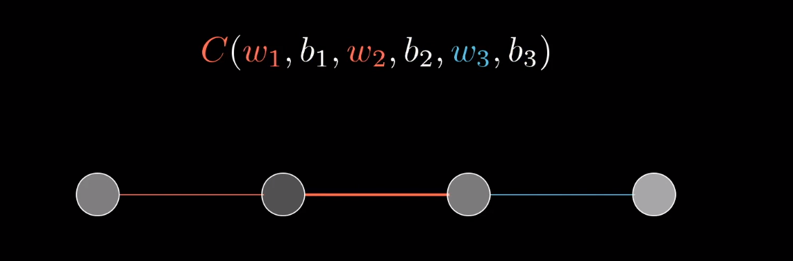 

 

>下面这张图用字母来表示了两层之间的参数关系，我们一起来看一下。其中 (L) 代表着这个参数对应的层数为第 L 层。首先 z = 权重 w * 激活值 a + 偏移 b；z 再经过激活函数 σ 得到输出 a；输出值 a 与标签(期待输出) y 作差再平方得到最后的代价函数 C。对应关系也可以从左下角的树形结构中得出，这一套关系我们必须非常熟悉：  

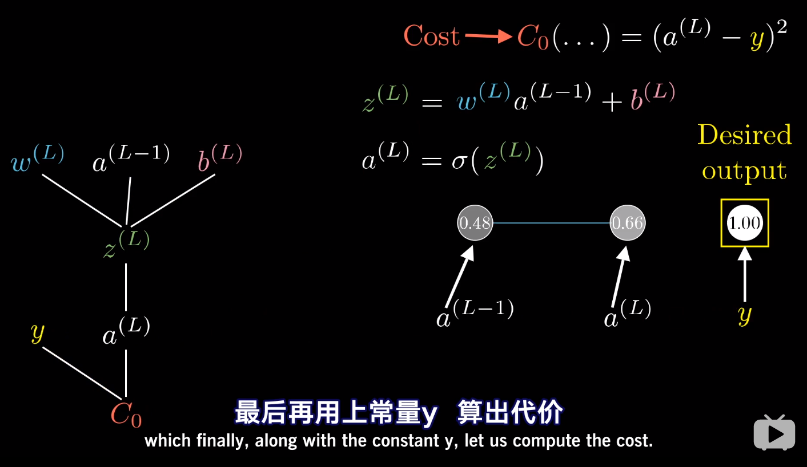 

 

>那么下面，我们就能引出这里的“梯度”概念了，如下图所示。既然我们要达到调节权重和偏移两种参数的值，我们就要知道这两种参数的改变究竟会对我们最后的代价函数值产生多大的影响。也就是，我们需要用代价函数分别对权重和偏移进行求导，而代价函数与这两个参数并不是直接关联，而是间接关联，因此我们就要通过链式求导法则进行求导，如下图就是对权重进行的求导过程。求导后我们带入相应的数值，就能得到代价函数对 w 权重的导数值。类似的我们也可以求代价函数对偏移 b 的导数值，这两个导数值构成的向量就是我们所说的“梯度”。它负方向代表了代价函数降低最快的方向，它的两个分量大小表示了代价函数应该往那两个方向走多远。  

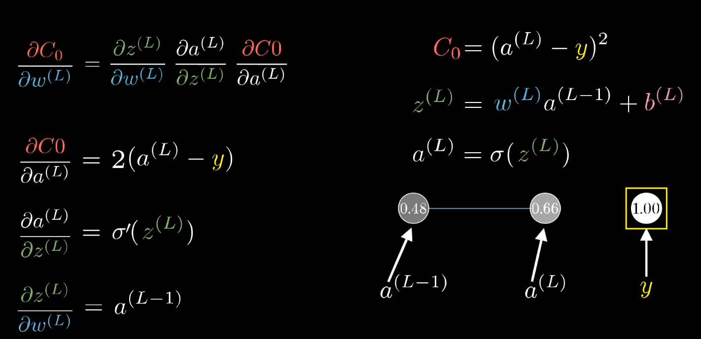 

 

>我在这里想对上面图的链式求导法则再多说几句，我们单看链式法则的最后一项 z 对 w 的求导，如果代价函数 C 对 w 的导数大，那么就要 z 对 w 导数大，也就是上一层的输出 a(L-1) 要大。我们这里可以试着开阔一下思维，前面我们所说的梯度内容都是基于那个很简单的只有 6 个参数的四层网络。如果我们联系手写数字的那个复杂一点的网络，对于最后一层那个网络的前一层不止一个输出，而是 16 个输出，即 16 个 a ，那么前一层神经元哪个 a 更大一点，哪个 a 就会对梯度值分量影响更大，我们就需要多往那个梯度的反方向走，从而得到更好的降低代价函数值的效果。 
>现在我们回到这个 6 个参数简单的例子中，现在我们计算出的梯度，其实只是一个图片输入得到的结果，最终，我们梯度下降的梯度其实是所有图片输入得到的梯度平均值，下面的图片说明了 w(L) 的导数情况：  

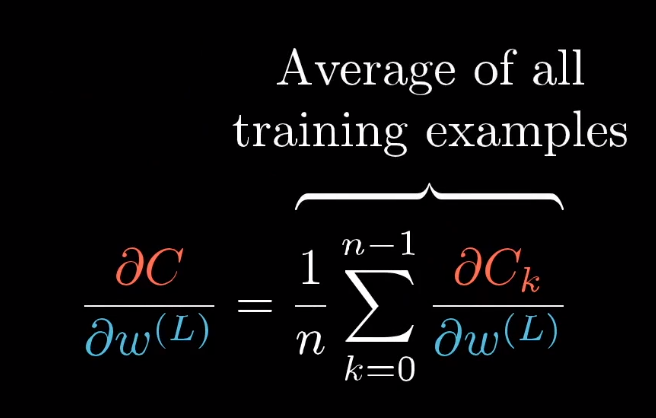 

 

>不过上面图片得到的结果不过是最终梯度的一个分量，即 L 层的 w 对应的分量。我们要调整所有的参数，就要计算所有的梯度分量，如下图所示。在手写数字识别中，整个梯度向量是由 13002 个分量构成的。而反向传播的概念其实就可以引出了，我们观察上面的链式求导过程以及结果，可以观察到第 L 层的 w 对应梯度分量值其实是根据 L 层的 a(L)，期待输出值 y，z(L)，和上一层的结果 a(L-1) 共同决定的。那么，我们很容易推得，L-1 层的相关参数对应的梯度分量其实是由 L-1 层和 L-2 层相关值决定的，以此类推，我们可以得到所有的梯度分量——这就叫做梯度反向传播：  

 

 

>梯度向量得到了，那么接下来梯度下降算法便得以实施，手写数字 13002 个参数依次更新，此时我们无论用 steep descent 还是牛顿的方法都是没问题的了。

>最后我强调一点就是之前说的 SGD 在神经网络中的操作，如果我们每次用整个训练数据集进行输入计算，那么最后累加得到的梯度向量就一定是代价函数降低的方向。但是，这样开销有时候会让计算设备负担不起。因此我们采取 minibatch 的思想，一次取一小部分数据进行梯度累加，得到一个梯度向量，进行梯度下降更新。这样做的结果我们之前也提到过，就是开始时会很明显下降，但是接近最优解时会产生振荡。不过这样做无论是从速度还是鲁棒性来说都比 pure GD 要好。

>[这里有个关于神经网络可视化理解的网站大家可以点进去玩一玩！](http://playground.tensorflow.org/#activation=tanh&batchSize=10&dataset=circle&regDataset=reg-plane&learningRate=0.03&regularizationRate=0&noise=0&networkShape=4,2&seed=0.07140&showTestData=false&discretize=false&percTrainData=50&x=true&y=true&xTimesY=false&xSquared=false&ySquared=false&cosX=false&sinX=false&cosY=false&sinY=false&collectStats=false&problem=classification&initZero=false&hideText=false)

## 30. Completing a Rank-One Matrix, Circulants!
>本节课教授讲了讲根据 m + n - 1 个已知元素构造 m * n 秩 1 矩阵的技巧。就是一个小 trick，听个乐。我们看下图，我来解释一下这个 trick。我们先看左上角 3 * 3 的矩阵，带叉号的元素是已知元素，我们要根据这 5 个已知元素构造出一个 3 * 3 的秩 1 矩阵。根据秩 1 矩阵的特点，我们知道任意一个 2 阶行列子式都等于 0 。因此，一个 2 阶行列子式中如果有三个已知量，第四个就能根据行列式为 0 算出来。因此，下面的 3 * 3 矩阵是可以构造成功的。那么如何验证何时成功何时不成功呢？我们可以根据右下角的 4 * 4 矩阵和其中的已知元素，构造一个连线图，左边的1234代表行，右边的代表列，一个已知元素代表一条连线。如果连线构成一个循环，则不能构造一个秩 1 矩阵，反之可以 (已知元素数量为 m - n + 1)：  

 

 

>下来介绍关于卷积的内容，在介绍卷积之前，我们看一下循环矩阵的定义。如下图这就是两个循环矩阵，我们发现每一列向量循环下移一格就是下一列的向量，而所有的循环矩阵都可以用矩阵 P 来表示：  

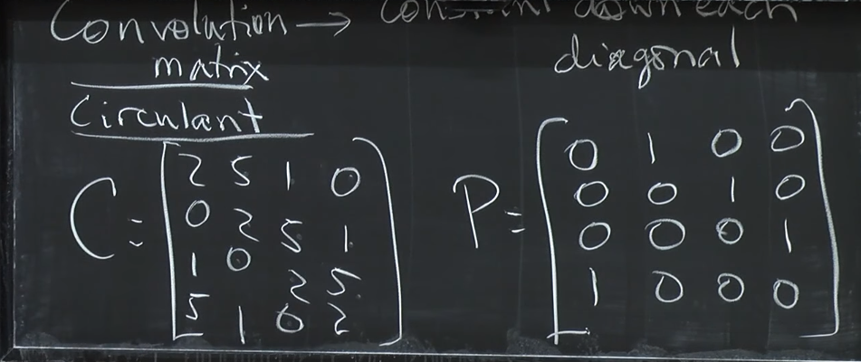 

 

>表示的多项式形式如下，并且我们观察到 P 矩阵的平方也是循环矩阵，并且任何矩阵经过 P 矩阵作用后，每一列都向下移一格。还有一个特点就是对于四阶矩阵 P， P^4 = I 单位矩阵，即又循环回来了。根据多项式的特点，循环矩阵乘循环矩阵结果还是循环矩阵：  

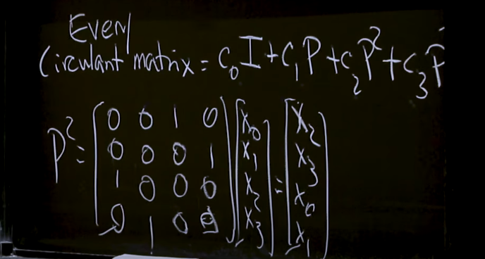 

 

>下面正式介绍卷积的定义，卷积其实是定义在多项式上的，如下图所示。两个向量卷积 $(3,1,2) * (4,6,1) = (12,22,17,13,2)$ 其实是 $(3+x+2x^2)·(4+6x+x^2) = (12+22x+17x^2+13x^3+2x^4)$的系数：  

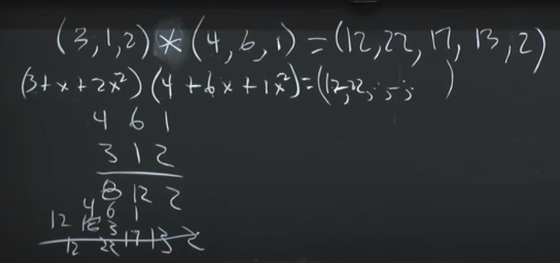 

 

>但是循环卷积就不一样了，如下图所示。因为这是三阶的多项式，因此 $x^3 = 1 ，x^4 = x$，因此最后两个系数要加到前面两个上面去，得到的结果就是 $(25,24,17)$：  

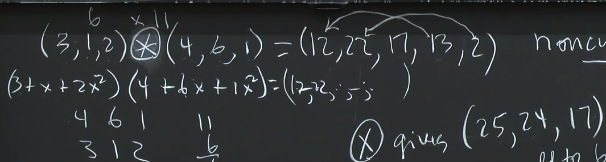 

 

>我们总结成一句话：循环矩阵的乘积完全对应于循环地多项式乘积，这就叫做循环卷积。

>最后我们看一下循环矩阵的特征值和特征向量的特点。首先比较明显的是对于四阶循环矩阵 P ，特征向量一定有 [1,1,1,1] 和 [1,-1,1,-1] 因为 Px = λx，P作用到向量 x 上，向量 x 元素向下移一格，还是原来向量的 λ 倍，这两个明显符合，对应的特征值分别是 1 和 -1。下节课我们会看到特征值还有 i 和 -i。

## 31. Eigenvectors of Circulant Matrices: Fourier Matrix
>接着上节课的内容，我们根据旋转矩阵的通式很容易求得以下结论：P 的特征向量也是任意旋转矩阵 C 的特征向量，即任意同阶旋转矩阵有相同的特征向量。但是，不同旋转矩阵的特征值各有不同，我们用之前的方法求一下四阶旋转矩阵 P 的特征值，如下图。得到 1，-1，i，-i。在复平面单位圆上就占据四个顶点。类似的我们可以求得八阶旋转矩阵 P 的特征值，得到等式 $λ^8 = 1$，解就是复平面单位圆上均匀分布的八个点。于是我们可以推得通解形式，即 $λ = w^1，w^2 ... w^N$，其中 $w = e^{2πi/8}$，N 取决于旋转矩阵的阶数。并且我们观察到 $w^2N = w^N = 1，w^{N+1} = w^1$ 等等循环特性：  

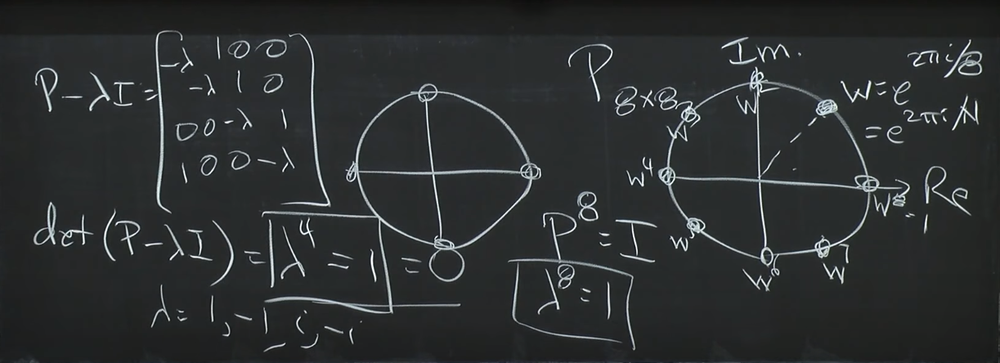 

 

>正因为有循环特性，因此我们可以把它与傅里叶矩阵联系起来。实际上，每一个旋转矩阵的特征向量构成的矩阵都对应着一个傅里叶矩阵，因为同阶旋转矩阵的特征向量相同，因此都对应着同一个傅里叶矩阵。并且旋转矩阵的特征向量都是相互正交的，因此旋转矩阵也是正规矩阵(正规矩阵介绍见下一段)。如下图所示是一个八阶傅里叶矩阵，它的列向量两两正交，每个列向量的模是√8，因此可以标准化为正交矩阵：  

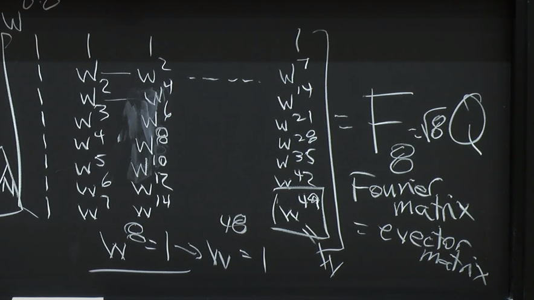 

 

>关于傅里叶矩阵有一个特性比较重要，如对于任意一个四阶旋转矩阵 $P = c0·I+c1·P+c2·P^2+c3·P^3$，用四阶傅里叶矩阵作用于它的系数向量可以得到相应旋转矩阵的特征值，如:$\left[ \begin{matrix}  1 & 1 & 1 & 1 \\  1 & i & -1 & -i\\  1 & -1 & 1 &-1 \\ 1 & -i & -1 &i\end{matrix} \right]$ $\left[ \begin{matrix}  1 \\ 2 \\ 0 \\0  \end{matrix} \right]$  =$\left[ \begin{matrix}  3 \\ 1+2i \\ -1 \\1-2i  \end{matrix} \right]$ 这四个数恰好是旋转矩阵 $P = I+2·P$ 对应的特征值。

>下面我们介绍一下正规矩阵。下图是来自百度百科的解释。由图一我们知道对角矩阵、实对称矩阵、是反对称矩阵、埃尔米特矩阵等等都属于正规矩阵。性质 1 告诉我们正规矩阵都能写成 $A = Q·Λ·Q^H$，其中 Q 是实矩阵的话 $Q^H = Q^T$，酉矩阵 Q 有与正交矩阵类似的性质 $Q^H·Q = I$，相当于把正交矩阵概念延伸到酉空间了。因此我们可以类比正交矩阵性质来看 2-4 条性质。性质 2，正交矩阵中，与正交矩阵相似的矩阵都是正交矩阵。性质 3 正交矩阵有 n 个线性无关特征向量。性质 4 正交矩阵不同特征值对应的特征子空间也互相正交：  

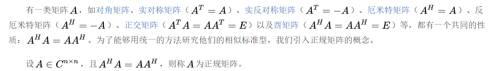 

 
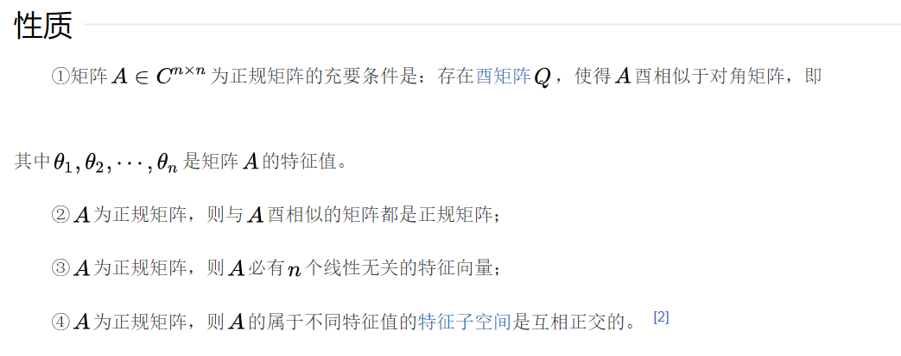 

 

>上面我们提到过关于旋转矩阵的内容，实际上，我们还可以把旋转矩阵和向量卷积联系起来。比如，我们设一个旋转矩阵为：
$\left[ \begin{matrix}  2 & 3 & 4 \\  4 & 2 & 3 \\  3 & 4 & 2 \end{matrix} \right]$ $\left[ \begin{matrix}  1 \\ 2 \\ 3 \end{matrix} \right]$ = $\left[ \begin{matrix}  20\\ 17 \\ 17 \end{matrix} \right]$
。其中旋转矩阵$\left[ \begin{matrix}  2 & 3 & 4 \\  4 & 2 & 3 \\  3 & 4 & 2 \end{matrix} \right]$的第一个列向量 $\left[ \begin{matrix}  2 \\ 4 \\ 3 \end{matrix} \right]$与 $\left[ \begin{matrix}  1 \\ 2 \\ 3 \end{matrix} \right]$做循环卷积的结果也是$\left[ \begin{matrix}  20\\ 17 \\ 17 \end{matrix} \right]$。 
和旋转矩阵类似的还有 Toeplitz 矩阵，如下图所示的矩阵就叫 Toeplitz 矩阵：  

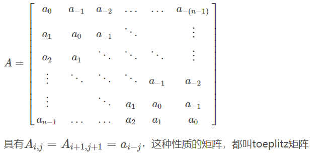 

>我们常用这种矩阵与一个向量的乘法来表示普通的卷积运算，如$\left[ \begin{matrix}  1 &  &  \\  2 & 1 &  \\  3 & 2 & 1 \\ & 3 & 2 \\ & & 3 \end{matrix} \right]$ $\left[ \begin{matrix}  4\\ 5 \\ 6 \end{matrix} \right]$ = $\left[ \begin{matrix}  4\\ 13 \\ 28\\27\\18 \end{matrix} \right]$，这个矩阵乘法代表的含义恰好是 $\left[ \begin{matrix}  1\\ 2 \\ 3 \end{matrix} \right]$ 与 $\left[ \begin{matrix}  4\\ 5 \\ 6 \end{matrix} \right]$两个向量的卷积结果。

>类似于向量卷积与多项式相乘系数的关系，两个函数之间也可以做卷积，定义如下，如果 $f(x)$ 和 $g(x)$都是同一周期的周期函数，他们之间也可以做循环卷积，在此不展开：  

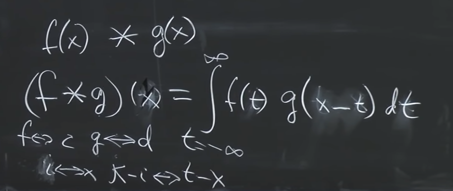 

>关于傅里叶矩阵我想讲的最后一点就是：卷积规则。如下图所示，两个旋转矩阵 CD 相乘结果的第一列其实就是对应向量循环卷积结果。如我们上面提到的$\left[ \begin{matrix}  2 & 3 & 4 \\  4 & 2 & 3 \\  3 & 4 & 2 \end{matrix} \right]$  $\left[ \begin{matrix}  1 \\ 2 \\ 3 \end{matrix} \right]$ = $\left[ \begin{matrix}  20\\ 17 \\ 17 \end{matrix} \right]$，我们现在把$\left[ \begin{matrix}  1 \\ 2 \\ 3 \end{matrix} \right]$ 也换成循环矩阵，可得$\left[ \begin{matrix}  2 & 3 & 4 \\  4 & 2 & 3 \\  3 & 4 & 2 \end{matrix} \right]$ $\left[ \begin{matrix}  1 & 3 & 2 \\  2 & 1 & 3 \\  3 & 2 & 1 \end{matrix} \right]$ = $\left[ \begin{matrix}  20 & 17 & 17 \\  17 & 20 & 17 \\  17 & 17 & 20 \end{matrix} \right]$。板书上那个 diagonals 应该不太准确，anyway，我们都知道 CD 相乘的特征值等于 C 特征值乘 D 特征值，对应的卷积过程就是，让傅里叶矩阵作用于对应的 c d 向量进行循环卷积结果，得到的应该就是 CD 相乘结果的特征值。而卷积规则说的就是在这一步等于傅里叶矩阵作用在c上，乘傅里叶矩阵作用在d上的结果(这里的乘代表向量分量依次相乘)：  

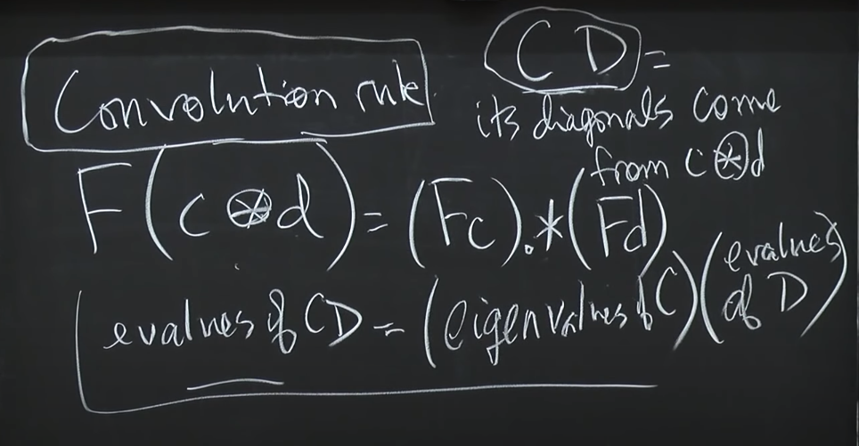 

 

>而这样的卷积规则对我们加快计算速度有很大帮助，因为循环卷积的复杂度为$N^2$，而傅里叶矩阵作用的复杂度为 $Nlog_2N$，于是等式左边的复杂度为 $N^2+Nlog_2N$ ，等式右边的复杂度为$2Nlog_2N+N$ (假设 c d 向量都是 N 维)。

>ps.这一节的笔记其实包含了下一节卷积规则的相关内容，并且我写的顺序比较乱，今天不太舒服，就看的迷迷糊糊的，两节课的笔记也写得比较乱，害。但是主要思想都在里面了。

