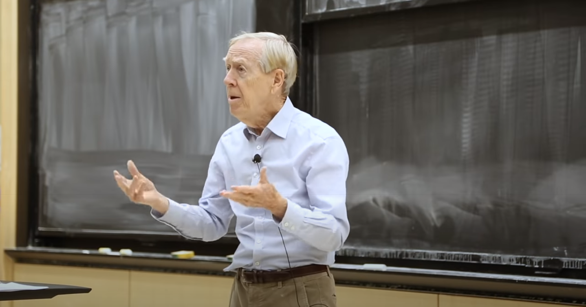
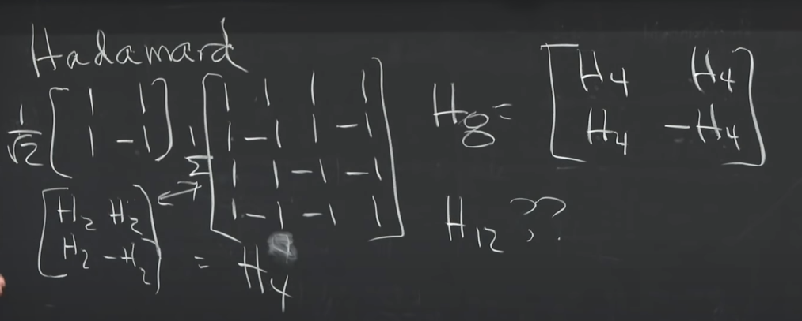
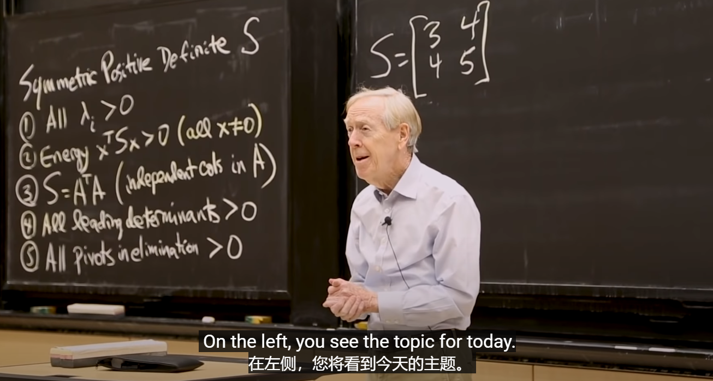

<!-- TOC -->

- [MIT 18.065 Matrix Methods in Data Analysis, Signal Processing, and Machine Learning, Spring 2018](#mit-18065-matrix-methods-in-data-analysis-signal-processing-and-machine-learning-spring-2018)
    - [1. The Column Space of A Contains All Vectors Ax](#1-the-column-space-of-a-contains-all-vectors-ax)
    - [2. Multiplying and Factoring Matrices](#2-multiplying-and-factoring-matrices)
    - [3. Orthonormal Columns in Q Give Q'Q = I](#3-orthonormal-columns-in-q-give-qq--i)
    - [4. Eigenvalues and Eigenvectors](#4-eigenvalues-and-eigenvectors)
    - [5. Positive Definite and Semidefinite Matrices](#5-positive-definite-and-semidefinite-matrices)
    - [6. Singular Value Decomposition (SVD)](#6-singular-value-decomposition-svd)
    - [7. Eckart-Young: The Closest Rank k Matrix to A](#7-eckart-young-the-closest-rank-k-matrix-to-a)
    - [8. Norms of Vectors and Matrices](#8-norms-of-vectors-and-matrices)
    - [9. Four Ways to Solve Least Squares Problems](#9-four-ways-to-solve-least-squares-problems)
    - [10. Survey of Difficulties with Ax = b](#10-survey-of-difficulties-with-ax--b)
    - [11. Minimizing _x_ Subject to Ax = b](#11-minimizing-_x_-subject-to-ax--b)

<!-- /TOC -->
# MIT 18.065 Matrix Methods in Data Analysis, Signal Processing, and Machine Learning, Spring 2018
>从这个标题可以看到这是 Gilbert Strang 在 2018 年 MIT 的又一课程，查矩阵范数的内容时突然发现的，刚好不想看书(人懒)，就先学这个吧。[课程链接：youtube](https://www.youtube.com/watch?v=Cx5Z-OslNWE&list=PLUl4u3cNGP63oMNUHXqIUcrkS2PivhN3k)。建议安装Dualsub谷歌浏览器翻译插件进行学习。 课程主题主要分为四个部分： 

 

 

>可以看到，这个系列课程与计算机专业息息相关，是之前线性代数课程的一个延申。并且该课程有一些在线编程类项目作业，而没有期末考试。可以用 Matlab/Python/Julia 等工具/语言完成。好的，现在我们开始走进这门课。 

 

 

## 1. The Column Space of A Contains All Vectors Ax
>本节课没有太多内容，主要提到的是两点内容：矩阵的 CR 分解，矩阵乘法的另一种看待方式。 
首先，矩阵 A = C·R 分解中，C 代表列空间的基组成的矩阵，其中的基向量是从 A 矩阵中的列向量中原封不动的抽取的，只要是线性无关的就加进来。R 代表行空间的基组成的矩阵，其中的基不是从 A 中直接获得，而是通过一定计算推导而得(课上的矩阵很简单，就直接看出来了)。特别的，我们发现 C 的最后一行中的 5 7 如果和 R 矩阵的两个行向量进行组合恰好就是 A 的第三行，这其实不是巧合，也许之后我们会再次接触这样的内容： 

 

 

>矩阵乘法 A = B·C (A 为 m * n 矩阵)我们之前总用 B 的行向量点乘 C 的列向量来得到。然而，还有一种看待方式是用 B 的第 k 列向量乘 C 的第 k 行向量来得到矩阵(k = 1,2,...,n)，之后把各个矩阵相加，这样的计算次数和之前是相同的。 

 

 

## 2. Multiplying and Factoring Matrices
>开始教授提到了五种之前讲过的矩阵分解方式(Factoring)。之后讲了一些关于秩1矩阵分解，矩阵乘法，四个基本子空间的内容，之前也都提到过，在此不再赘述。： 

 

 

## 3. Orthonormal Columns in Q Give Q'Q = I
>本节课的重点在正交矩阵，教授开始讲了旋转矩阵的正交性，之后又引出了反射矩阵(det为负的情景)的正交性，Householder矩阵的正交性： 

 

 

>Hadamard矩阵正交性： 

 

 

>Haar小波矩阵(图像压缩中讲过)正交性(可进一步将列向量单位化)： 

 

 

>傅里叶矩阵(四阶)正交性： 

 

 

## 4. Eigenvalues and Eigenvectors
>这节课首先需要注意的是矩阵 AB 和 BA 的相似关系。AB 和 BA 相似，相似矩阵 M = B，因此 AB 和 BA有相同的特征值，但是 A 的特征值乘 B 的特征值往往不等于 AB 的特征值，同样 A 的特征值加 B 的特征值往往不等于 A + B 的特征值： 

 

 

>其次就是，实对称矩阵具有实特征值，实对称矩阵的正交分解：A = Q·Λ·QT，也称之为谱定理。其他内容就是一些回顾性内容了。

## 5. Positive Definite and Semidefinite Matrices
>课堂主要是一些关于正定矩阵和半正定矩阵的验证，以及一些回顾性内容，下图列出了五个判定正定的条件，半正定往往只需要稍作修改即可(大于变成大于等于)： 

 

 

## 6. Singular Value Decomposition (SVD)
>之前我们也花了很大篇幅来说明 SVD，主要是运用 A·AT 和 AT·A 的特性去计算分解后两个正交矩阵和特征值的值。但是实际中往往 A 会很庞大，A·AT 的计算量很大，因此我们不常用这种方法。而是，用下图的方法来求得另一组正交矩阵 U ，我们常常是很容易得到矩阵 A 和一组正交矩阵 V，还有特征值。这一组式子来自于我们最初讨论 SVD 时，把一组单位正交基 V 转化为另一组单位正交基 U 的过程。 

 

 

>而通过证明，我们发现这样得到的矩阵 U 确实是正交矩阵： 

 

 

>当我们分解过后，我们来看 SVD 的几何意义(如下图所示)，当一个矩阵 A 作用到一个向量 x 上时，可以看作 U·Σ·VT 三个部分分别作用的结果。VT 为正交矩阵，作用类似于旋转/反射，Σ 对角矩阵作用后相当于拉伸/压缩成一个椭圆，最后正交矩阵 U 作用也是一个旋转。这个示意图是二维情况，并且我们假设了 Σ 是正定的，不存在升维/降维情况。整个过程实际上涉及了四个参数，首先 VT 的旋转/反射涉及一个参数 θ 。Σ 是二维的，因此涉及两个参数，对应两个基的拉伸幅度。最后 U 与 VT 类似： 

 

 

>如果扩展到三维，那三个矩阵就分别对应3、3、3个参数，加起来是 9 个，旋转此时也涉及三个方向，三个角。在实际应用中我们常常关注奇异值分解的第一个分量的值 σ1，因为 Σ 矩阵上的奇异值往往按从大到小排列，展开式中每一项的秩为 1 (如第一项 u1·σ1·v1T)： 

 

 

>之后从奇异值分解引出了极分解(Polar Decomposition)，**极分解告诉我们任意一个矩阵 A 都可以分解为一个对称矩阵和一个正交矩阵的乘积**。 A = S·Q，我们可以由奇异值分解进行推导：A = U·Σ·VT = (U·Σ·UT)·(U·VT)，前半部分很明显是对称的，后半部分是两个正交矩阵的乘积，还是正交矩阵(由正交矩阵几何意义很容易想到)。

## 7. Eckart-Young: The Closest Rank k Matrix to A
>本节课的重要思想就是关于主成分分析(PCA)的核心观念，我们如何找到最接近 A 的秩为 k 的矩阵？首先我们需要回答：如何度量两个矩阵的接近程度？答案是：范数。关于向量范数我们之前已经有所耳闻，主要有以下三种最关键的，下面的两个公式是范数需要满足的条件： 

 

 

>之后我们引出矩阵范数，其中 σ 就是矩阵奇异值分解中的奇异值，这是最主要的三种矩阵范数。其中 Frobenius 范数还有下面图的表示方法(关于奇异值的部分)： 

 

 
 

 

>接下来，就是 Eckart-Young 的发现(如下图所示)，他发现既然任何矩阵 A (秩为r) 都可以奇异值分解为如下 r 个秩 1 矩阵相加的结果，那我们取前 k 个构成的矩阵，就是最接近 A 的秩 k 矩阵。其中 σi 是从大到小排列的，这个“最接近”的度量方式就是上面我们提到的三种矩阵范数其中的任意一个 ： 

 

 

>最后是关于 PCA 的内容，教授举了一个很像最小二乘的例子(图之后重新画。。。)： 

 

 

>左图是最小二乘估计(Least Square Estimate)的方法，右图是 PCA 的方法，我们发现二者度量的误差距离是不一样的，LSE 是竖直的距离，而 PCA 度量的是垂直于直线的距离。并且这是一个直线拟合的问题，PCA 的结论告诉我们那个斜率 k 就是所有样本构成的 2 * n 矩阵经过奇异值分解后(n为样本数，矩阵第一行代表年龄，第二行代表身高)，奇异值 σ1 的值。

## 8. Norms of Vectors and Matrices
>本节课我们首先来看二维向量范数，下图从左至右依次是各个范数等于 1 的情况：2-范数为1、1-范数为1、无穷范数为1、0-范数为1 (0-范数指的是向量中不为 0 的分量个数)。有趣的是，我我们从 0-范数 一直增加到无穷范数我们发现图像是一个扩张的过程，从两条线扩张到菱形再到圆再到方形。而一个好的范数，我们要求图像是凸的而不是凹的，如 1、2、∞ 范数都是凸的，而 p ∈ [0,1) 的范数都是凹的： 

 

 

>补充一点就是 S-范数 (课本中也叫加权范数/椭圆范数)。S-范数定义为 ||x|| = (xT·A·x)^1/2，我们也可以按照上图作出此图像 S-范数等于 1 的情况。下图是一个正定矩阵的 S 范数为 1 的情况，做出图来就是一个椭圆： 

 

 

>当我们进行空间中点的范数大小判定时，我们就可以用对应的图形从原点进行扩张，先命中的就是范数更小的点。下图可能不太清晰，但是也标出了图中直线上 L1，L2 范数最小的两个点。其中判定 L1 最小点时，我们用菱形扩张，L2 最小点我们用圆进行扩张： 

 

 

>下面我们详细介绍一下矩阵范数，下图右侧是矩阵 2-范数 的一个定义。我们看到是从向量范数角度进行定义的， ||Ax||/||x||，这个值可以看作向量 x 经过 A 矩阵作用后改变的程度，我们叫这个数为爆炸因子，而 2 范数就是找一个最大的爆炸因子，这就和向量有关。如果 x 是 A 的特征向量，那么此时对应的爆炸因子就是相应的特征值，但是对于一个一般的矩阵(非方阵)，这个值往往是奇异值 σ ，而最大的爆炸因子就是 σ1，推导过程见右下，奇异向量 ||v|| = 1，而奇异值分解中 A·v = σ·u，||u|| = 1： 

 

 

## 9. Four Ways to Solve Least Squares Problems
>前半节课教授回顾了关于四个基本子空间和伪逆的内容。 
>关于之前的最小二乘问题，我们在前面也得出了很多结论。如 A·x = b 无解时，我们可以两边同左乘 AT 则原方程有解，得到 AT·A·x-hat = AT·b，当是我们是用投影的角度来看待这个方程有解的。现在我们有另一种看待方式，就是在无解方程 A·x = b 上，最小化 ||Ax-b||^2，这里我们取 2-范数 的平方，之后对 xT 求导，就可以得到 AT·A·x-hat = AT·b 这个式子： 

 

 

>上面两个角度我们都假设了 A 是列满秩的，如果列不满秩，则上述方法不可行。同时，当列满秩时，我们发现，上述方法解出 x-hat = (AT·A)^-1·AT·b = A+·b ( A+ 为伪逆)。即当列满秩时，(AT·A)^-1·AT = A+ 右乘 A ，左右两式都得到单位矩阵 I (n * n)。这就是第三种方法，但 x-hat = A+·b 这种方法在列不满秩情况下也可使用： 

 

 

>至于第四种方法下节课我们会提到，如下图所示。第一种就是伪逆方法，第二种应该是上面介绍的最小化 Loss = ||Ax-b||^2 然后求导的方法，第三种施密特正交化应该是投影的方法(投影的根源就是正交)，第四种下节课我们会提到： 

 

 

## 10. Survey of Difficulties with Ax = b
>本节课我们专注于现实的应用问题，在面对现实问题时，我们要求解 A·x = b 此种问题时，往往会遇到 A 不是方阵但列满秩的情况，上一节课也提到过我们可以用那四种方法来解决(最小二乘问题本质上就是 Ax = b 的求解问题)。但是还有一种情况是 A 是一个非奇异矩阵，但 nearly singular 很接近奇异，也就是说有的奇异值很接近 0 ，或者说 A 的逆矩阵中有值很大的元素，这样我们求解出来的结果往往不太符合期望。此时我们可以加一个正则项，如下图所示： 

 

 

>我们需要最小化的 Loss 改变了，而这个 A*·x = b*，对应的最小二乘方法就是上节课我们提到的方法 4 中的那个等式 (AT·A+δ^2·I)x = AT·b (至于这个推导原因我也不清楚，A 为 1 * 1 矩阵时是一个求导的关系，即最小化的式子求导为 0 得到的式子恰好是 A*·x = b* 的结果)。教授给我们推导了 A = [σ] 即 A 为 1 * 1 矩阵的优化解决方式： 

 

 

>我们可以通过最小化那个式子(求导)，或者解  (AT·A+δ^2·I)x = AT·b 这个等式，来得到同一个式子。然后结果 x 在上图的左下角。我们发现如果我们的正则项系数 δ 取 0 ，那么当矩阵 A 为 0 时，即 σ = 0 时，我们的 x 会出现错误(分母为 0)，但是如果我们有正则项，就算 σ = 0 ，我们也能得到两个结果(见上图右下角)。因此正则项不但保证了逆的不理想的情况，也保证了所有情况有解。而这个解的形式最终会和 A+ 相近，即： 

 

 

## 11. Minimizing _x_ Subject to Ax = b
>这节课讲的一点是解决施密特正交化的一些问题。之前我们讨论过施密特正交化是依次取基向量的误差部分 e ，但是当两个向量十分接近时，e 就会很小，我们不希望这种事情发生。于是，我们在选取基向量时，可以依次考察所有向量，选择一个最适合做下一个正交基向量的向量，即误差最大的来进行迭代。这样看似计算量变大了，其实时几乎不变的，因为我们在用之前的方法时，也是需要依次计算的。如下图，我们在挑选 q2 时，选取剩下所有向量与 q1 进行误差 e 的计算： 

 

 

>还有最后提到 Krylov 子空间迭代。