<!-- TOC -->

- [Matrix_Theory_Textbook](#matrix_theory_textbook)
    - [正交变换与正交矩阵、对称变换与对称矩阵](#正交变换与正交矩阵对称变换与对称矩阵)
    - [$e^A$ 的解读与计算](#e^a-的解读与计算)
    - [$e^A·e^B与e^{AB}的关系$](#e^a·e^b与e^ab的关系)
    - [由 一阶线性常系数齐次微分方程组 到 二阶线性常系数齐次微分方程组](#由-一阶线性常系数齐次微分方程组-到-二阶线性常系数齐次微分方程组)
    - [矩阵微分](#矩阵微分)
    - [LU分解的应用与计算](#lu分解的应用与计算)
    - [施密特QR分解应用与计算](#施密特qr分解应用与计算)
    - [Householder transformation](#householder-transformation)

<!-- /TOC -->

# Matrix_Theory_Textbook
>在这一小节中我会记录矩阵论课本的学习历程。因为学习顺序和之前基础的原因，我就从1.3节正交变换与正交矩阵开始记录。并且我记录的不是所有知识点，只是一些觉得重要的或者有启发性的内容，亦或是在看课本过程中难以理解的部分。

## 正交变换与正交矩阵、对称变换与对称矩阵
>需要指出的是，**正交变换在几何中指的是空间中任意向量 x 的模保持不变的变换过程**。当然，与正交变换对应的矩阵就是正交矩阵。至于正交矩阵的特点上面的内容也介绍过。其次，**正交变换在标准正交基下的矩阵是正交矩阵，但是，他在别的基下的矩阵可能是正交矩阵，也可能不是**。比如之前在《线性代数的本质》中相似矩阵那一节提到的，不同基下的空间旋转变换，在一个非标准基下对应的矩阵就不是正交矩阵。欧式空间中，两组标准正交基的转换，也是由正交矩阵连接起来的。
 类似的，对于对称变换的定义是这样的：(Tx,y) = (x,Ty)。而欧氏空间的线性变换是实对称变换的充要条件是：他对于正交基的矩阵是实对称矩阵。对于别的基就不一定了。

## $e^A$ 的解读与计算
>参考课程：[youtube：e to a matrix](https://youtu.be/l61k97RFsfs) 
>我们都知道 $e^A$ 的展开式如下图所示，但是如果我们在解一个矩阵形式的微分方程，最后的结果带 $e^A$，如果用这种单纯展开的计算方法，有时候会非常复杂，因为 A 矩阵的高次幂计算难度很大：  

 

 

>于是，我们可以分为如下两种情况对 $e^A$ 进行计算。第一种，当 A 矩阵不满秩， $e^A$ 展开式就只有有限项，如下面这个简单的例子。奇异矩阵 A 的高次幂都为 0 ，因此有限项相加就不复杂了：  

 

 

>第二种情况是 A 满秩，那么 A 就可以进行对角化，而对角矩阵的高次幂很好计算。如下面这个例子所示，$A^N = PD^NP^{-1}$，这里 P 代表特征矩阵，D 代表对角矩阵。  

 

 

>我们把对角化 A 的分解形式代入 $e^A$ 展开式中，问题就转化为了求 $e^D$，如果我们对 $e^D$ 进行多项式展开，最后会发现累加和的矩阵对角元素恰好保留了 $e^x$ 的多项式展开和的形式，于是 $e^D$ 结果就如下图所示，关于对角矩阵指数形式我们需要记住，这个比较特殊。$e^D$ 求出来了 $e^A$ 就只需要做两次矩阵乘法就好了(最下面一行应该是 $e^A = Pe^DP^{-1}$):  

 

 

>最终得到的结果如下，并且在最后一行，给出了当我们解微分方程时会用到的 $e^{At}$ 解的形式 ：  

 

 

## $e^A·e^B与e^{AB}的关系$
>参考课程：[Matrix exponential properties](https://youtu.be/kQW9oTwGMoU) 
>课程上给我们举例证明了一般情况下$e^A·e^B≠e^{A+B}$。我们首先选择两个矩阵 A B 如下图所示，之后按照上节课的计算方法可以得到 $e^A$ $e^B$  

 

 

>现在我们来计算 $e^{A+B}$，如下图所示，因为我们观察到 (A+B) 的奇次幂是次对角单位阵，偶次幂是单位矩阵，因此我们把 $e^{A+B}$ 分为两个部分计算，如右下角(可能有点不太清晰)   

 

 

>代入相应的矩阵进一步的推导，我们发现 $e^A·e^B≠e^{A+B}$：  

 

 

>究其不等的原因如下，因为$AB≠BA$。如果$AB=BA$，那么我们会得到最下面的结果(这部分展开用到帕斯卡公式暂时放着不管)，：  

 

 

>继续往下推导可得到 $e^A·e^B=e^{A+B}$ 的结果。  

 

 

## 由 一阶线性常系数齐次微分方程组 到 二阶线性常系数齐次微分方程组
>参考课程 [youtube：Cos of matrix](https://youtu.be/qmZJLu4esbA)

>在《$e^A$ 的解读与计算》小节的最后，我们提到了 $e^A$ 的计算涉及的是一阶线性常系数齐次微分方程组 $x'(t)=Ax(t)$ 的情况，通解形式为：$x(t)=e^{At}·c$。在此不再赘述。本节课我们主要需要注意的是 $cos(A)$ 的展开，与其在二阶线性常系数齐次微分方程组中的应用。我们假设矩阵 A 如下图所示，于是 A 可对角化为 $PDP^{-1}$  

 

 

> $cos(A)$ 的展开形式如下图。而我们观察到将 cos 应用到对角阵 D 上也同样简单，这是对角阵的一个特点：  

 

 

>对于其应用于二阶线性常系数齐次微分方程组的结果如下，其中$sin(A)$的展开类似于$cos(A)$的展开。如果我们直接解下图所示的带矩阵的二阶线性常系数齐次微分方程组，我们会得到一个很复杂的两个方程，但是如果用矩阵形式的通解代入，就非常简单了：  

 

 

## 矩阵微分
>在《矩阵论》课本的 3.4 节，给我们首先讲了关于矩阵 $A(t)$ 关于变量 t 的导数。这个非常简单，我们只需要把矩阵的每个元素看作关于 t 的变量，然后对每个元素求导即可，求导结束后还是一个同尺寸的矩阵。之后课本中还有一些关于 $\frac{dA(t)}{dt}$ 的性质，如 $\frac{d}{dt}(A(t)+B(t))$、$\frac{d}{dt}(A(t)·B(t))$、$\frac{d}{dt}(a·A(t))$ 等计算法则都比较简单，就不赘述了。还有$\frac{d}{dt}(e^{tA})$、$\frac{d}{dt}(cos(tA))$、$\frac{d}{dt}(sin(tA))$，都和我们之前学的普通变量函数导数计算法则类似。

>在 [Derivative of a Matrix : Data Science Basics](https://www.youtube.com/watch?v=e73033jZTCI) 课程中，给我们首先讲了关于 $\frac{d}{dx}(Ax)$ 的内容。假设 A 是一个二阶矩阵如下图，那么 $Ax$ 就是一个二维向量，我们把它的每一维当作一个函数  

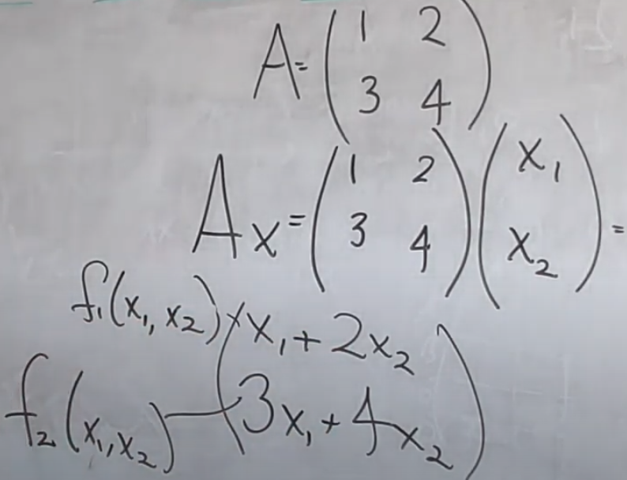 

 

>之后将 $\frac{d}{dx}(Ax)$ ，定义为如下的形式，即每个函数对求导向量 x 每个分量进行求导。并且结果显示：$\frac{d}{dx}(Ax)=A$，这样的形式恰好与之前我们接触到的 $\frac{d}{dx}(kx)=k$ 是一样的。并且我们要从这个例子中总结出：**一个多元函数对一个向量求导，就是其中的每一个函数分别对每个向量分量求导**。如果是三元函数 $f(f1,f2,f3)$ 对向量 $x=(x1,x2,x3,x4)$ 求导结果就是一个$3*4$的求导矩阵   

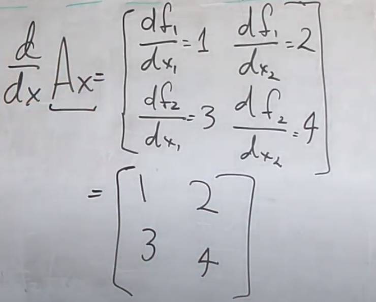 

 

>接下来再看一个例子$\frac{d}{dx}(x^TAx)$，如下图所示。相比于上一例，这个式子打开其实只有一个函数，结果在左边。  

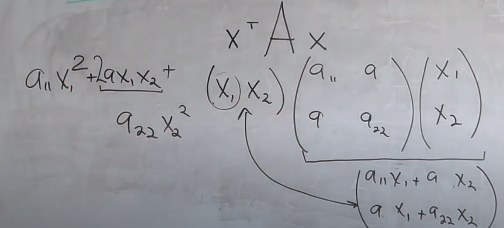 

 

>我们让这个函数分别对 $x1,x2$ 求导，结果如下，进一步化简我们可以看到这个形式恰好是 $2Ax$，即：$\frac{d}{dx}(x^TAx)=2Ax$，这与我们之前接触的 $\frac{d}{dx}(kx^2)=2kx$ 是一致的：  

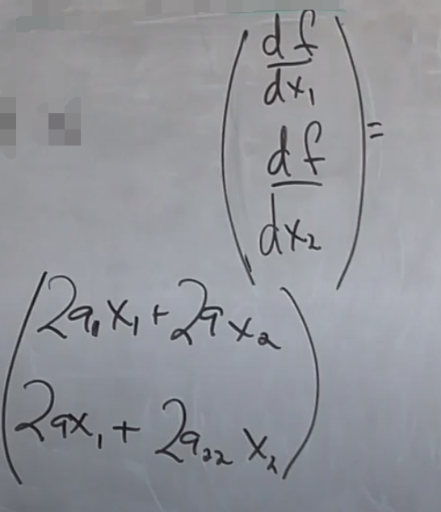 

 

## LU分解的应用与计算
>参考课程：[Solve a System of Linear Equations Using LU Decomposition](https://www.youtube.com/watch?v=m3EojSAgIao)。LU分解的作用往往是让我们更加快捷的解一个 n 阶方程组系统(方程个数 = 未知数个数)，如下图所示，是一个简单的例子我们如果能将矩阵 A 分解成为 L U 的形式，那么$Ax=LUX=L(Ux)=b$，我们先解 $Ly=b$，再解 $Ux=y$，得到最终解 x。因为 L U 都是上/下三角矩阵，解方程组就很容易了：  

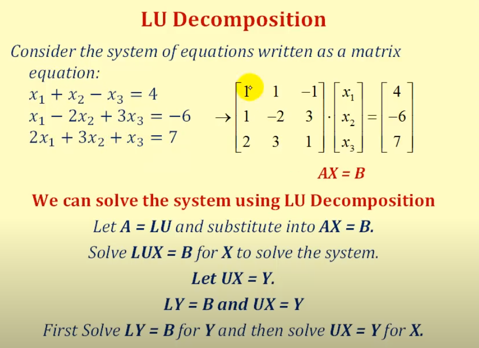 

 

>我们按照下面的方法进行分解。左边三个矩阵式用上面的行向量消元的过程，下三角矩阵起始阶段设为 I (单位矩阵)如从原始的 A ，将第一行乘 -1 倍加到第二行，对应的 L 中就要把第一行的 +1 倍加到第二行。A 依次消元得到 U，对应同时 L 也从单位矩阵 I 慢慢转化为最终的下三角矩阵。解方程的过程我就不赘述了。   

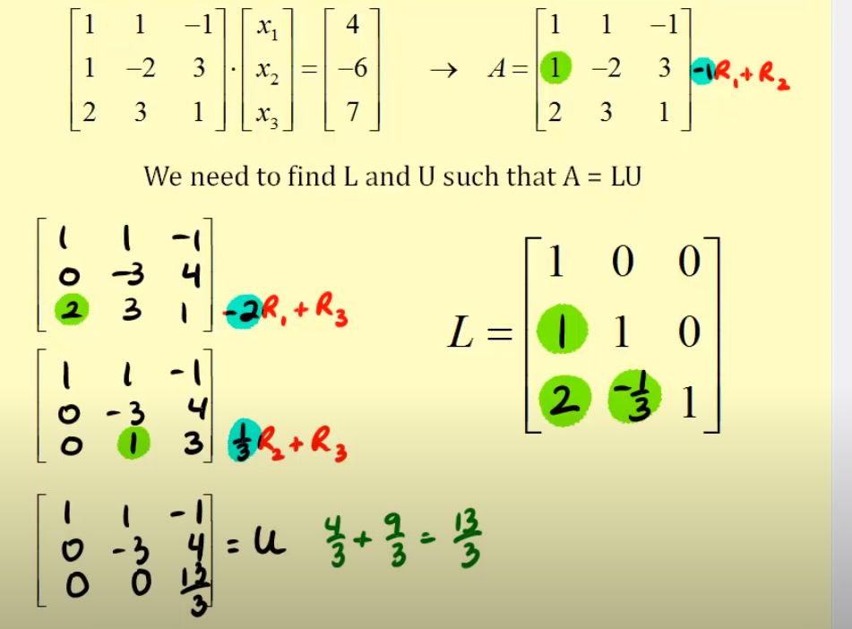 

 

>其实，LU分解除了有方程个数 = 未知数个数的要求，还有前 n-1 个主元不为 0 ，为 0 就不能继续向下消元了。课本中告诉我们验证矩阵 A 是否可 LU 分解还可以依次看 A 顺序主子式 $Δ_k≠0(k=1,2,...,n-1)$，都不为 0 ，且矩阵 A 可逆，则一定可以 LU 分解，这是充分条件。A 顺序主子式 $Δ_k≠0(k=1,2,...,n-1)$ 都不为 0 是 LDU 分解的充要条件，其中 L 是单位上三角，U 为单位下三角，D 为对角矩阵。并且 LDU 分解并不要求矩阵 A 是可逆矩阵，参考课本例 4.1，但是 LU 分解中 A 必须是可逆矩阵。 
>若前 n-1 阶主子式为 0 或者说前 n-1 个主元中一个主元为 0 ，且 A 为可逆矩阵，则存在一个置换矩阵 P 使得 $P·A = L·U-hat = L·D·U$，其中 $U-hat$ 为上三角矩阵，$U$ 为单位上三角矩阵。那么我们解 $Ax=b$，就转化为解 $P·A=L·U-hat=P·b$，也是非常方便。

>其中，$A=L(DU)=L·U-hat$，叫 Doolittle 分解；$A=(LD)U=L-hat·U$，叫 Crout 分解。特别的，当 A 为实对称正定矩阵的时候有 Cholesky 分解，也很好理解，就是利用了 $A^T=A$ 的特点。

## 施密特QR分解应用与计算
>参考课程：[QR decomposition](https://www.youtube.com/watch?v=J41Ypt6Mftc)

>首先，课本上定义的矩阵 A 的 QR 分解其实是要求 A 是一个 n 阶方阵，Q 是 n 阶正交矩阵，R 是 n 阶上三角矩阵。其实非方阵 A 也存在 QR 分解。对于下图的矩阵 A 我们也可以进行 QR 分解。  

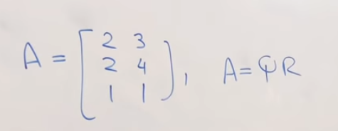 

 

>步骤1. 将 A 的列向量进行施密特正交化，得到两个单位正交向量，组成矩阵 Q 。 
步骤2. 之后由 $Q^TA=Q^TQR=R$，可以计算出上三角矩阵 R。为什么这里 R 是上三角矩阵呢？其实这和施密特正交化过程有关，我们看下图的 $Q^TA$ 的形式。我们看到 $Q^T$ 的第一行就是单位化的矩阵 $A$ 的第一列，$Q^T$ 的第二行经过施密特正交化后与 $A$ 的第二列向量就是正交的，因此他们点乘一定为 0 ，这样就使得 R 成了上三角矩阵：  

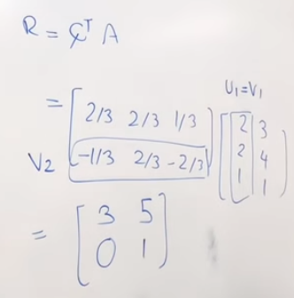 

 

>QR分解在解最小二乘的相关问题时非常有用，如下图。我们之前介绍过当 $Ax=b$ 无解时，我们可以转化为$A^TAx=A^Tb$，这样就能得到一个最优的解(投影原理)，此时，若我们能够将 A 进行如下的 QR 分解，最后可以得到等式 $Rx-hat=Q^Tb$ (这里假设 R 可逆，在99%实际情况中，R 都是可逆的)。得到了$R·x-hat=Q^Tb$就很好解 x-hat 了，因为 R 是上三角矩阵：  

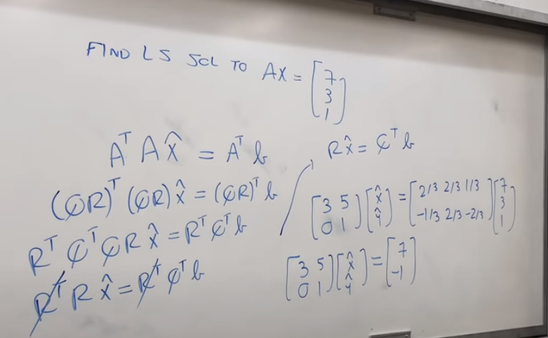 

 

>除了施密特 QR 分解还有 Householder QR 和 givens QR 分解，我们把 Householder transformation 和 givens transformation 学完就能理解了。

## Householder transformation
>参考课程： 
[Householder transformations, part 1](https://www.youtube.com/watch?v=6TIVIw4B5VA&t=87s) 
[Householder transformations, part 2](https://www.youtube.com/watch?v=wmjUHak9yHU) 
[Householder transformations, part 3](https://www.youtube.com/watch?v=iMrgPGCWZ_o)

>Householder transformation 在几何上表现的就是相对于一个超平面的镜面对称变换。我们用二维的情况来推导Householder 矩阵，这样有利于我们理解，见下图所示 (忽略老师的小拇指hhh) ：我们首先找一个垂直于超平面的单位向量 u，$||u||_2=1$，向量 $x$ 是我们要进行镜面对称的向量，它于向量 $u$ 同起点。那么根据这样的关系，我们可以算出老师用加粗标出的两端向量为 $-u^H·x·u$，其中$u^H·x$是 x 向量在单位向量 u 方向上的投影大小，再乘单位向量 u 就表示投影方向。再二倍反向，就是两个加粗向量的和。最后对称变换后的向量就等于 x 加两端加粗向量 $x+(-2·u^H·x·u)=x_{reflaction}=(I-2uu^H)x$，则Householder矩阵就是 $I-2uu^H$：  

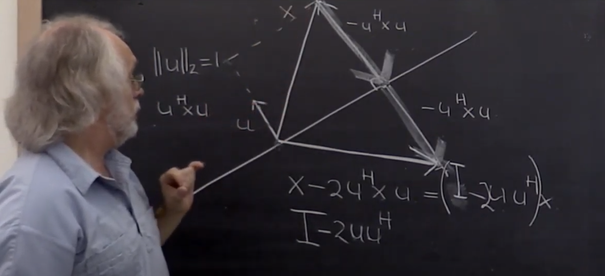 

 

>Householder transformation 在矩阵上的应用就是，我们可以把一个矩阵转化为类似上三角的矩阵。如下图所示，我们希望给矩阵 5*3 的矩阵 A 的第一列转化为如下形式，就需要找到一个矩阵 $H_0$ 作用于 A 的第一列，使得第一列呈现 $(x,0,0,0,0)^T$，而其他列我们暂时不在乎：  

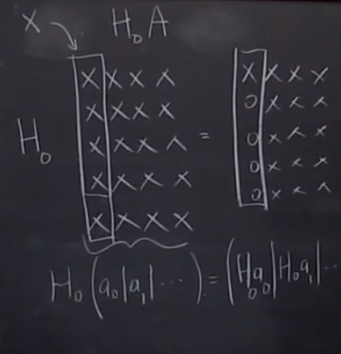 

 

>在几何上的表现如下图，我们把上面的作用用 $Hx=βe_0$ 来概括，因为在反射过程中向量长度不变，因此 $|β|=||x||_2$，根据这种关系向量 $v=x-βe_0=x-||x||_2e_0$ (图中的 + 代表垂直于超平面投影)，我们就能得到$u=\frac{v}{||v||_2}$，矩阵 $H=I-2uu^H$：  

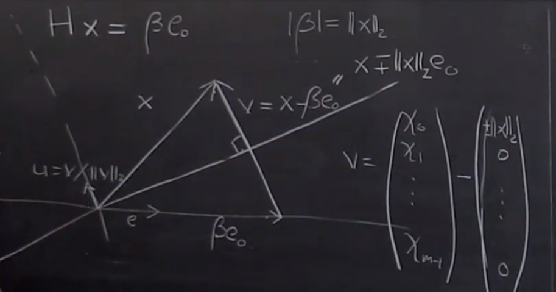 

 

