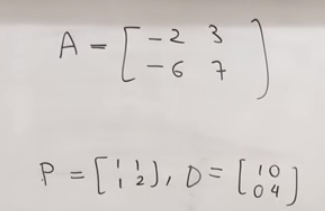

<!-- TOC -->

- [Matrix_Theory_Textbook](#matrix_theory_textbook)
    - [正交变换与正交矩阵、对称变换与对称矩阵](#正交变换与正交矩阵对称变换与对称矩阵)
    - [$e^A$ 的解读与计算](#e^a-的解读与计算)
    - [$e^A·e^B与e^{AB}的关系$](#e^a·e^b与e^ab的关系)
    - [由 一阶线性常系数齐次微分方程组 到 二阶线性常系数齐次微分方程组](#由-一阶线性常系数齐次微分方程组-到-二阶线性常系数齐次微分方程组)

<!-- /TOC -->

# Matrix_Theory_Textbook
>在这一小节中我会记录矩阵论课本的学习历程。因为学习顺序和之前基础的原因，我就从1.3节正交变换与正交矩阵开始记录。并且我记录的不是所有知识点，只是一些觉得重要的或者有启发性的内容，亦或是在看课本过程中难以理解的部分。

## 正交变换与正交矩阵、对称变换与对称矩阵
>需要指出的是，**正交变换在几何中指的是空间中任意向量 x 的模保持不变的变换过程**。当然，与正交变换对应的矩阵就是正交矩阵。至于正交矩阵的特点上面的内容也介绍过。其次，**正交变换在标准正交基下的矩阵是正交矩阵，但是，他在别的基下的矩阵可能是正交矩阵，也可能不是**。比如之前在《线性代数的本质》中相似矩阵那一节提到的，不同基下的空间旋转变换，在一个非标准基下对应的矩阵就不是正交矩阵。欧式空间中，两组标准正交基的转换，也是由正交矩阵连接起来的。
 类似的，对于对称变换的定义是这样的：(Tx,y) = (x,Ty)。而欧氏空间的线性变换是实对称变换的充要条件是：他对于正交基的矩阵是实对称矩阵。对于别的基就不一定了。

## $e^A$ 的解读与计算
>参考课程：[youtube：e to a matrix](https://youtu.be/l61k97RFsfs) 
>我们都知道 $e^A$ 的展开式如下图所示，但是如果我们在解一个矩阵形式的微分方程，最后的结果带 $e^A$，如果用这种单纯展开的计算方法，有时候会非常复杂，因为 A 矩阵的高次幂计算难度很大：  

 

 

>于是，我们可以分为如下两种情况对 $e^A$ 进行计算。第一种，当 A 矩阵不满秩， $e^A$ 展开式就只有有限项，如下面这个简单的例子。奇异矩阵 A 的高次幂都为 0 ，因此有限项相加就不复杂了：  

 

 

>第二种情况是 A 满秩，那么 A 就可以进行对角化，而对角矩阵的高次幂很好计算。如下面这个例子所示，$A^N = PD^NP^{-1}$，这里 P 代表特征矩阵，D 代表对角矩阵。  

 

 

>我们把对角化 A 的分解形式代入 $e^A$ 展开式中，问题就转化为了求 $e^D$，如果我们对 $e^D$ 进行多项式展开，最后会发现累加和的矩阵对角元素恰好保留了 $e^x$ 的多项式展开和的形式，于是 $e^D$ 结果就如下图所示，关于对角矩阵指数形式我们需要记住，这个比较特殊。$e^D$ 求出来了 $e^A$ 就只需要做两次矩阵乘法就好了(最下面一行应该是 $e^A = Pe^DP^{-1}$):  

 

 

>最终得到的结果如下，并且在最后一行，给出了当我们解微分方程时会用到的 $e^{At}$ 解的形式 ：  

 

 

## $e^A·e^B与e^{AB}的关系$
>参考课程：[Matrix exponential properties](https://youtu.be/kQW9oTwGMoU) 
>课程上给我们举例证明了一般情况下$e^A·e^B≠e^{A+B}$。我们首先选择两个矩阵 A B 如下图所示，之后按照上节课的计算方法可以得到 $e^A$ $e^B$  

 

 

>现在我们来计算 $e^{A+B}$，如下图所示，因为我们观察到 (A+B) 的奇次幂是次对角单位阵，偶次幂是单位矩阵，因此我们把 $e^{A+B}$ 分为两个部分计算，如右下角(可能有点不太清晰)   

 

 

>代入相应的矩阵进一步的推导，我们发现 $e^A·e^B≠e^{A+B}$：  

 

 

>究其不等的原因如下，因为$AB≠BA$。如果$AB=BA$，那么我们会得到最下面的结果(这部分展开用到帕斯卡公式暂时放着不管)，：  

 

 

>继续往下推导可得到 $e^A·e^B=e^{A+B}$ 的结果。  

 

 

## 由 一阶线性常系数齐次微分方程组 到 二阶线性常系数齐次微分方程组
>参考课程 [youtube：Cos of matrix](https://youtu.be/qmZJLu4esbA)

>在《$e^A$ 的解读与计算》小节的最后，我们提到了 $e^A$ 的计算涉及的是一阶线性常系数齐次微分方程组 $x'(t)=Ax(t)$ 的情况，通解形式为：$x(t)=e^{At}·c$。在此不再赘述。本节课我们主要需要注意的是 $cos(A)$ 的展开，与其在二阶线性常系数齐次微分方程组中的应用。我们假设矩阵 A 如下图所示，于是 A 可对角化为 $PDP^{-1}$  

 

 

> $cos(A)$ 的展开形式如下图。而我们观察到将 cos 应用到对角阵 D 上也同样简单，这是对角阵的一个特点：  

 

 

>对于其应用于二阶线性常系数齐次微分方程组的结果如下，其中$sin(A)$的展开类似于$cos(A)$的展开。如果我们直接解下图所示的带矩阵的二阶线性常系数齐次微分方程组，我们会得到一个很复杂的两个方程，但是如果用矩阵形式的通解代入，就非常简单了：  

 

 
