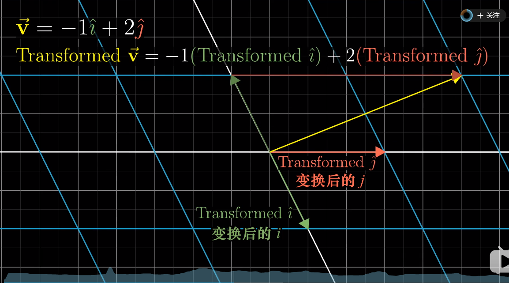
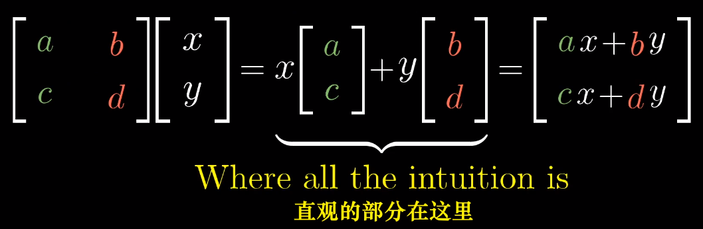
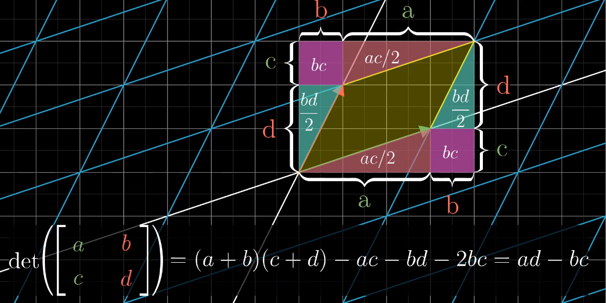
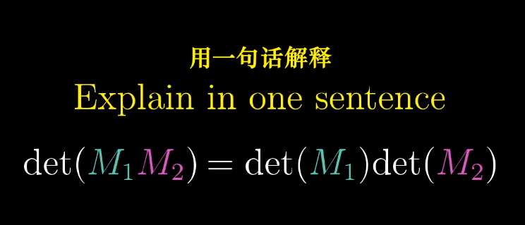
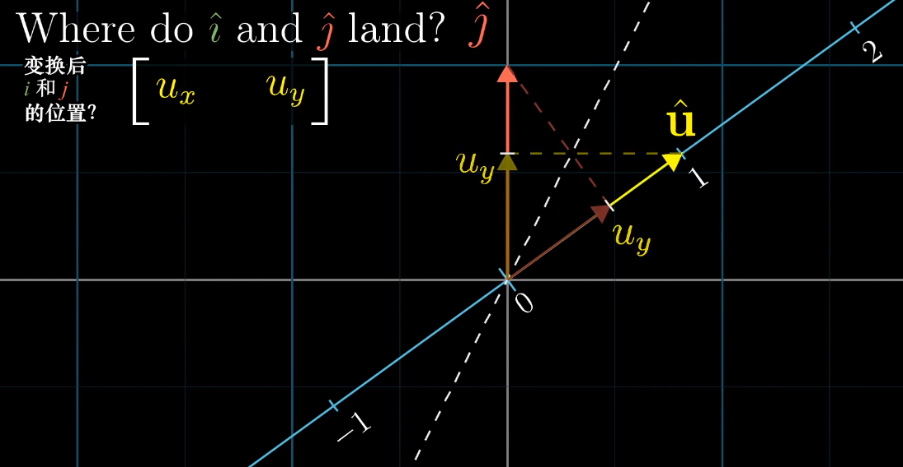
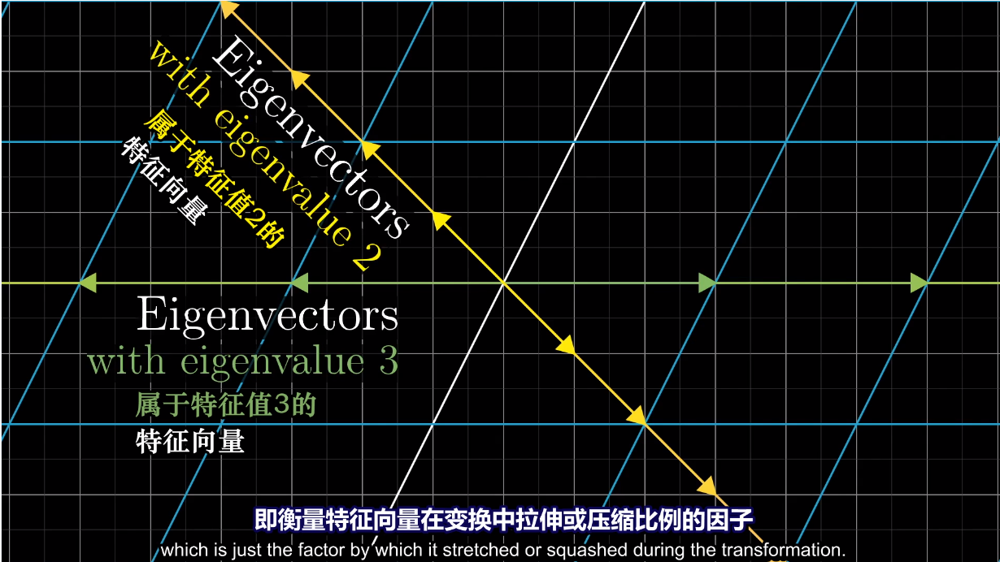
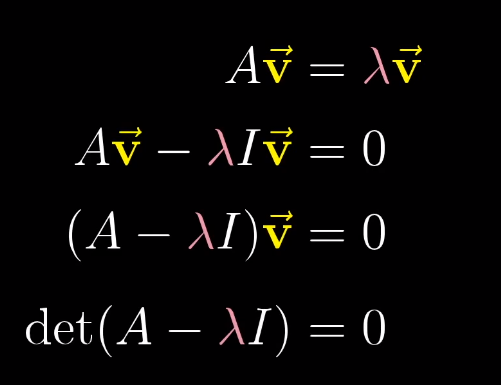
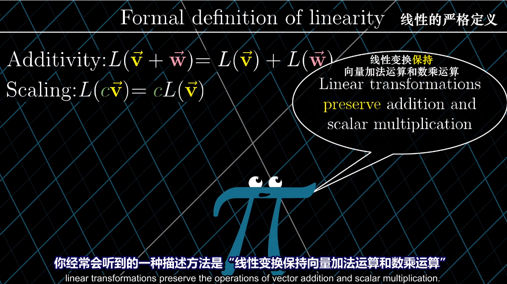
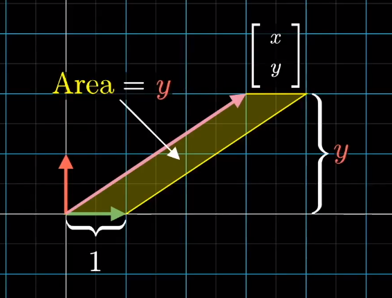
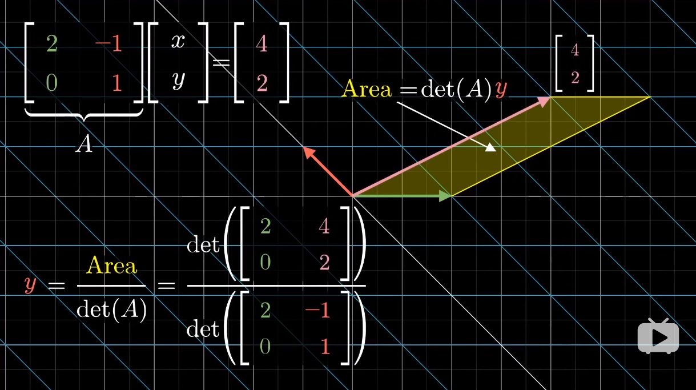

<!-- TOC -->

- [线性代数的本质](#线性代数的本质)
    - [序言](#序言)
    - [向量究竟是什么](#向量究竟是什么)
    - [线性组合、张成的空间与基](#线性组合张成的空间与基)
    - [矩阵与线性变换](#矩阵与线性变换)
    - [矩阵乘法与线性变换复合](#矩阵乘法与线性变换复合)
    - [三维空间中的线性变换](#三维空间中的线性变换)
    - [行列式](#行列式)
    - [逆矩阵、列空间与零空间](#逆矩阵列空间与零空间)
    - [非方阵](#非方阵)
    - [点积与对偶性](#点积与对偶性)
    - [叉积的标准介绍](#叉积的标准介绍)
    - [基变换](#基变换)
    - [特征向量与特征值](#特征向量与特征值)
    - [抽象向量空间](#抽象向量空间)
    - [克拉默法则几何解释](#克拉默法则几何解释)

<!-- /TOC -->
# 线性代数的本质
>本文参考3Blue1Brown的线性代数讲解视频，写下笔记和自己的认识。 
[课程链接：youtube](https://www.youtube.com/watch?v=fNk_zzaMoSs&list=PLZHQObOWTQDPD3MizzM2xVFitgF8hE_ab) 
[课程链接：bilibili](https://www.bilibili.com/video/BV1s4411S78P?from=search&seid=12604659975522241651) 
## 序言
>课程中3Blue1Brown主要用了大量精力给我们解释了线性代数中常见的向量操作、矩阵操作所表示的几何含义，并且制作出精美的动画演示过程。
这对我们理解其中的奥秘十分重要，在科研过程中，如果只停留在计算和表示层面，我们很难有一个公式的直观理解
，也就是作者强调的intuition。只有真正的理解数字背后的含义，我们才能够进行创新和拓展。
## 向量究竟是什么
>向量对我们之前肤浅的接触过线性代数的学生来看，不过是几个连续
的数字组成的像有向的数组列表一样的东西，可以进行加减，数乘等运算。
不过，在后续中我们看到，无论是有向的数组、函数还是自定义的
一些计算规则，只要他们满足向量空间需要满足的
一些公理，那么他们都可以统称为广义的向量。并且带有一致的计算规则。
我们在后续的介绍中会提到。 
现在，我们就停留在我们认识的阶段即可，来一步步展开。
## 线性组合、张成的空间与基
>向量的线性组合会构成相应的张成的空间(span)，不过，有些
向量可能对张成的空间维数扩大没有帮助，如三维中，三个向量共面不共线。
那么我们就可以去掉其中一个，并且称这三个向量线性相关。基的概念
就是可以描述出张成的空间中所包含的所有向量的一组线性无关向量集合。
## 矩阵与线性变换
>线性变换实际上是一个运动的过程。在此我们先看一个空间 
变换的过程： 

 

 

>线性变换就是空间变换的一个特例： 

 

 

>而在二维空间中我们需要记录的只是两个基向量的变换过程，其他向量
会随之变换： 

 

 

>变换后的线性组合不变： 

 

 

>而变换矩阵可以表示我们对空间以及其中的向量具体是如何进行变换的： 

 

 

>上图中矩阵中绿色的第一列，和红色的第二列分别对应二维向量横纵坐标
的变换方式，经过如图所示的运算，我们可以得到变换的后的向量
这也就是我们常见的矩阵乘法： 

 

 

>更加有趣的是，作者用一个动画来分别描述变换矩阵的两列对两个
基向量，以及整个空间的变换过程： 

 

 

>因此，当我们看到一个矩阵，就可以看成一个对空间的变换！

## 矩阵乘法与线性变换复合
>先进行空间旋转，再进行空间剪切，需要对一个向量进行两次矩阵向量乘
运算，但是我们可以将两个变换矩阵复合到一起变成一个过程： 

  

 

 

 

>下面我简单说明一下基向量i的去向: 

 

 

>如图所示，基向量 i 首先经过M1作用，被拉伸/压缩到[e g]，之后
[e g]又经过M2作用，横纵坐标分别由[a c]和[b d]作用，最后
得到如图所示的向量。基向量 j 类似。 
而矩阵乘法交换作用于向量后得到的向量往往和交换前的结果不同，
由空间变化我们就可以得知，这样，我们对矩阵乘法没有交换律就有更深一层的理解了
。而结合律却是适用的，因为在空间中(AB)C和A(BC)对空间的变换
其实是等价的。

## 三维空间中的线性变换
>三维空间与二维其实是类似的，只不过三维中我们用一个3*3的
矩阵来表示这个变换过程： 

 

 

>我们分别对 x,y,z 三个方向上的坐标进行如下变换，叠加在一起
便是最终的变换结果。同样的，三维矩阵也有和二维类似的矩阵复合过程。

## 行列式
>变换矩阵行列式的作用其实是来描述一个空间被拉伸/压缩的程度的！
它的数值就是拉伸/压缩的倍数！并且在线性变换中，空间中的每一部分
经过变换后，都有一个同样的变换倍数。
更重要的是，当一个变换矩阵的行列式为 0，那么说明这个空间
被“降维”了，我们以三维为例，当三维空间经过变换被压缩到
一条直线甚至一个点时，变换矩阵的行列式才可能为 0 ！如下图所示: 

 

 

>还有一点就是行列式的值若为负值，我们可以认为空间被进行了
“翻转”，本来基向量i在基向量j的右边，经过翻转，变到了左边，
犹如一张翻转了的纸一样，而行列式的绝对值意义不变。如下图所示： 

 

 

>三维空间中的行列式意义其实也是一样的。而负值变换的过程就是
坐标轴从右手定则变为左手定则的过程。 
对于行列式的计算这里有一个二维的示意图。基向量 i 先被拉伸为
[a c] 之后基向量 j 又被拉伸到 [b d]，分别对应途中绿色和红色两个向量，而为了计算黄色部分面积
也就是行列式的值，我们可以由以下几何关系得出： 

 

 

>同样，我们也可以由几何关系得出以下规则： 

 

 

## 逆矩阵、列空间与零空间
>逆变换矩阵其实就是空间的逆变换过程： 

 

 

>只要我们在第一次变换过程中不会进行“降维”，也就是行列式不为 0，
我们就能找到对应的逆变换、逆矩阵，同时一个输入对应一个输出向量。但是，一旦我们进行了降维，我们就无法
从低维度还原回高维度的情况。 
矩阵秩的概念我们都不陌生，但是，它在几何中表示的是，一个变换矩阵
把高维空间进行变换后的维数： 

 

 

>如果我们对空间进行了降维变换，那么就会有一组向量被挤压成零向量。
如果一个平面被挤压成一维，那么就有一条线上的向量被挤压成零向量；
如果一个三维空间被挤压成二维，那么就有一条线上的向量被挤压成零向量；
如果一个三维空间被挤压成一维，那么就有一个平面上的向量被挤压成零向量： 

 

 

>变换后落到零点的向量集合，被称为“零空间”或“核”(kernel)。也就是方程 Ax = 0 时，我们解出的x，就是经过A变换后得到的空间向量集合——核(kernel)

## 非方阵
>如果一个变换矩阵不是方阵，那么空间的变换又是如何进行的呢？
这里虽然作者没有做动画，但是有了之前的知识也能够理解(作者懒得做了)。 

 

 

>如这样一个 3 * 2 的矩阵，我们作用到一个 2 * 2 的二维平面空间中，带来的结果就是，
把二维平面扩展到过原点的三维平面了。原理还是基向量 i 被拉伸到绿色列的三维情况，基向量 j 被拉伸到红色列的三维情况。 
同样，我们把一个 2 * 3 的矩阵可以作用到一个 3 * 3 的空间中，那么，这也叫“降维”。
同样也有到一维的转换，我们可以用一个 1 * 2 的矩阵降维平面到数轴： 

 

 

## 点积与对偶性
>点积的顺序无关性，体现出了一定的对偶性(duality)。 
作者用一个平面斜向放置的数轴来解释这一现象。我们将二维空间中的点投影到如下图的斜向数轴上，u 为轴上的单位向量，这样的投影变换，将二维
中的向量投影到一维数轴上就是一个降维过程，并且它满足线性变换等距性
的要求，那么就存在一个 1 * 2 的变换矩阵来描述这一过程。根据如图所示的
对偶性(对称性)，u 投影到单位向量 j 上，和 j 投影到 u 上的长度是相等的
，纵坐标方向也一样，那么我们就得到的了变换矩阵的值： 

 

 

>ux 就是对基向量 i 的变换，uy 就是对基向量 j 的变换。我们便找到了点积和矩阵变换之间
的关系： 

 

 

>即点积就是一个降维的变换过程，将 [x y] 以左边的变换矩阵，变换到一维，映射到了一个数上

## 叉积的标准介绍
>二维中两个向量叉积的的大小就是两个向量围成的平行四边形面积，这有些
像行列式，因为两个二维向量构成的2*2行列式的结果就是对应的平行四边形面积，方向
遵循右手定则，叉积的结果其实是一个向量。而三维中，两个向量的叉积
计算方法如下，而我们也就死记硬背，但是作者也给出了形象的几何理解
，但是这里与我目前关系不大，因此我不进行细究，有兴趣可以参考以下链接：
[三维叉积几何解释](https://www.bilibili.com/video/BV1ys411472E?p=12) 

 

 

## 基变换
>当使用下图 **b1，b2** 作为基向量时，[-1 2] 表达的是黄色向量的值，但是如果我们要得到
该向量在基向量 **i，j** 下的坐标时，我们需要给 b1，b2 基向量下的坐标
左乘一个变换矩阵，而这个变换矩阵的两列，表达的就是 i 变为 b1，j 变换为
b2 的意思，也就是说，我们为了消除以 b1，b2作为基向量的误解，而进行空间变换
尝试用 i,j 的视角进行解读。这里好像是反的，但是事实确实如此。 

 

 

 

 

>反过来，如果我们知道在 i,j 基向量下的某向量坐标，如何知道在 b1,b2 中
的呢？结果就是——矩阵的逆： 

 

 

>接下来就是相似矩阵的概念：如果我在 i,j 基下面做一个顺时针90°旋转的变换，那么
我在 b1,b2 中如何对空间做出同样的变换呢？答案就是——相似矩阵。 
**相似矩阵就是同一个线性变换在不同基下的形式！** 

 

 

>等式左边最右面的矩阵是一个基向量的转换，也就是上一例中把 i,j 转换为 b1,b2 的矩阵，
按照文中的语言，也就是，从我们的视角转换到珍妮弗(她)的视角。
这样，我们再进行第二个**旋转矩阵**的变换，旋转过后，我们进行最左边的
逆矩阵转换，也就是从她的视角再转换为我们的视角。这样基变换逆矩阵、
旋转矩阵、基变换矩阵的乘积得到的结果，也就是在珍妮弗语言下将空间旋转90°
的变换矩阵。 

 

 

## 特征向量与特征值
>**特征向量就是经过空间变换后，空间中仍在原来的直线上的那些向量集合**，
只是进行了一定程度的拉伸/压缩，而**特征值就是拉伸/压缩程度倍数的度量**！ 

 

 

>如上图所示的绿色和黄色向量就是特征向量，而红色向量因为偏离了原来的直线
，因此，他不是特征向量。 

 

 

>如上图所示，黄色线上的向量被拉伸了2倍，绿色线上的被拉伸了3倍，因此他们
对应的特征值分别就是 2 和 3。 

 

 

>还有就是三维的情况，如上图所示，当我们找到三维空间上的特征向量，
我们也就发现了三维空间变换过程中的**旋转轴**，特别的，当对应的特征值为 1
时，这个方向上不进行拉伸/压缩。 
接下来就是计算上面的技巧： 

 

 

>我们发现这个计算公式其实表达的就是对于一个特征向量 v 经过变换矩阵 A 变换后，
只是放缩了一个λ倍而已。而在计算中，我们常用以下的技巧： 

 

 

>经过移项后，我们另最后一个行列式为 0，为什么呢？因为在倒数第二步，
我们把 A-λI 看成一个空间变换矩阵，也就是向量 v 经过空间变换后为 0
向量，由前面的内容我们知道了，这里其实就是降维的过程！只有 A-λI 矩阵
将原来的空间进行降维，空间中才会出现被压缩为 0 向量的向量。而降维
的矩阵需要满足的条件就是行列式为 0 ，也就是将原始空间压缩为 0 倍(可以回忆二维情况
，将二维空间面积压缩为 0；或者三维情况，将三维体积压缩为平面甚至直线，体积为 0)
 但是有些变换是不存在特征向量、特征值的，比如二维旋转变换矩阵 A ，因为
经过旋转后没有一个平面上的向量，在原来的直线上。这时你算 Ax = λx 时会发现，
解出来λ是一个虚数。
 还有一个如下图的特殊情况，特征值为2，平面中所有向量都是特征向量，
这时你代入λ，求 (A-λI)x = 0 ，会发现得到 0x = 0 ，所有x都符合要求： 

 

 

>这里最后一个知识点就是“特征基”：当**基向量都是特征向量**会发生什么？
 我们都知道对角阵在计算高次幂时非常方便，如下图所示： 

 

 

>非对角阵在计算高次幂时就是一场噩梦！因此，我们有了一个想法，**当空间变换后所存在的基向量足够张成整个空间时，我们就可以用特征向量作为基**！比如，二维情况，
变换后的空间，存在两个线性无关的基向量的情况。按照上一章的变换技巧，
我们以基向量作为特征向量，也就是进行基变换后在进行空间变换： 

 

 

>如上图所示，这个新的变换必然是对角阵，因为它的基向量只进行了缩放。那此时
，我们要计算非对角阵高次幂，我们只需要进行“相似对角化”，转换为对角矩阵后，
进行高次幂计算，之后再转换回原来的基。 

 

 

>但并不是所有的变换都适用，前提是：**当空间变换后所存在的基向量足够张成整个空间时才行**。

## 抽象向量空间
>首先强调一点：**行列式和特征向量和所选基向量无关。行列式是空间放缩倍数，特征向量是经过变换
仍然留在原来直线上的向量**。 

 

 

>接下来进入主题，回到第一章的问题，什么是向量？现在我们进行解释，首先是**函数为什么是向量**？
“线性”定义： 

 

 

>我们可以看到，多项式函数求导就是线性运算： 

 

 

 

 

>既然是线性运算(线性变换)，那么求导过程就对应一个矩阵。现在，我们尝试用矩阵来描述求导： 

 

 

>上图是一个函数的矩阵描述，右侧是对应的基向量(基函数)，求导过程如下: 

 

 

>最左侧的是多项式求导矩阵，之后作用于一个多项式后，得到的列向量就是求导后的多项式系数向量。
这样我们就把求导和向量运算结合到了一起，实际上线性代数中的概念在函数中都有与之对应的部分： 

 

 

 

 

 

 

>而围绕向量空间的关键点就是：加法和数乘！满足 **8个公理**，他就能代表任何事物！普适的代价是抽象！8 个公理在矩阵论第一章中就为我们展示了。

## 克拉默法则几何解释
>正交变换概念： 

 

 

>在正交矩阵中，满足以下规则： 

 

 

>下面介绍克拉默法则：

 

 

>如上图所示，这样我们把向量 [x y] 中的 y 值和面积联系了起来(平行四边形面积 = 底乘高)，之后经过下图 A 矩阵进行空间变换，y 的面积也发生了变化，变换后的面积为 det(A)·y ，变换后的 [x y] 向量变为 [4 2] 这是我们已知的 

 

 

>根据以上的关系，我们可以计算 y ： 

 

 

>需要说明的只有分子上的 Area 的值计算方法，也就是变换后黄色部分面积，
我们可以由变换后的绿色向量和变换后的[x y]粉色向量构成的矩阵的
行列式得到黄色部分面积。而粉色向量变换后就是[4 2]，绿色向量变换后就是[2 0] !
这里用到了之前的一些知识。按照这种方法，我们也可以得到 x 的计算方法。也可以拓展到高维。
不过克拉默法则并不是解方程组的最好方法，高斯消元法应用往往更多，但这里提供了一个很好的几何解释。 

>现在，所有的内容已经解释完毕。最后Shout out to 3Blue1Brown！
